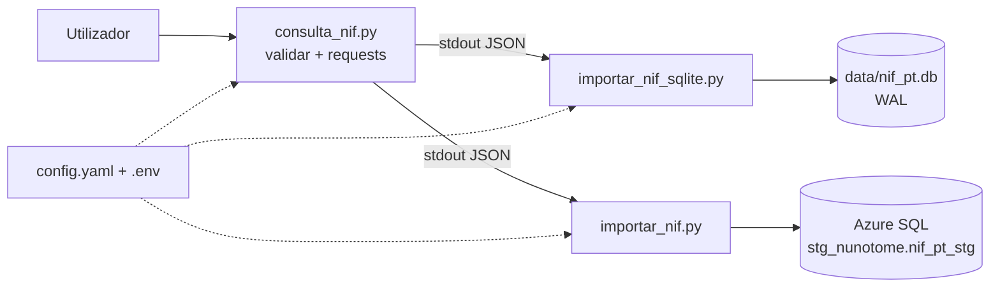

# nif-pt

> Consulta de NIFs portugueses via [nif.pt](http://www.nif.pt) com validação Mod-11 e persistência SQLite / Azure SQL.

[](https://www.python.org/downloads/)
[](CHANGELOG.md)
[](LICENSE)
[](MANUAL.md)

## Visão Geral

Ferramenta CLI em Python que consulta a API pública `nif.pt` e guarda o resultado de forma **pipeline Unix** (`stdout` → `stdin`):

```
consulta_nif.py  ──JSON──>  importar_nif_sqlite.py  (SQLite local)
                ──JSON──>  importar_nif.py         (Azure SQL)
```

* **Validação** do NIF (9 dígitos, algoritmo Mod-11 da AT) antes de consumir créditos da API.
* **SQLite** guarda JSON bruto (`data/nif_pt.db`, `PRAGMA WAL`) — schemaless, à prova de mudanças da API.
* **Azure SQL** normaliza 36 colunas em `stg_nunotome.nif_pt_stg` (via `pyodbc` + `ODBC Driver 18`).

Ver [MANUAL.md](MANUAL.md) para documentação completa e [docs/](docs/README.md) para arquitetura técnica.

## Quickstart (3 comandos)

```bash
# 1. Ambiente
python -m venv venv
# Git Bash (MINGW64):
source venv/Scripts/activate
# PowerShell:
# .\venv\Scripts\Activate.ps1
pip install -r requirements.txt

# 2. Configurar segredos
cp config/.env.example config/.env
# Editar config/.env -> NIF-PT-KEY=xxxxx (obter em http://www.nif.pt/contactos/api/)

# 3. Consultar e guardar
python consulta_nif.py 509442013
python consulta_nif.py 509442013 | python importar_nif_sqlite.py
python consulta_nif.py 509442013 | python importar_nif.py  # requer AZURE_USER e ODBC 18
```

## Arquitetura



* **Configuração centralizada:** `config/config.yaml` (27L, 3 blocos) + `config/.env` (segredos) via `config/config.py:get_config()` (`config/config.py:17`).
* **Ponto de entrada:** cada script com `if __name__ == "__main__"` — `main.py` é stub legado.

## Estrutura do Projeto

```
nif-pt/
├── consulta_nif.py            # 110L — consulta API nif.pt
├── importar_nif.py            # 213L — mapeia 36 cols → Azure SQL
├── importar_nif_sqlite.py     # 88L  — guarda JSON bruto → SQLite
├── config/
│   ├── config.py              # 40L — get_config()
│   ├── config.yaml            # 27L — default + 3 blocos
│   └── .env.example           # template (commitado)
│   └── .env                   # segredos (NÃO versionar)
├── sql/01_criar_tabelas.sql   # 157L — DDL nif_pt + nif_pt_stg
├── Logging/logging_template.py# 579L — template rotação (não integrado)
├── docs/                      # documentação técnica
├── data/nif_pt.db             # gerado, ignorado (.gitignore)
├── requirements.txt
└── MANUAL.md                  # manual de instruções completo
```

## Configuração

**`config/config.yaml`:**
```yaml
consulta_nif:
  api_base: "http://www.nif.pt"
importar_nif_sqlite:
  db_path: "data/nif_pt.db"
  tabela: "nif_pt"
importar_nif:
  sql_server: "kiwa-pt-operations.database.windows.net"
  sql_database: "kiwa-pt-operations"
  sql_schema: "stg_nunotome"
  sql_driver: "ODBC Driver 18 for SQL Server"
  tabela_staging: "nif_pt_stg"
```

**`config/.env`** (criar a partir de `.env.example`):
```env
NIF-PT-KEY=coloque_aqui
AZURE_USER=seu_user
AZURE_PALAVRA_CHAVE=sua_password
```

## Exemplos

```bash
# Só consultar (JSON para stdout)
python consulta_nif.py 509442013 > resultado.json

# Guardar em SQLite
python consulta_nif.py 509442013 | python importar_nif_sqlite.py

# Guardar em Azure SQL
python consulta_nif.py 509442013 | python importar_nif.py

# Ambos (Bash)
python consulta_nif.py 509442013 | tee >(python importar_nif_sqlite.py) | python importar_nif.py

# Ambos (PowerShell)
$json = python consulta_nif.py 509442013
$json | python importar_nif_sqlite.py
$json | python importar_nif.py

# Batch
Get-Content nifs.txt | ForEach-Object { python consulta_nif.py $_ | python importar_nif_sqlite.py; Start-Sleep -Seconds 1 }
```

## Documentação

| Documento | Descrição |
|-----------|-----------|
| [MANUAL.md](MANUAL.md) | Manual de instruções completo (15 capítulos) |
| [docs/README.md](docs/README.md) | Índice da documentação técnica |
| [docs/architecture/architecture.md](docs/architecture/architecture.md) | Arquitetura C4 + ADRs |
| [docs/database/schema.md](docs/database/schema.md) | Esquemas BD (ER + catálogo 37/40 cols) |
| [docs/api/nif-pt-api.md](docs/api/nif-pt-api.md) | Contrato API nif.pt |
| [CHANGELOG.md](CHANGELOG.md) | Histórico de versões |
| [CONTRIBUTING.md](CONTRIBUTING.md) | Guia de contribuição |
| [SECURITY.md](SECURITY.md) | Gestão de segredos |

## Troubleshooting Rápido

| Erro | Causa | Solução |
|------|-------|---------|
| `NIF-PT-KEY não encontrada` | `.env` em falta ou nome errado | Verificar `config/.env` tem `NIF-PT-KEY=` com hífen |
| `yaml` ModuleNotFound | `requirements.txt` antigo | `pip install pyyaml` (corrigido em `v0.2.1`) |
| `database is locked` | Concorrência SQLite | Já usa `WAL` (`importar_nif_sqlite.py:40`); evitar writes paralelos |
| `pyodbc.Error` Azure | Driver/firewall | Instalar ODBC 18 + whitelist IP no Azure |

Ver [MANUAL.md — Resolução de Problemas](MANUAL.md#13-resolução-de-problemas-troubleshooting) para lista completa.

## Changelog

Ver [CHANGELOG.md](CHANGELOG.md). Versão atual `v0.2.0-beta`, próximo `v0.2.1` (fix `requirements.txt`).

## Licença

MIT — ver `LICENSE` (a criar).

## Contacto

Repositório: `https://github.com/nunoetome/nif-pt` — Issues e PRs bem-vindos.
