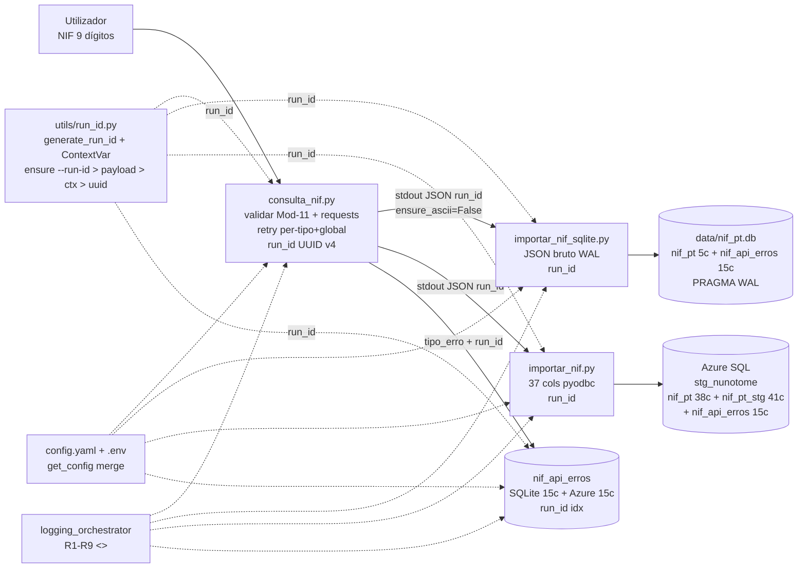

# nif-pt

> Consulta de NIFs portugueses via [nif.pt](http://www.nif.pt) — validação Mod-11, pipeline Unix e persistência SQLite WAL + Azure SQL com camada resiliente de rate-limit e **rastreabilidade `run_id` (UUID v4) por execução**.

[](https://www.python.org/downloads/)
[](CHANGELOG.md)
[](LICENSE)
[](MANUAL.md)
[](docs/guides/logging.md)

## Visão Geral

Ferramenta CLI em Python que consulta a API pública `nif.pt` (`GET ?json=1&q=<NIF>&key=<KEY>`) e guarda o resultado de forma **pipeline Unix** (`stdout` JSON → `stdin`):

```
consulta_nif.py  ──JSON(run_id)──>  importar_nif_sqlite.py  (SQLite WAL, 5c: JSON+run_id)
                 ──JSON(run_id)──>  importar_nif.py         (Azure SQL, 37c normalizadas+run_id)
                 ──erro(run_id)──>  nif_api_erros           (SQLite + Azure, 15c auditoria+run_id)
```

* **Rastreabilidade `run_id`** (`utils/run_id.py:41` `generate_run_id()` UUID v4) — gerado por execução (`consulta_nif.py:481` `ensure_run_id()` + `--run-id`), propagado via `stdout` JSON (`run_id`) → `stdin` importadores, persistido em todas as tabelas (`nif_pt.run_id NVARCHAR(36)`, `nif_pt_stg`, `nif_api_erros`) com índice e migração idempotente `sql/03_migracao_run_id.sql`.

* **Validação** Mod-11 da AT (`consulta_nif.py:99` `validar_nif`) antes de consumir créditos.
* **Resiliência:** `utils/error_handler.py` (806L) classifica `rate_limit_minute/hour/day/month/paid` → `retry 60s/3600s` vs `abort`, persiste sempre em `nif_api_erros` (dual SQLite `PRAGMA WAL` + Azure `sql/02_criar_tabela_erros.sql`) com `run_id` (`utils/run_id.py:87` `ensure_run_id()`), limites `max_tentativas_global 5 / minuto 3 / hora 2 / dia 0 / mes 0` em `config.yaml`.
* **SQLite** `data/nif_pt.db` WAL — `nif_pt` (5 cols: 4 + `run_id TEXT`) + `nif_api_erros` (15 cols: 14 + `run_id TEXT` + `idx_run_id`) — schemaless, migração idempotente (`importar_nif_sqlite.py:102` / `utils/error_handler.py:153`).
* **Azure SQL** `kiwa-pt-operations/stg_nunotome` — `nif_pt` 38 cols (37+`run_id`) + `nif_pt_stg` 41 cols (40+`run_id`) + `nif_api_erros` 15 cols (14+`run_id`) + índices `run_id` — analítico, `pyodbc` + `ODBC Driver 18`, migração `sql/03_migracao_run_id.sql`.
* **Logging** estruturado `Logging/logging_orchestrator.py` (580L) — `RotatingFileHandler` 10 MB/5000/10, prefixo `<<nif-pt>>`, `log_files/nif_pt.log`, estilos R1–R9 (`BANNER = 49`, `BOX`, `TAG [api][valid][cfg][db][sqlite][io][map][erro][rate-limit]`, `TIMING %.2fs`).

Ver [MANUAL.md](MANUAL.md) (v1.0.0 + `run_id`) para manual completo e [docs/technical.md](docs/technical.md) para arquitetura técnica com Mermaid.

## Quickstart (3 comandos)

```powershell
# 1. Ambiente — PowerShell (Windows)
py -m venv .venv
.\.venv\Scripts\Activate.ps1
# se bloquear: Set-ExecutionPolicy -Scope Process -ExecutionPolicy Bypass
pip install -r requirements.txt
# requirements.txt: requests>=2.31.0, pyyaml>=6.0.1, python-dotenv>=1.0.0, pyodbc>=5.0.0

# Git Bash (MINGW64) — alternativa:
# python -m venv .venv && source .venv/Scripts/activate

# 2. Configurar segredos
Copy-Item config\.env.example config\.env
# Editar config\.env -> NIF-PT-KEY=xxxxx  (com hífen! obter em http://www.nif.pt/contactos/api/)
# Opcional Azure: AZURE_USER, AZURE_PALAVRA_CHAVE

# 3. Consultar e guardar
python consulta_nif.py 509442013
python consulta_nif.py 509442013 | python importar_nif_sqlite.py
python consulta_nif.py 509442013 | python importar_nif.py  # requer AZURE_USER + ODBC 18

# Help Python (PEP 257)
python -c "import consulta_nif; help(consulta_nif.validar_nif)"
python -c "from utils.error_handler import tratar_erro; help(tratar_erro)"
```

## Arquitetura



* **Configuração centralizada:** `config/config.yaml` (37L, 11 chaves default) + `config/.env` (segredos) via `config/config.py:get_config()` (`config/config.py:30`).
* **Help Python:** docstrings PEP 257 em todos os módulos — `help(consulta_nif.validar_nif)`, `help(utils.error_handler.tratar_erro)` (ver `docs/api/help.md`).

## Stack e requisitos

| Dependência | Versão | Instalação | Obrigatória |
|-------------|--------|------------|-------------|
| Python | `>=3.11` | https://www.python.org/downloads/ | ✅ |
| `requests` | `>=2.31.0` | `pip install -r requirements.txt` | ✅ |
| `pyyaml` | `>=6.0.1` | idem | ✅ |
| `python-dotenv` | `>=1.0.0` | idem | ✅ |
| `pyodbc` | `>=5.0.0` | idem | Só `importar_nif.py` |
| `ODBC Driver 18` | 18.x | https://learn.microsoft.com/sql/connect/odbc/download-odbc-driver-for-sql-server | Só Azure SQL |
| Chave `nif.pt` | — | http://www.nif.pt/contactos/api/ | ✅ |

## Estrutura do Projeto

```
nif-pt/
├── consulta_nif.py               # 570L — validar Mod-11 + GET ?json=1 + retry per-tipo+global + run_id + BOX
├── importar_nif.py               # 576L — mapear 37 cols (36+run_id) → Azure staging (pyodbc) + --run-id
├── importar_nif_sqlite.py        # 268L — JSON bruto → SQLite WAL (5c: 4+run_id) + --run-id + migração idempotente
├── utils/run_id.py               # 191L — generate_run_id() UUID v4 + ContextVar + ensure_run_id(CLI>payload>ctx>gen) + --run-id parse
├── utils/error_handler.py        # 806L — classificar + tratar + guardar_erro(...,run_id) + init_error_table (15c run_id)
├── main.py                       # 92L — ensure_run_id() por execução
├── Logging/logging_orchestrator.py # 580L — RotatingFileHandler 10MB/5000/10, R1-R9, <<nif-pt>>, nif_pt.log, TAG [run]
├── config/
│   ├── config.py                 # 70L — get_config() merge default+script+.env, *** mascarado
│   ├── config.yaml               # 37L — default (11 chaves) + 3 blocos
│   └── .env.example              # template (commitado) — .env com NIF-PT-KEY hífen (não versionar)
├── sql/
│   ├── 01_criar_tabelas.sql      # 169L — nif_pt 38c (37+run_id) + nif_pt_stg 41c (40+run_id) + idx run_id
│   ├── 02_criar_tabela_erros.sql # 47L — nif_api_erros 15c (14+run_id) dual SQLite/Azure + idx run_id
│   └── 03_migracao_run_id.sql    # 39L — migração idempotente run_id (ALTER + CREATE INDEX) para BDs existentes
├── docs/
│   ├── technical.md              # v1.1.0 — C4 + sequência + ER (run_id) + catálogo file:line + ADRs
│   ├── api/help.md               # Help Python verificado (help(validar_nif), help(tratar_erro), help(generate_run_id))
│   ├── architecture/             # C4 + diagramas Mermaid (run_id)
│   ├── database/                 # ER + catálogo 38/41/15c + migração run_id
│   ├── api/nif-pt-api.md         # Contrato nif.pt
│   └── guides/                   # instalação, logging R1-R9, run_id
├── data/nif_pt.db                # gerado, WAL, ignorado (.gitignore)
├── log_files/nif_pt.log          # gerado, RotatingFileHandler, ignorado
├── requirements.txt              # 4 deps pinadas
├── CHANGELOG.md                  # v1.0.0 (2026-09-10)
└── MANUAL.md                     # manual de utilizador v1.0.0 (15 capítulos, dual PS/Bash)
```

## Configuração

**`config/config.yaml` (37L):**

```yaml
default:
  retry_count: 1
  timeout: 10
  tempo_de_espera: 60
  tempo_espera_minuto: 60
  tempo_espera_hora: 3600
  max_tentativas_global: 5
  max_tentativas_minuto: 3
  max_tentativas_hora: 2
  max_tentativas_dia: 0
  max_tentativas_mes: 0
  max_tentativas_paid: 0
consulta_nif:
  api_base: "http://www.nif.pt"
importar_nif_sqlite:
  db_path: "data/nif_pt.db"
  tabela: "nif_pt"
importar_nif:
  sql_server: "kiwa-pt-operations.database.windows.net"
  sql_database: "kiwa-pt-operations"
  sql_schema: "stg_nunotome"
  sql_driver: "ODBC Driver 18 for SQL Server"
  tabela_staging: "nif_pt_stg"
```

**`config/.env`** (criar de `.env.example`):

```env
NIF-PT-KEY=coloque_aqui          # com hífen — os.getenv("NIF-PT-KEY")
AZURE_USER=seu_user
AZURE_PALAVRA_CHAVE=sua_password
# API_TOKEN=opcional
```

## Exemplos

```powershell
# Só consultar (JSON stdout, stderr com BOX/TAG/TIMING, inclui run_id)
python consulta_nif.py 509442013 > resultado.json
Get-Content resultado.json | ConvertFrom-Json | Format-List  # campo run_id: UUID v4

# Guardar em SQLite (run_id propagado via JSON run_id)
python consulta_nif.py 509442013 | python importar_nif_sqlite.py
# Ver rastreabilidade:
# sqlite3 data/nif_pt.db "SELECT nif, substr(run_id,1,8), data_consulta FROM nif_pt ORDER BY data_consulta DESC LIMIT 3;"

# Guardar em Azure SQL (37c + run_id)
python consulta_nif.py 509442013 | python importar_nif.py
# SELECT nif, run_id, title FROM stg_nunotome.nif_pt_stg WHERE run_id='...';

# Ambos — PowerShell (tee >( ) só Bash) — mesmo run_id nas duas BDs
$json = python consulta_nif.py 509442013
$json | python importar_nif_sqlite.py   # herda run_id do JSON
$json | python importar_nif.py          # mesmo run_id

# Ambos — Bash (run_id idem)
python consulta_nif.py 509442013 | tee >(python importar_nif_sqlite.py) | python importar_nif.py

# Override determinístico / replay com --run-id (precedência CLI > payload > contexto > geração)
python consulta_nif.py 509442013 --run-id 550e8400-e29b-41d4-a716-446655440000 | python importar_nif_sqlite.py --run-id 550e8400-e29b-41d4-a716-446655440000
# ou só na origem — importadores herdam do JSON:
python consulta_nif.py 509442013 --run-id 550e8400-e29b-41d4-a716-446655440000 | python importar_nif_sqlite.py

# Batch com rate-limit (cada iteração gera run_id único; agrupar por run_id para auditoria)
Get-Content nifs.txt | ForEach-Object { python consulta_nif.py $_ | python importar_nif_sqlite.py; Start-Sleep -Seconds 1 }

# Validar sem gastar créditos
python -c "from consulta_nif import validar_nif; print(validar_nif('509442013'))"  # True
# Gerar run_id isolado
python -c "from utils.run_id import generate_run_id; print(generate_run_id())"
```

## Logging (R1–R9)

`log_files/nif_pt.log` com `RotatingFileHandler` (10 MB / 5000 recs / 10 backups), prefixo `<<nif-pt>>`, `stderr` não quebra pipe:

```
<<nif-pt>> 2026-09-10 02:15:32 - __main__ - INFO - ===================================================
<<nif-pt>> 2026-09-10 02:15:32 - __main__ - INFO - ========= nif-pt consulta_nif a iniciar =========
<<nif-pt>> 2026-09-10 02:15:32 - __main__ - INFO - ===================================================
<<nif-pt>> 2026-09-10 02:15:32 - consulta_nif - INFO - [api] GET http://www.nif.pt?q=509442013 key=***XXXX timeout=10s
<<nif-pt>> 2026-09-10 02:15:32 - consulta_nif - INFO - [api] NIF 509442013 válido=True credits used=free left=[] (0.85s)
<<nif-pt>> 2026-09-10 02:15:32 - __main__ - INFO - | Consulta com sucesso                          |
<<nif-pt>> 2026-09-10 02:15:32 - __main__ - INFO - Aplicação concluída em 0.92s
```

Ver `docs/guides/logging.md` e `docs/technical.md` §12 (run_id) + §11 (logging).

## Documentação

| Documento | Descrição |
|-----------|-----------|
| [MANUAL.md](MANUAL.md) | Manual de utilizador v1.0.0 + `run_id` (15 caps + pipeline `run_id`, CLI `--run-id`, migração) |
| [docs/technical.md](docs/technical.md) | Documentação técnica v1.1.0 — C4, sequência, ER (run_id), catálogo file:line, ADRs |
| [docs/api/help.md](docs/api/help.md) | Help Python (PEP 257) — `help(validar_nif)`, `help(tratar_erro)`, `help(generate_run_id)` |
| [docs/architecture/architecture.md](docs/architecture/architecture.md) | Arquitetura C4 + 9 ADRs (ADR-009 run_id) |
| [docs/database/schema.md](docs/database/schema.md) | ER + catálogo 38/41/15c + `run_id` + migração `03_migracao_run_id.sql` |
| [docs/api/nif-pt-api.md](docs/api/nif-pt-api.md) | Contrato API nif.pt |
| [CHANGELOG.md](CHANGELOG.md) | Histórico v0.1.0-alpha → v1.0.0 |
| [CONTRIBUTING.md](CONTRIBUTING.md) | Guia de contribuição |
| [SECURITY.md](SECURITY.md) | Gestão de segredos |

## Troubleshooting rápido

| Erro | Causa | Solução |
|------|-------|---------|
| `NIF-PT-KEY não encontrada` | `.env` em falta ou `NIF_PT_KEY` sem hífen | `config/.env` deve ter `NIF-PT-KEY=` com hífen (`config/config.py:55`) |
| `Limit per minute` | Quota minuto | Aguarda 60s (auto-retry `max 3`), ver `nif_api_erros` |
| `Limit per day/month` | Quota diária/mensal | Abort — `max 0`, ver `log_files/nif_pt.log` BOX fatal |
| `database is locked` | Concorrência SQLite | Já WAL (`importar_nif_sqlite.py:50`); evitar writes paralelos |
| `pyodbc.Error` Azure | Driver/firewall | ODBC 18 + whitelist IP no Portal Azure |
| `ModuleNotFoundError: yaml` | `requirements.txt` antigo | `pip install pyyaml` (fix v1.0.0) |

Ver [MANUAL.md §13](MANUAL.md#13-resolução-de-problemas-troubleshooting) para lista completa.

## Changelog

`v1.1.0` (unreleased) — **rastreabilidade `run_id`**: `utils/run_id.py` (UUID v4 + `ContextVar` + `--run-id`), `consulta_nif.py:consultar_nif(nif, run_id)` inclui `run_id` em todos os JSON, `importar_nif(_sqlite).py` DDL `run_id TEXT/NVARCHAR(36)` + migração idempotente + `INSERT` com `run_id` + `ensure_run_id(CLI>payload>ctx>gen)`, `utils/error_handler.py:guardar_erro(...,run_id)`, `sql/01`/`02` + `03_migracao_run_id.sql`, `main.py` `ensure_run_id()` por execução.
`v1.0.0` (2026-09-10) — primeiro stable: `error_handler` + `nif_api_erros` dual + `logging_orchestrator` + `timeout 10s` + `max_tentativas_*` + docs v1.0.0. Ver [CHANGELOG.md](CHANGELOG.md).

## Licença

MIT — ver `LICENSE` (a criar).

## Contacto

Repositório: `https://github.com/nunoetome/nif-pt` — Issues e PRs bem-vindos. Chave API: http://www.nif.pt/contactos/api/
