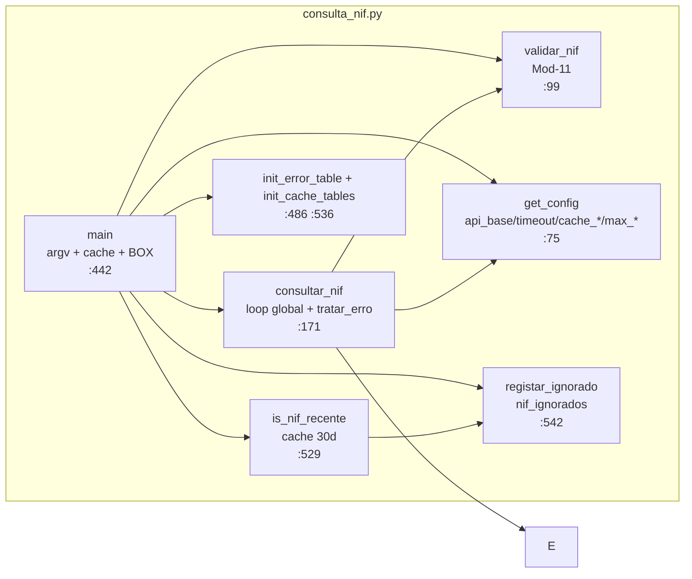
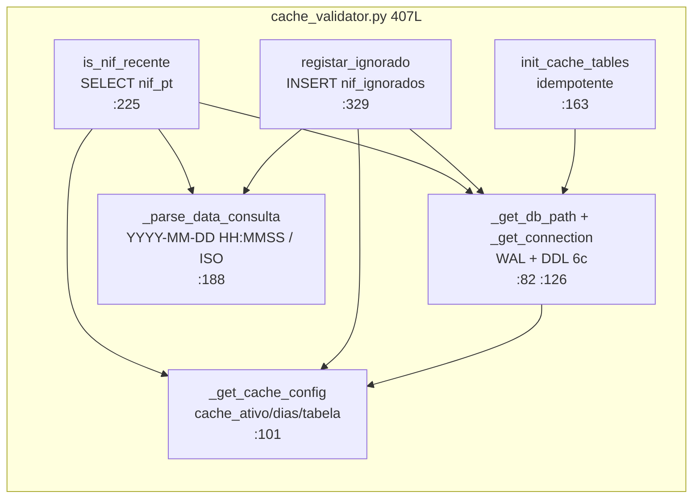
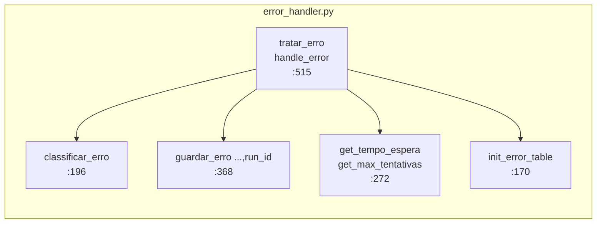

# Arquitetura — nif-pt v1.2.0

> C4 Nível 1-2 + ADRs (10). Diagramas fonte em [diagrams.md](diagrams.md) + [../technical.md](../technical.md).

## 1. Contexto (C4 Nível 1)

```mermaid
graph TB
    U[Utilizador<br/>CLI NIF 9 dígitos] --> SYS[nif-pt v1.2.0<br/>Python 3.11 CLI<br/>cache + run_id]
    SYS --> API[(nif.pt<br/>GET ?json=1&q=&key=<br/>timeout 10s<br/>se cache miss)]
    SYS --> DB[(SQLite<br/>data/nif_pt.db<br/>nif_pt 5c + nif_api_erros 15c<br/>+ nif_ignorados 6c WAL)]
    CFG[config.yaml 31L + .env<br/>get_config merge cache_*] -. configuração .-> SYS
    LOG[log_files/nif_pt.log<br/>RotatingFileHandler<br/>&lt;&lt;nif-pt&gt;&gt; R1-R9 [cache][run]] -. logs .-> SYS
    CV[utils/cache_validator<br/>is_nif_recente + registar_ignorado] -. cache .-> SYS
```

| Ator / Sistema | Descrição |
|---|---|
| Utilizador | `python consulta_nif.py <NIF>` + pipe `| python importar_nif_sqlite.py` |
| nif-pt | Valida Mod-11, verifica cache `nif_ignorados` antes de API, consulta com retry per-tipo+global, persiste, loga R1-R9 |
| nif.pt | `GET http://www.nif.pt/?json=1&q=&key=` (só se `is_nif_recente==False`) |
| SQLite | `nif_pt` 5c JSON bruto + `nif_api_erros` 15c + `nif_ignorados` 6c WAL + `idx_run_id` + `idx_nif_ignorados_*` |
| cache_validator | `is_nif_recente` + `registar_ignorado` + `init_cache_tables` DDL 6c |
| config | `cache_ativo`, `cache_antiguidade_dias`, `cache_tabela_ignorados` |

## 2. Contentores (C4 Nível 2)

```mermaid
graph TB
    subgraph nif-pt v1.2.0
        C[consulta_nif.py<br/>626L<br/>validar + cache + loop global 5<br/>+ tratar_erro + run_id + --run-id]
        CV[utils/cache_validator.py<br/>407L<br/>is_nif_recente + registar_ignorado<br/>DDL nif_ignorados 6c + WAL]
        E[utils/error_handler.py<br/>806L<br/>classificar + guardar + retry/abort<br/>run_id]
        S[importar_nif_sqlite.py<br/>285L<br/>WAL + INSERT JSON 5c<br/>early skip ignorado + run_id]
        R[utils/run_id.py<br/>191L<br/>generate_run_id + ContextVar<br/>ensure CLI>payload>ctx>gen]
        CFG[config/config.py<br/>134L<br/>get_config *** cache_*]
        LOG[Logging/logging_orchestrator.py<br/>580L<br/>10MB/5000/10 R1-R9 [cache][run]]
        MAIN[main.py<br/>92L ensure_run_id]
    end
    U[Utilizador<br/>NIF --run-id] -->|argv + run_id| C
    C -->|recente?| CV
    CV -.->|cache hit| DB
    C -->|stdout JSON run_id + ignorado| S
    C -->|tratar_erro run_id| E
    R -. run_id .-> C & S & E & CV & MAIN
    E -.-> DB
    CV -.-> DB
    CFG -.-> C & S & E & CV
    LOG -.-> C & S & E & CV & MAIN
    S --> DB[(SQLite 5c/15c/6c WAL)]
```

| Contentor | Linhas | Responsabilidade | Estado v1.2.0 |
|---|---|---|---|
| `consulta_nif.py` | 626 | `validar_nif` Mod-11 + `is_nif_recente` cache + `requests.get` + loop `max_global+1` + `tratar_erro(...,run_id)` + `consultar_nif(nif, run_id)` + `--run-id` + `run_id` em todos os JSON + `ignorado` | ✅ |
| `utils/cache_validator.py` | 407 | `is_nif_recente(nif,dias) -> (bool,str)` + `registar_ignorado(nif, data_ultima)` + `init_cache_tables()` + DDL `nif_ignorados` 6c + 2 índices + `WAL` + `_parse_data_consulta` | ✅ novo `v1.2.0` |
| `utils/error_handler.py` | 806 | `classificar_erro` 6 tipos + `tratar_erro(...,run_id)` `retry 60s/3600s` vs `abort` + `guardar_erro(...,run_id)` 15c | ✅ |
| `utils/run_id.py` | 191 | `generate_run_id()` UUID v4 + `ContextVar` + `ensure_run_id(CLI>payload>ctx>gen)` + `extract_cli_run_id`/`remove_run_id_args` | ✅ |
| `importar_nif_sqlite.py` | 285 | `PRAGMA WAL` + `INSERT (nif,dados,data_consulta,run_id)` + `ensure_run_id` + `CREATE INDEX idx_run_id` + early skip `ignorado` + fallback | ✅ |
| `config/config.py` | 134 | `get_config()` merge `default< script <.env` + `***` + documenta `cache_*` | ✅ |
| `Logging/logging_orchestrator.py` | 580 | `RotatingFileHandler` + 9 estilos R1-R9, `<<nif-pt>>`, `nif_pt.log`, TAG `[cache][run]` | ✅ |
| `main.py` | 92 | `ensure_run_id(cli_value)` por execução + Stub `BANNER_APP` + `BOX` | ✅ |

*Removido v1.2.0: `importar_nif.py` (576L, `pyodbc` 37c Azure), `sql/01_criar_tabelas.sql` (169L), `sql/02_criar_tabela_erros.sql` (47L), `sql/03_migracao_run_id.sql` (39L). `api/`, `models/`, `scrapers/` reservados v1.3.*

## 3. Componentes — `consulta_nif.py`



| Função | Linha | Descrição |
|---|---|---|
| `validar_nif(nif:str)->bool` | `:99` | `Σ d*(9-i)%11` → digito controlo |
| `is_nif_recente (via cache_validator)` | `:529` | `SELECT data_consulta FROM nif_pt WHERE nif=? ORDER BY datetime DESC LIMIT 1` + `total_seconds/86400 < dias` |
| `registar_ignorado` | `:542` | `INSERT nif_ignorados (nif, data_ultima_consulta, dias_desde_ultima, motivo)` |
| `consultar_nif(nif:str, run_id)->dict` | `:171` | 6 ramos + loop `max_global+1` + `tentativas_por_tipo` + `tratar_erro(...,run_id)` |
| `main()` | `:442` | `argv` + `--run-id` + `init_error_table()` + `init_cache_tables()` + cache check → `ignorado:true` + `json.dumps` + BOX/TIMING |

## 4. Componentes — `utils/cache_validator.py` (novo v1.2.0)



| Função | Linha | Descrição |
|---|---|---|
| `is_nif_recente(nif, dias)->(bool,str\|None)` | `:225` | `SELECT data_consulta FROM nif_pt WHERE nif=? ORDER BY datetime DESC LIMIT 1` + parse `_parse_data_consulta` + `total_seconds/86400 < dias` + `INFO [cache] recente=True/False (%.2fs)` |
| `registar_ignorado(nif, data_ultima, motivo)->int\|None` | `:329` | `INSERT INTO nif_ignorados (nif, data_ultima_consulta, dias_desde_ultima, motivo) VALUES (?,?,?,?)` + `INFO [cache] Ignorado registado id=...` |
| `init_cache_tables()->None` | `:163` | DDL `nif_ignorados` 6c + 2 índices WAL idempotente (fail-open) |
| `_get_cache_config()->(bool,int,str)` | `:101` | Lê `cache_ativo`, `cache_antiguidade_dias`, `cache_tabela_ignorados` do YAML (sanitizado) |
| `_parse_data_consulta(val)->datetime\|None` | `:188` | Converte `YYYY-MM-DD HH:MM:SS` / `ISO` / `Z` → `datetime` |

## 5. Componentes — `utils/error_handler.py`



| Função | Linha | Descrição |
|---|---|---|
| `classificar_erro(data:dict)->str` | `:196` | `Limit per minute/hour/day/month/paid` + `generic/unknown` via `left` |
| `tratar_erro(nif,data,...run_id)->dict` | `:515` | `{tipo,acao,espera,deve_retry,max_tipo,max_global}` com `&&` |
| `guardar_erro(...,run_id)->int\|None` | `:368` | `INSERT nif_api_erros` WAL 15c `run_id` |
| `init_error_table()->None` | `:170` | DDL 15c idempotente WAL + migração `run_id` |
| `get_tempo_espera(tipo)->int` | `:272` | 60 / 3600 / 0 do `config.yaml` |
| `get_max_tentativas(tipo)->int` | `:296` | 3 / 2 / 0 do `config.yaml` |

## 6. Componentes — `importar_nif_sqlite.py`

```mermaid
graph LR
    subgraph importar_nif_sqlite.py 285L
        GD[get_db WAL 5c run_id<br/>:66]
        MS[main stdin run_id<br/>early skip ignorado<br/>:123]
        ER[ensure_run_id<br/>CLI>payload>ctx>gen]
    end
    MS --> ER & GD
    MS -->|ignorado==true| SKIP[skip INSERT + BOX [cache]]
    MS -->|erro!=null| EXIT[exit 1]
    MS -->|ok| GD
```

| Função | Linha | Descrição |
|---|---|---|
| `get_db()->sqlite3.Connection` | `:66` | `mkdir` + `WAL` + `DDL nif_pt` 5c + migração `run_id` + `idx_run_id` |
| `main()->None` | `:123` | `stdin` JSON → `ensure_run_id(CLI>payload>gen)` → `if ignorado: skip + BOX` → `if erro: exit 1` → `INSERT (nif,dados,data_consulta,run_id)` + fallback |

## 7. Fluxo de Dados

```
[CLI NIF --run-id] → validar_nif() → get_config() → init_error_table() + init_cache_tables()
           → is_nif_recente(nif, dias=30) → se recente: registar_ignorado() → stdout JSON {ignorado:true, motivo:cache_recente, data_ultima_consulta, cache_antiguidade_dias, run_id} → importar_nif_sqlite.py early skip → exit 0 (sem API)
           → se não recente: requests.get(?json=1&q=&key=, timeout 10) → tratar_erro() [retry 60s/3600s | abort] → guardar_erro(...,run_id) WAL → records[nif] → stdout JSON {run_id} → stdin → SQLite JSON 5c + nif_ignorados 6c → BOX [cache][run] + log_files/nif_pt.log (stderr)
```

`stderr` não quebra pipe; `tipo_erro` só em erro classificado; `ignorado` só em cache hit.

## 8. ADRs

### ADR-001 — SQLite JSON bruto (sem Azure desde v1.2.0)

* **Decisão:** SQLite `dados TEXT` schemaless (`importar_nif_sqlite.py:55` 5c) único motor; Azure removido (`pyodbc`, `ODBC 18`, `kiwa-pt-operations/stg_nunotome`, `sql/0*` apagados em v1.2.0).
* **Conseq.:** Simplificação — só `sqlite3` stdlib, 3 deps, `data/nif_pt.db` WAL 3 tabelas; perda de analítico 37c — futuro `v1.3` pode reintroduzir normalização local se necessário.

### ADR-002 — `PRAGMA WAL`

* **Decisão:** `importar_nif_sqlite.py:95` + `utils/error_handler.py:142` + `utils/cache_validator.py:142` `WAL`.
* **Conseq.:** mitigado `database is locked`.

### ADR-003 — Remoção `ODBC 18` + `Encrypt=yes`

* **Decisão:** Removido em v1.2.0 com Azure (`config.yaml` sem `importar_nif` block, `requirements.txt` sem `pyodbc`).
* **Conseq.:** Instalação simplificada (só `pip install -r requirements.txt`).

### ADR-004 — Pipeline `stdin/stdout`

* **Decisão:** autónomos `sys.stdin.read()` / `stdout` JSON, `main.py` stub; `importar_nif_sqlite.py:194` early skip `ignorado`.
* **Conseq.:** `tee` não PS — ver `MANUAL.md §6.4`; cache hit não insere mas audita em `nif_ignorados`.

### ADR-005 — `get_config()` merge

* **Decisão:** `config.py:53` `default< script <.env` shallow + `NIF-PT-KEY` hífen + `cache_*` documentado.
* **Conseq.:** `cache_ativo/dias/tabela` versionados em YAML, segredos só `.env`.

### ADR-006 — `logging_orchestrator` integrado

* **Decisão:** `Logging/logging_orchestrator.py:226` `setup_logging()` em todos os scripts, `<<nif-pt>>`, `nif_pt.log`, R1-R9 + TAG `[cache][run]`.
* **Conseq.:** `BOX NIF ignorado - cache recente` + `BOX NIF ignorado - skip SQLite` distinguem cache hit de API.

### ADR-007 — `error_handler` + `nif_api_erros`

* **Decisão:** 6 tipos `rate_limit_*`, só SQLite `nif_api_erros` 15c `run_id`, `retry 60s/3600s` com `max_tentativas_*`.
* **Conseq.:** auditoria + resiliência com `tentativas_por_tipo` + `tentativa_global` (`&&`).

### ADR-008 — `NIF-PT-KEY` hífen

* **Decisão:** fidelidade ao portal; frágil — futuro `NIF_PT_KEY` normalizado.

### ADR-009 — `run_id` UUID v4 + `ContextVar` + `ensure_run_id`

* **Decisão:** Rastreabilidade por execução sem quebrar pipe; replay com `--run-id`; índices `run_id`.
* **Conseq.:** `CLI>payload>ctx>gen`, `nif_pt`/`nif_api_erros`/`nif_ignorados` agrupáveis por `run_id` (futuro: adicionar `run_id` a `nif_ignorados` se necessário).

### ADR-010 — Validação cache SQLite `nif_ignorados` (novo v1.2.0)

* **Decisão:** `utils/cache_validator.py` 407L com DDL `nif_ignorados` 6c (vs cache em memória ou ficheiro), `is_nif_recente` via `SELECT data_consulta FROM nif_pt` + `total_seconds/86400 < dias`, `registar_ignorado` com `dias_desde_ultima`, `config.yaml` `cache_ativo/cache_antiguidade_dias/cache_tabela_ignorados`, payload `{ignorado:true, motivo:cache_recente}` + `sys.exit(0)` sem API, `importar_nif_sqlite.py` early skip.
* **Conseq.:** Evita gasto de créditos para NIFs recentes (default 30d), auditoria em `nif_ignorados` com 2 índices, fail-open (erro BD → `False` e prossegue para API), `TAG [cache]` + `BOX` + `TIMING` (R9), configurável/desligável (`cache_ativo:false` ou `dias:0`), sem dependências extra (só `sqlite3`).

## 9. Roadmap

| Versão | Foco |
|--------|------|
| `v1.0.0` ✅ | `error_handler` + `nif_api_erros` + `logging_orchestrator` + `timeout 10s` + docs v1.0.0 |
| `v1.1.0` ✅ | `run_id` UUID v4 + `ContextVar` + `--run-id` + 5/15c `run_id` |
| `v1.2.0` ✅ | `cache_validator` + `nif_ignorados` 6c + payload `ignorado` + early skip + remoção Azure |
| `v1.3` | `cli.py --nif --to sqlite --no-cache --refresh` + `--json` + `api/` FastAPI |
| `v1.4` | `tests/` + `mkdocs` + `scrapers/` fallback |

## 10. Referências

* `consulta_nif.py:99` `validar_nif` · `consulta_nif.py:171` `consultar_nif` · `utils/cache_validator.py:225` `is_nif_recente` · `utils/error_handler.py:515` `tratar_erro` · `utils/run_id.py:41` `generate_run_id`
* `importar_nif_sqlite.py:55` `nif_pt` 5c · `utils/cache_validator.py:43` `nif_ignorados` 6c · `utils/error_handler.py:46` `nif_api_erros` 15c
* `config/config.yaml:15` `cache_*` · `docs/technical.md` · `MANUAL.md` v1.2.0
