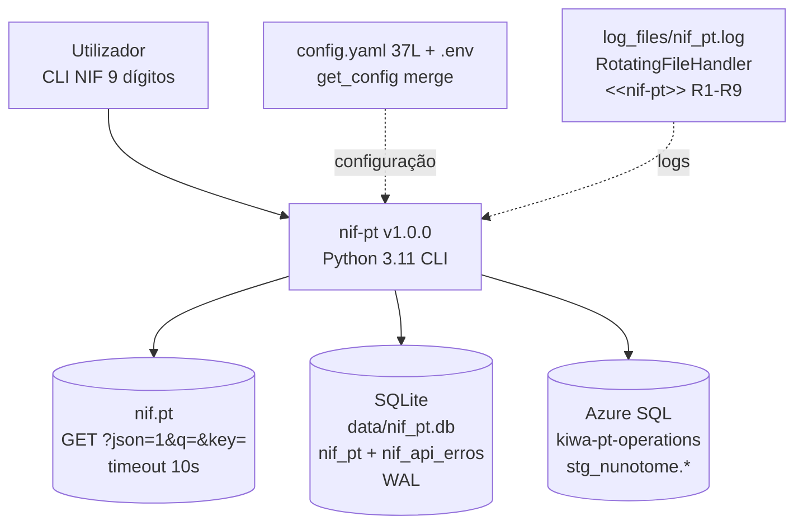
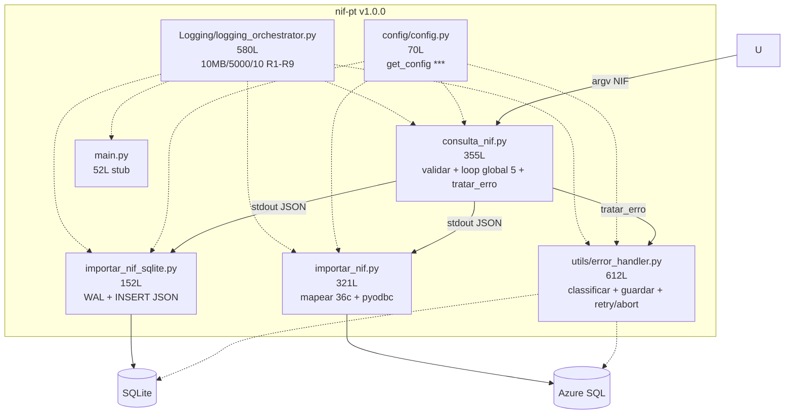
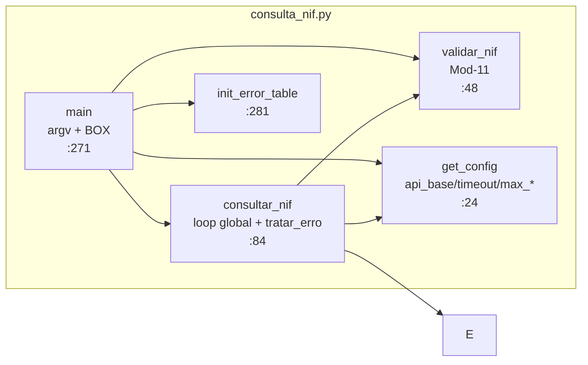
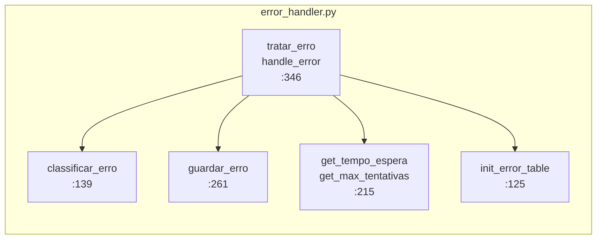
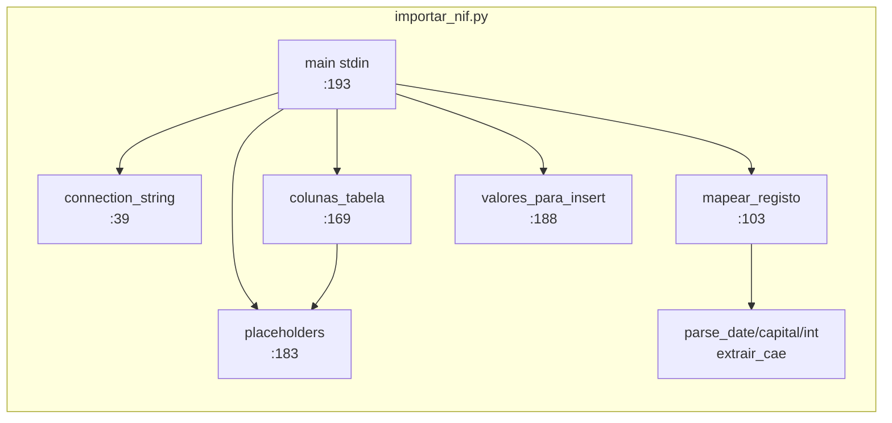

# Arquitetura — nif-pt v1.0.0

> C4 Nível 1-2 + ADRs (8). Diagramas fonte em [diagrams.md](diagrams.md) + [../technical.md](../technical.md).

## 1. Contexto (C4 Nível 1)



| Ator / Sistema | Descrição |
|---|---|
| Utilizador | `python consulta_nif.py <NIF>` + pipe `| python importar_*.py` |
| nif-pt | Valida Mod-11, consulta com retry per-tipo+global, persiste, loga R1-R9 |
| nif.pt | `GET http://www.nif.pt/?json=1&q=&key=` |
| SQLite | `nif_pt` 4c JSON bruto + `nif_api_erros` 14c WAL |
| Azure SQL | `nif_pt` 37c PK nif + `nif_pt_stg` 40c + `nif_api_erros` 14c |

## 2. Contentores (C4 Nível 2)



| Contentor | Linhas | Responsabilidade | Estado v1.0.0 |
|---|---|---|---|
| `consulta_nif.py` | 355 | `validar_nif` Mod-11 + `requests.get` + loop `max_global+1` + `tratar_erro` + BOX | ✅ |
| `utils/error_handler.py` | 612 | `classificar_erro` 6 tipos + `tratar_erro` `retry 60s/3600s` vs `abort` + `guardar_erro` WAL | ✅ |
| `importar_nif_sqlite.py` | 152 | `get_db` WAL + `INSERT (nif,dados,data_consulta)` + `BOX` | ✅ |
| `importar_nif.py` | 321 | `mapear_registo` 36c + `connection_string` ODBC 18 + `INSERT` staging | ✅ |
| `config/config.py` | 70 | `get_config()` merge `default< script <.env` + `***` mascarado | ✅ |
| `Logging/logging_orchestrator.py` | 580 | `RotatingFileHandler` + 9 estilos R1-R9, `<<nif-pt>>` | ✅ |
| `main.py` | 52 | Stub `BANNER_APP` + `BOX` ajuda | 🚧 futuro `cli.py` |

*`api/`, `models/`, `scrapers/` reservados v0.4.*

## 3. Componentes — `consulta_nif.py`



| Função | Linha | Descrição |
|---|---|---|
| `validar_nif(nif:str)->bool` | `:48` | `Σ d*(9-i)%11` → digito controlo |
| `consultar_nif(nif:str)->dict` | `:84` | 6 ramos + loop `max_global+1` + `tentativas_por_tipo` + `tratar_erro` |
| `main()` | `:271` | `argv` + `init_error_table()` + `json.dumps` + BOX/TIMING |

## 4. Componentes — `utils/error_handler.py`



| Função | Linha | Descrição |
|---|---|---|
| `classificar_erro(data:dict)->str` | `:139` | `Limit per minute/hour/day/month/paid` + `generic/unknown` via `left` |
| `tratar_erro(nif,data,...)->dict` | `:346` | `{tipo,acao,espera,deve_retry,max_tipo,max_global}` com `&&` |
| `guardar_erro(...)->int|None` | `:261` | `INSERT nif_api_erros` WAL 14c |
| `init_error_table()->None` | `:125` | DDL idempotente |
| `get_tempo_espera(tipo)->int` | `:215` | 60 / 3600 / 0 do `config.yaml` |
| `get_max_tentativas(tipo)->int` | `:226` | 3 / 2 / 0 do `config.yaml` |

## 5. Componentes — `importar_nif.py`



## 6. Fluxo de Dados

```
[CLI NIF] → validar_nif() → get_config() → init_error_table() → requests.get(?json=1&q=&key=, timeout 10)
         → tratar_erro() [retry 60s/3600s | abort] → guardar_erro() WAL → records[nif] → stdout JSON
         → stdin → (SQLite JSON | Azure 36c) → BOX + log_files/nif_pt.log (stderr)
```

`stderr` não quebra pipe; `tipo_erro` só em erro classificado.

## 7. ADRs

### ADR-001 — SQLite JSON bruto vs Azure 36c

* **Decisão:** SQLite `dados TEXT` schemaless (`importar_nif_sqlite.py:32`); Azure 36c (`sql/01_criar_tabelas.sql:21`).
* **Conseq.:** SQLite resiste a mudanças; Azure analítico. 36 = 37-1 = 40-4.

### ADR-002 — `PRAGMA WAL`

* **Decisão:** `importar_nif_sqlite.py:50` + `utils/error_handler.py:110` `WAL`.
* **Conseq.:** mitigado `database is locked`.

### ADR-003 — `ODBC 18` + `Encrypt=yes`

* **Decisão:** `config.yaml:35` `ODBC Driver 18`, `importar_nif.py:47` `Encrypt=yes;TrustServerCertificate=no`.

### ADR-004 — Pipeline `stdin/stdout`

* **Decisão:** autónomos `sys.stdin.read()` / `stdout` JSON, `main.py` stub.
* **Conseq.:** `tee >( )` não PS — ver `MANUAL.md §6.4`.

### ADR-005 — `get_config()` merge

* **Decisão:** `config.py:30` `default< script <.env` shallow + `NIF-PT-KEY` hífen.

### ADR-006 — `logging_orchestrator` integrado

* **Decisão:** `Logging/logging_orchestrator.py:226` `setup_logging()` em todos os scripts, `<<nif-pt>>`, `nif_pt.log`, R1-R9.

### ADR-007 — `error_handler` + `nif_api_erros`

* **Decisão:** 6 tipos `rate_limit_*`, dual SQLite/Azure `sql/02_criar_tabela_erros.sql` 14c, `retry 60s/3600s` com `max_tentativas_*`.
* **Conseq.:** auditoria + resiliência com `tentativas_por_tipo` + `tentativa_global` (`&&`).

### ADR-008 — `NIF-PT-KEY` hífen

* **Decisão:** fidelidade ao portal; frágil — futuro `NIF_PT_KEY` normalizado.

## 8. Roadmap

| Versão | Foco |
|--------|------|
| `v1.0.0` ✅ | `error_handler` + `nif_api_erros` + `logging_orchestrator` + `timeout 10s` + docs v1.0.0 |
| `v1.1` | `cli.py --nif --to {sqlite,azure,both}` + `usp_merge_nif_pt` |
| `v1.2` | `api/` FastAPI + `models/` Pydantic + `tests/` |

## 9. Referências

* `consulta_nif.py:48` `validar_nif` · `consulta_nif.py:84` `consultar_nif` · `utils/error_handler.py:346` `tratar_erro`
* `sql/01_criar_tabelas.sql:21` 37c · `sql/02_criar_tabela_erros.sql:20` 14c · `docs/technical.md`
