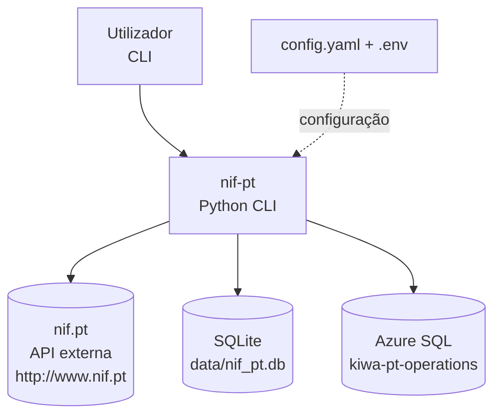
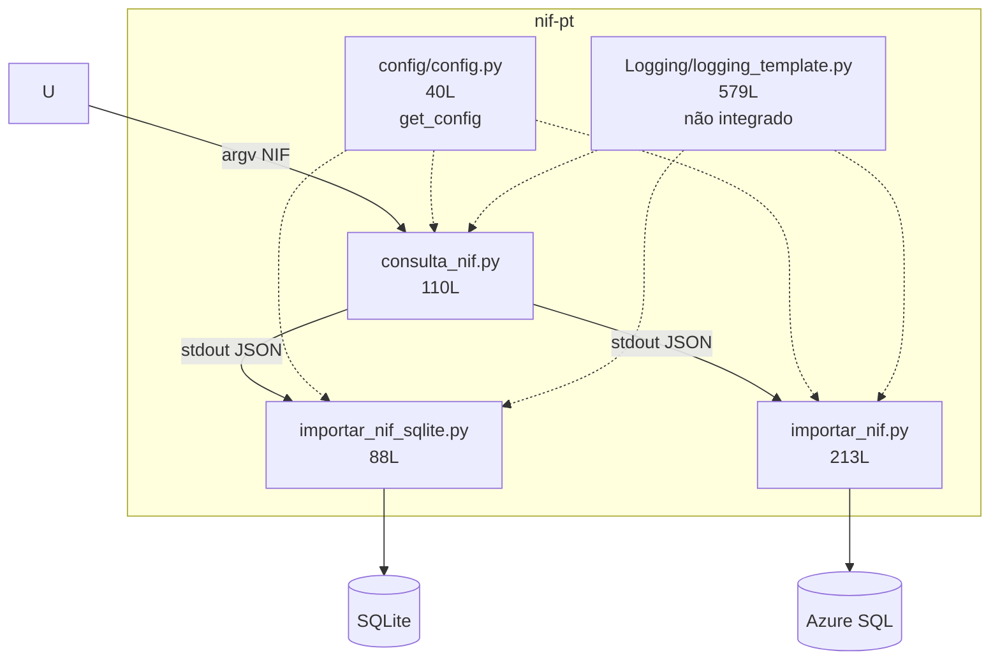
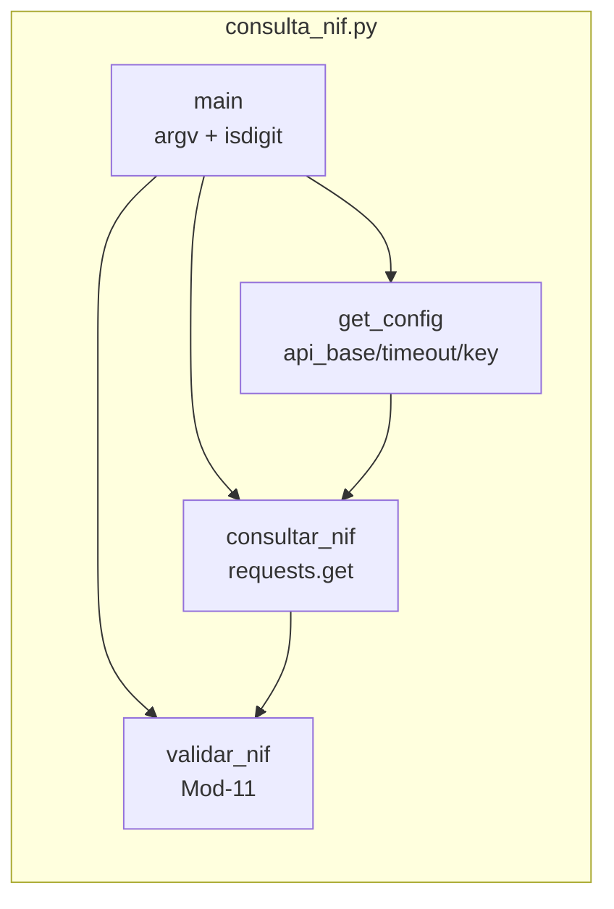
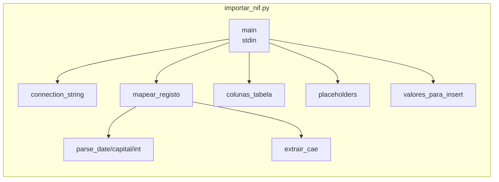

# Arquitetura — nif-pt

> Nível C4 1-2 + ADRs. Diagramas fonte em [diagrams.md](diagrams.md).

## 1. Contexto (C4 Nível 1)



| Ator / Sistema | Descrição |
|----------------|-----------|
| Utilizador | Executa `consulta_nif.py` com NIF de 9 dígitos |
| nif-pt | CLI Python — valida, consulta, normaliza, persiste |
| nif.pt | Fonte pública — `GET ?json=1&q=&key=` |
| SQLite | BD local schemaless (JSON bruto) |
| Azure SQL | BD remota normalizada (`stg_nunotome`) |

## 2. Contentores (C4 Nível 2)



| Contentor | Linhas | Responsabilidade | Estado |
|-----------|--------|-----------------|--------|
| `consulta_nif.py` | 110 | Validação Mod-11 + `requests.get` + JSON normalizado | ✅ Funcional |
| `importar_nif_sqlite.py` | 88 | `PRAGMA WAL` + `INSERT (nif, dados, data_consulta)` | ✅ |
| `importar_nif.py` | 213 | `mapear_registo()` 36 cols + `pyodbc` INSERT | ✅ |
| `config/config.py` | 40 | `get_config()` merge `default< script <.env` | ✅ |
| `Logging/logging_template.py` | 579 | `RotatingFileHandler`, 9 estilos | 🚧 Template |
| `main.py` | 7 | Stub `print` | 🚧 Legado |

* `api/`, `models/`, `scrapers/`, `utils/` vazios — reservados `v0.3`.*

## 3. Componentes — `consulta_nif.py`



| Função | Linhas | Descrição |
|--------|--------|-----------|
| `validar_nif(nif:str)->bool` | `consulta_nif.py:26` | `Σ d*(9-i)%11` → dígito controlo |
| `consultar_nif(nif:str)->dict` | `consulta_nif.py:38` | 6 ramos de retorno, sempre `nif/valido/fonte/erro/dados/creditos` |
| `main()` | `consulta_nif.py:88` | CLI `sys.argv`, `isdigit`, `json.dumps` |

## 4. Componentes — `importar_nif.py`



| Função | Linhas | Descrição |
|--------|--------|-----------|
| `connection_string()` | `importar_nif.py:34` | `DRIVER={ODBC Driver 18};SERVER=...;Encrypt=yes` |
| `mapear_registo()` | `importar_nif.py:83` | Desembrulha `dados.{place,geo,contacts,structure}` + `creditos` → 36 keys |
| `colunas_tabela()` | `importar_nif.py:132` | Lista 36 colunas (sem `id/data_*` DEFAULT) |
| `parse_date/int/capital` | `importar_nif.py:54` | Conversões com `try/except→None` |

## 5. Fluxo de Dados

```
[CLI NIF] → validar_nif() → get_config() → requests.get(?json=1&q=&key=) → records[nif] → stdout JSON → stdin → (SQLite JSON bruto | Azure 36 cols)
                ↓ exit 1 se isdigit falha               ↓ exit 1 se erro/timeout/rede
```

* `stderr` mensagens humanas, `stdout` só JSON — permite `| python importar_*.py`.

## 6. Decisões de Arquitetura (ADRs)

### ADR-001 — SQLite JSON bruto vs Azure normalizado

* **Contexto:** necessidade de flexibilidade (API muda) vs queries analíticas.
* **Decisão:** SQLite guarda `dados TEXT` (schemaless, `importar_nif_sqlite.py:27` 4 cols); Azure normaliza 36 cols (`sql/01_criar_tabelas.sql:21` 37 vs `:93` 40).
* **Consequências:** SQLite resiste a mudanças, Azure permite `SELECT title, cae WHERE geo_region='Porto'`. Divergência documentada em `MANUAL.md` §7 e `docs/database/schema.md`.
* **Alternativa descartada:** normalizar ambos — quebraria com novos campos da API.

### ADR-002 — `PRAGMA journal_mode=WAL`

* **Decisão:** `importar_nif_sqlite.py:40` ativa WAL.
* **Consequências:** mitiga `database is locked`; permite leitura concorrente. Não elimina necessidade de `busy_timeout` em carga alta.

### ADR-003 — `ODBC Driver 18` + `Encrypt=yes`

* **Decisão:** `config.yaml:26` `sql_driver: ODBC Driver 18 for SQL Server`, `importar_nif.py:34` `Encrypt=yes;TrustServerCertificate=no`.
* **Consequências:** exige instalação manual; compatível com Azure SQL atual. Driver 17 exigiria `TrustServerCertificate=yes`.

### ADR-004 — Pipeline `stdin`/`stdout` (vs `main.py` orquestrador)

* **Decisão:** cada script autónomo com `sys.stdin.read()` / `sys.stdout` JSON, `main.py:1` stub legado mantido.
* **Consequências:** composição Unix (`tee`, `|`), testabilidade, mas `tee >( )` não portável para PowerShell (ver `MANUAL.md` §6.4).
* **Futuro:** `v0.3` `cli.py` com `argparse` (`--nif`, `--to {sqlite,azure,both}`) orquestrará sem `tee`.

### ADR-005 — Configuração centralizada `config/config.py`

* **Decisão:** `get_config(script_name)` funde `default` + bloco do script + `os.getenv` (`config.py:29` `config.update(script_config)` shallow merge).
* **Consequências:** `.env` só segredos, `config.yaml` versionado. Limitação: shallow merge, `open(yaml)` sem `encoding='utf-8'`, `NIF-PT-KEY` com hífen frágil.

### ADR-006 — Template logging não integrado

* **Decisão:** `Logging/logging_template.py:1` 579L com `RotatingFileHandler` custom, 9 estilos (`BANNER_APP`, `TAG`, `TIMING`), mantido como template sem `import` nos scripts.
* **Consequências:** erros só em `stderr`; `log_files/` não existe; prefixo `<<eqs>>` legado. Roadmap `v0.3` integra com `setup_logging()`.

## 7. Roadmap

| Versão | Foco |
|--------|------|
| `v0.2.1` | Fix `requirements.txt`, `README`, `CHANGELOG`, `docs/` (este) |
| `v0.3.0` | `cli.py` orquestrador, logging integrado, `NIF-PT-KEY` → `NIF_PT_KEY`, `timeout:10` |
| `v0.4.0` | `api/` FastAPI, `models/` Pydantic, `scrapers/` fallback HTML, `tests/` |
| `v1.0.0` | `MERGE` staging→prod, `retry_count`/`tempo_de_espera`, `mkdocs` |

## 8. Referências

* `consulta_nif.py:21` `get_config("consulta_nif")`, `importar_nif.py:23` `get_config("importar_nif")`
* `sql/01_criar_tabelas.sql:8` `CREATE SCHEMA stg_nunotome`
* `MANUAL.md` §2, `docs/database/schema.md`, `docs/api/nif-pt-api.md`
