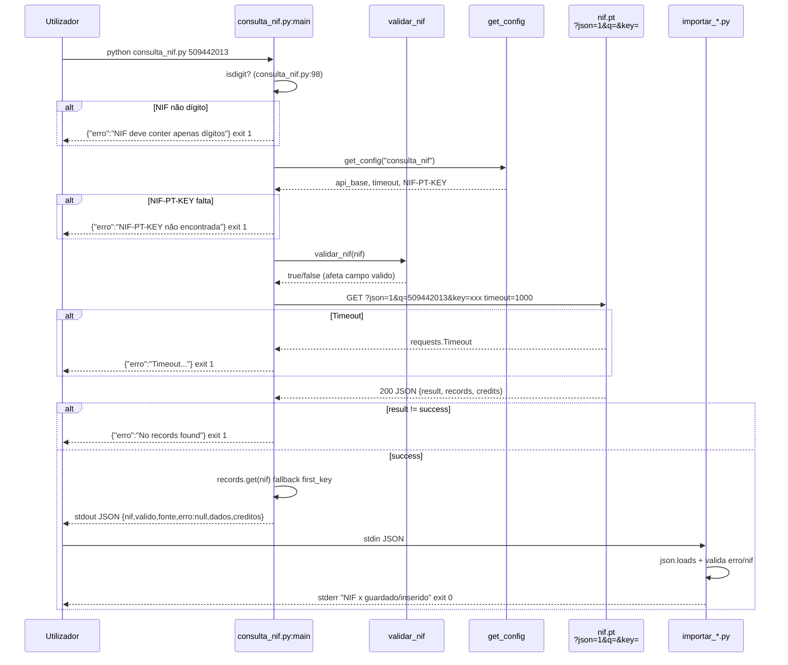
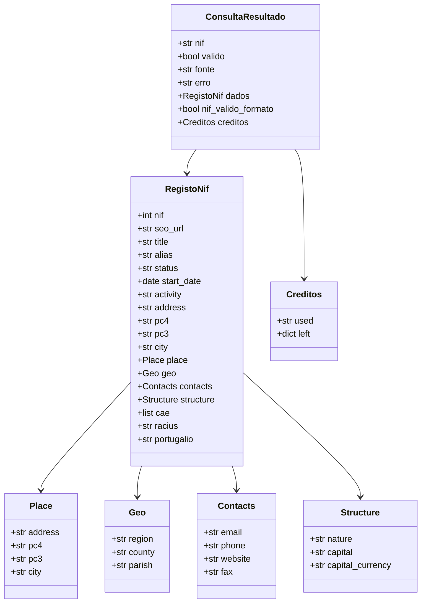
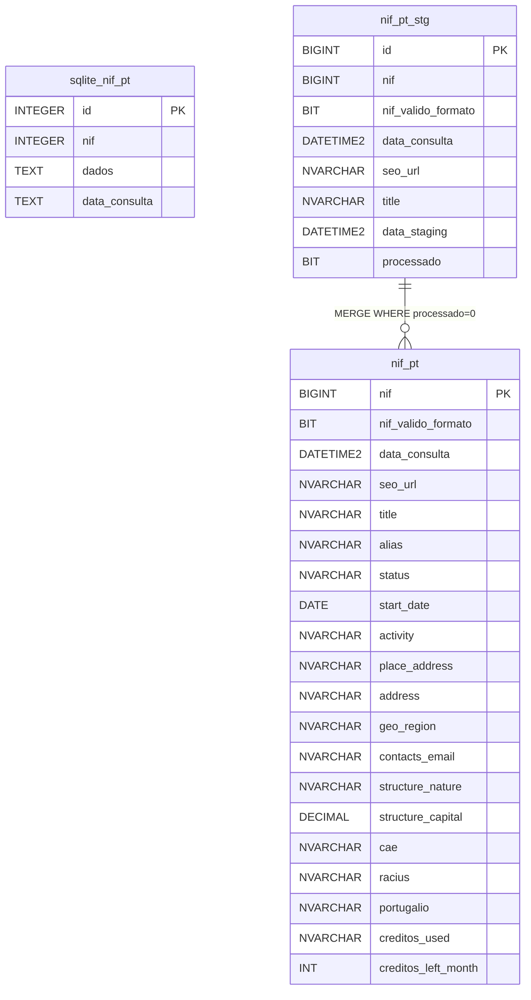
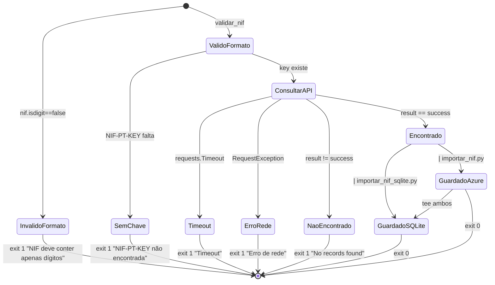
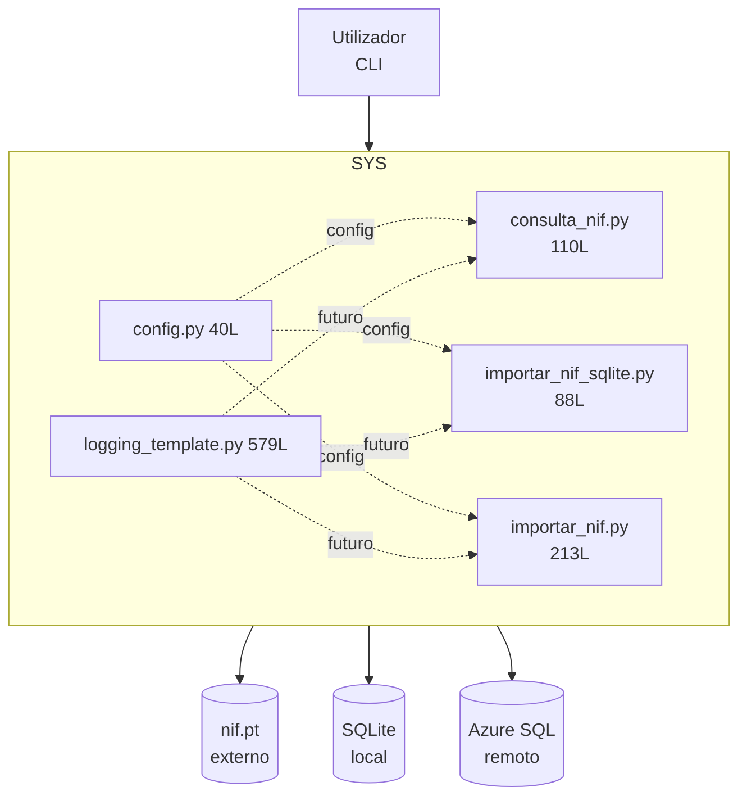
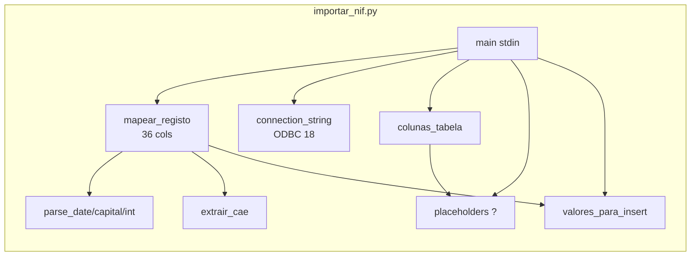

# Diagramas — nif-pt

> Fonte única de todos os diagramas Mermaid. Copiar para https://mermaid.live para validar. Referenciados em `MANUAL.md`, `architecture.md`, `schema.md`.

## 1. Pipeline (graph LR)

```mermaid
graph LR
    U[Utilizador<br/>NIF 9 dígitos] --> C[consulta_nif.py<br/>validar_nif + requests]
    C -->|stdout JSON<br/>ensure_ascii=False| S[importar_nif_sqlite.py<br/>JSON bruto]
    C -->|stdout JSON| A[importar_nif.py<br/>36 cols normalizadas]
    S --> DB1[(data/nif_pt.db<br/>id, nif, dados, data_consulta<br/>PRAGMA WAL)]
    A --> DB2[(Azure SQL<br/>stg_nunotome.nif_pt_stg<br/>40 cols)]
    DB2 -. MERGE futuro .-> DB3[(stg_nunotome.nif_pt<br/>37 cols PK nif)]
    CFG[config.yaml + .env<br/>get_config()] -.-> C & S & A
```

## 2. Sequência — Consulta (sequenceDiagram)



## 3. Atividades — Validação e Request (graph TD)

```mermaid
graph TD
    A[argv NIF] --> B{nif.isdigit?}
    B -- não --> E1[erro + exit 1]
    B -- sim --> C[get_config<br/>api_base, timeout, key]
    C --> D{API_KEY existe?}
    D -- não --> E2[erro NIF-PT-KEY + exit 1]
    D -- sim --> F[validar_nif Mod-11<br/>Σ d*(9-i)%11]
    F --> G[requests.get<br/>?json=1&q=&key= timeout]
    G --> H{raise_for_status<br/>resp.json}
    H -- Timeout/RequestException --> E3[erro rede + exit 1]
    H -- JSONDecodeError --> E4[erro não JSON + exit 1]
    H -- ok --> I{result == success?}
    I -- não --> E5[erro result + exit 1]
    I -- sim --> J[records.get nif fallback]
    J --> K[return dict<br/>valido, fonte, dados, creditos]
    K --> L[print json.dumps stdout<br/>exit 0/1 conforme erro]
```

## 4. Classes de Domínio (classDiagram)



*Mapeado por `importar_nif.py:83` `mapear_registo()` → 36 colunas.*

## 5. ER (erDiagram)



## 6. Estados do NIF (stateDiagram-v2)



## 7. Contentores C4 (graph TB)



## 8. Componentes — `importar_nif.py` (graph LR)



*Todos os diagramas validados para `mermaid.live` (graph/sequenceDiagram/classDiagram/erDiagram/stateDiagram).*
