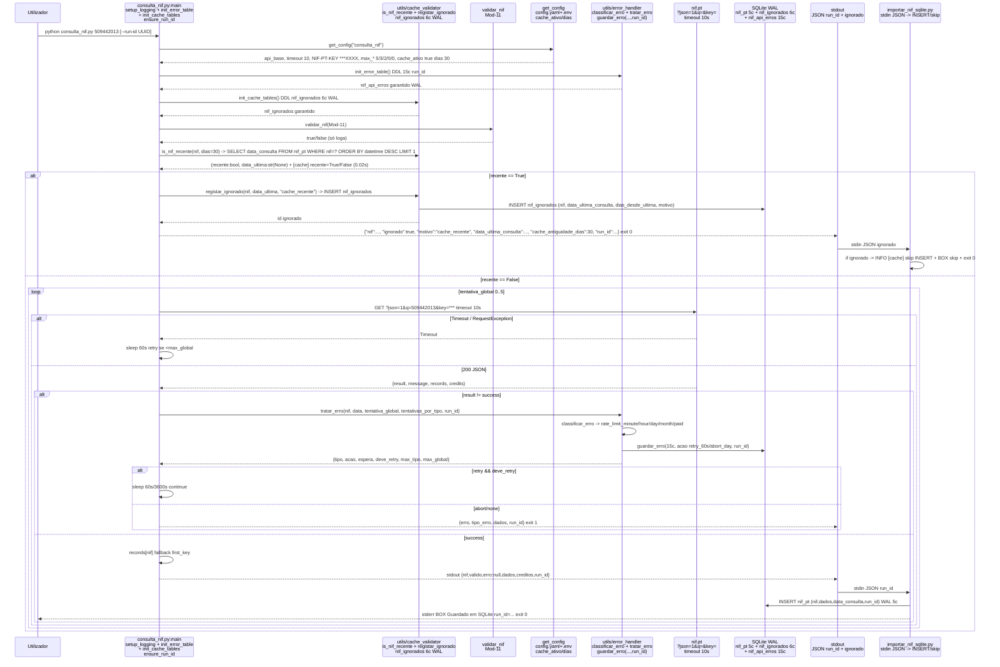
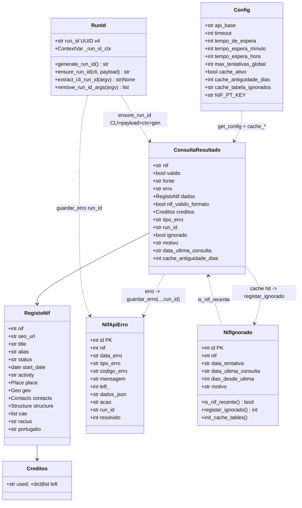
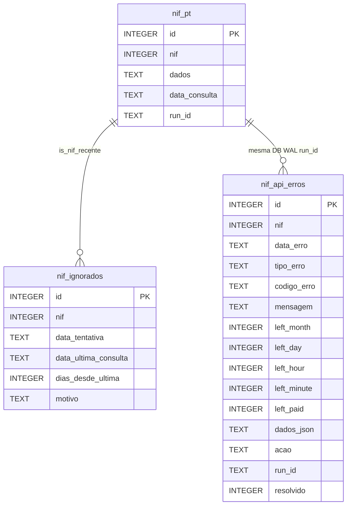
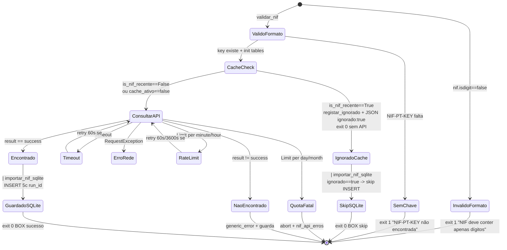
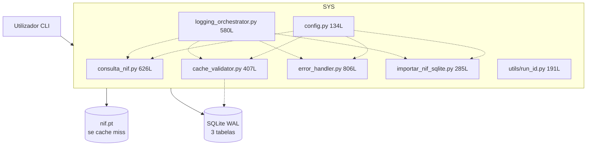

# Diagramas — nif-pt v1.2.0

> Fonte Mermaid única. Validar em https://mermaid.live. Referenciados em `MANUAL.md`, `architecture.md`, `technical.md`. Atualizado para cache + só SQLite.

## 1. Pipeline — cache + run_id (graph LR)

```mermaid
graph LR
    U[Utilizador<br/>NIF 9 dígitos] --> C[consulta_nif.py<br/>validar_nif + cache<br/>retry per-tipo+global<br/>run_id UUID v4]
    C -->|cache hit<br/>is_nif_recente==True| IG[(nif_ignorados<br/>6c cache_recente<br/>WAL)]
    C -->|stdout JSON ignorado<br/>ignorado:true motivo:cache_recente| S[importar_nif_sqlite.py<br/>early skip INSERT]
    C -->|stdout JSON run_id<br/>ensure_ascii=False<br/>cache miss| S2[importar_nif_sqlite.py<br/>JSON bruto WAL 5c run_id]
    C -->|erro classificado run_id| E[(nif_api_erros<br/>SQLite 15c run_id idx)]
    C -->|cache miss| API[(nif.pt<br/>GET ?json=1&q=&key=)]
    S2 --> DB[(data/nif_pt.db<br/>nif_pt 5c + nif_api_erros 15c<br/>+ nif_ignorados 6c<br/>PRAGMA WAL)]
    IG --> DB
    E --> DB
    CV[utils/cache_validator.py<br/>is_nif_recente + registar_ignorado<br/>DDL 6c 2 índices] -. cache .-> C
    CFG[config.yaml 31L + .env<br/>get_config merge cache_*] -.-> C & S2 & E & CV
    LOG[logging_orchestrator<br/>R1-R9 <<nif-pt>> [cache][run]] -.-> C & S2 & E & CV
    RID[utils/run_id.py<br/>generate_run_id + ContextVar<br/>--run-id > payload > ctx > uuid] -. run_id .-> C & S2 & E
```

## 2. Sequência — Consulta com cache + retry + run_id (sequenceDiagram)



## 3. Atividades — Validação + cache + request com error_handler (graph TD)

```mermaid
graph TD
    A[argv NIF --run-id] --> R0[ensure_run_id cli_value<br/>extract_cli_run_id + remove_run_id_args]
    R0 --> B{nif.isdigit?}
    B -- não --> E1[erro + run_id + exit 1]
    B -- sim --> C[get_config<br/>api_base, timeout 10, cache_ativo/dias, max_*]
    C --> D{API_KEY existe?}
    D -- não --> E2[erro NIF-PT-KEY + run_id + exit 1]
    D -- sim --> F[init_error_table WAL 15c<br/>+ init_cache_tables WAL 6c]
    F --> G[validar_nif Mod-11<br/>Σ d*(9-i)%11]
    G --> CC{cache_ativo?}
    CC -- não --> H[Loop tentativa_global 0..5]
    CC -- sim --> CH[is_nif_recente nif dias<br/>SELECT nif_pt ORDER BY datetime DESC LIMIT 1<br/>parse YYYY-MM-DD HH:MMSS / ISO]
    CH --> CR{recente?}
    CR -- sim recente=True --> CI[registar_ignorado<br/>INSERT nif_ignorados<br/>dias_desde_ultima + motivo cache_recente]
    CI --> CO[stdout JSON ignorado:true<br/>motivo cache_recente<br/>data_ultima_consulta + cache_antiguidade_dias<br/>+ run_id + BOX cache + exit 0]
    CR -- não recente=False --> H
    CH -- erro BD fail-open --> H
    H --> I[requests.get<br/>?json=1&q=&key= timeout 10s]
    I --> J{raise_for_status<br/>resp.json}
    J -- Timeout/RequestException --> K[retry rede 60s<br/>se <max_global]
    K --> H
    J -- JSONDecodeError --> E4[erro não JSON + run_id + exit 1]
    J -- ok --> L{result == success?}
    L -- não --> M[classificar_erro<br/>guardar_erro WAL run_id]
    M --> N{tipo + limite?}
    N -- minute tenta<3 && global<5 --> O1[sleep 60s retry]
    N -- hour tenta<2 && global<5 --> O2[sleep 3600s retry]
    N -- day/month/paid ou esgotou --> E5[abort tipo_erro + run_id + exit 1]
    O1 --> H
    O2 --> H
    L -- sim --> P[records[nif] fallback]
    P --> Q[stdout JSON<br/>valido true + run_id + BOX]
    Q --> R[Pipe -> importar_nif_sqlite.py<br/>if ignorado: skip INSERT [cache]<br/>else INSERT WAL 5c run_id]
    R --> Z[*]
    CO --> S[Pipe -> importar_nif_sqlite.py<br/>is ignorado -> skip INSERT<br/>BOX NIF ignorado - skip]
    S --> Z
    E1 --> Z
    E2 --> Z
    E4 --> Z
    E5 --> Z
```

## 4. Classes de Domínio (classDiagram)



*Cache: `is_nif_recente()` lê `nif_pt`; `registar_ignorado()` escreve `nif_ignorados` 6c; ` consulta_nif.main` decide `ignorado:true` antes de API.*

## 5. ER (erDiagram) v1.2.0



## 6. Estados do NIF (stateDiagram-v2) — com cache



## 7. Contentores C4 (graph TB)



## 8. Componentes — `importar_nif_sqlite.py` + `cache_validator` (graph LR)

```mermaid
graph LR
    subgraph importar_nif_sqlite.py 285L
        GD[get_db WAL 5c run_id]
        MS[main stdin run_id<br/>early skip ignorado]
    end
    subgraph cache_validator.py 407L
        IR[is_nif_recente<br/>SELECT nif_pt]
        RG[registar_ignorado<br/>INSERT nif_ignorados]
        IT[init_cache_tables<br/>DDL 6c WAL]
        PC[_parse_data_consulta]
    end
    MS --> IR
    IR --> PC
    MS --> RG
    MS --> GD
    MS -->|ignorado==true| SKIP[skip INSERT BOX [cache]]
    IT --> GD
```

*Todos os diagramas validados em `mermaid.live` (graph/sequence/class/er/state). Ver `docs/technical.md` para catálogo file:line.*
