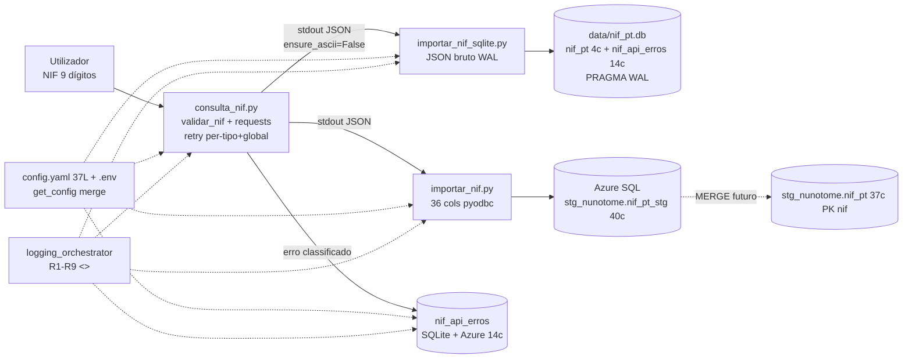
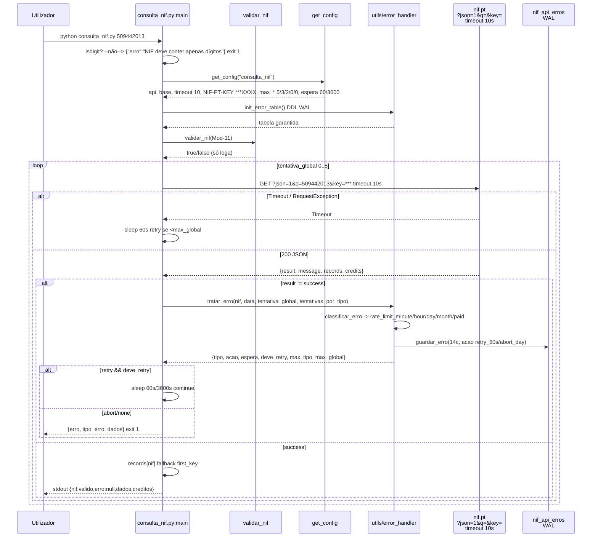
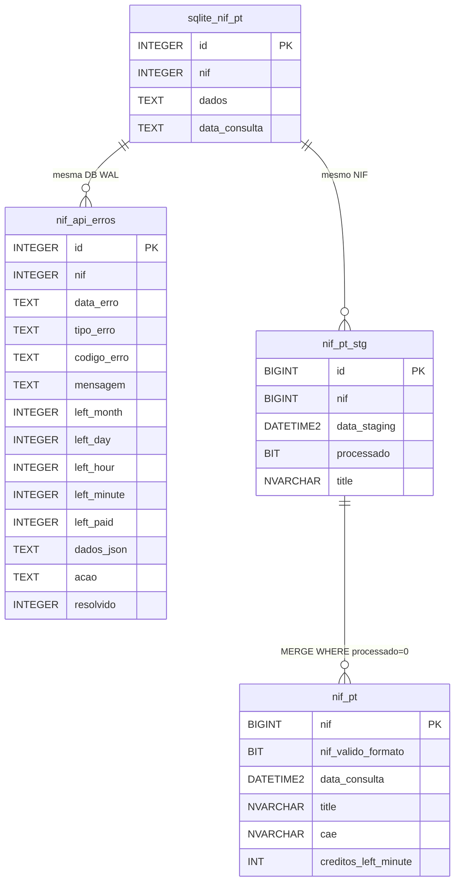
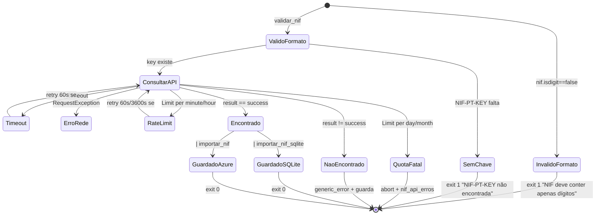
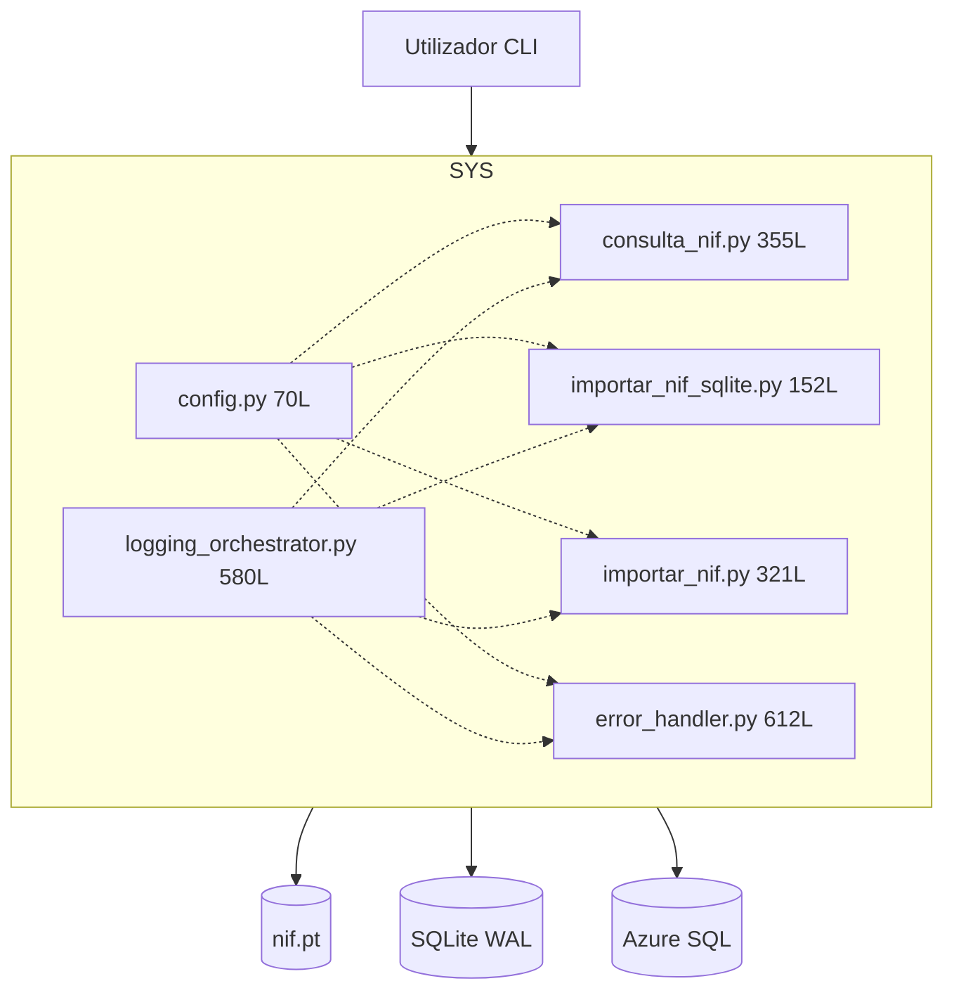
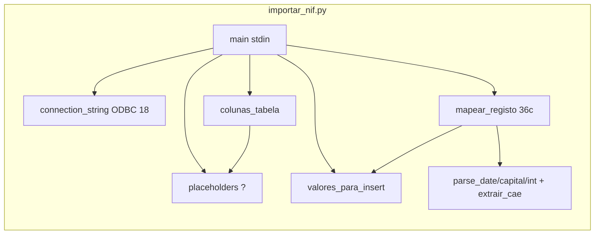

# Diagramas — nif-pt v1.0.0

> Fonte Mermaid única. Validar em https://mermaid.live. Referenciados em `MANUAL.md`, `architecture.md`, `technical.md`.

## 1. Pipeline (graph LR)



## 2. Sequência — Consulta com retry e camada de erro (sequenceDiagram)



## 3. Atividades — Validação e request com error_handler (graph TD)

```mermaid
graph TD
    A[argv NIF] --> B{nif.isdigit?}
    B -- não --> E1[erro + exit 1]
    B -- sim --> C[get_config<br/>api_base, timeout 10, max_*]
    C --> D{API_KEY existe?}
    D -- não --> E2[erro NIF-PT-KEY + exit 1]
    D -- sim --> F[init_error_table<br/>WAL]
    F --> G[validar_nif Mod-11<br/>Σ d*(9-i)%11]
    G --> H[Loop tentativa_global 0..5<br/>tentativas_por_tipo dict]
    H --> I[requests.get<br/>?json=1&q=&key= timeout 10s]
    I --> J{raise_for_status<br/>resp.json}
    J -- Timeout/RequestException --> K[retry rede 60s<br/>se <max_global]
    K --> H
    J -- JSONDecodeError --> E4[erro não JSON + exit 1]
    J -- ok --> L{result == success?}
    L -- não --> M[classificar_erro<br/>guardar_erro WAL]
    M --> N{tipo + limite?}
    N -- minute tenta<3 && global<5 --> O1[sleep 60s retry]
    N -- hour tenta<2 && global<5 --> O2[sleep 3600s retry]
    N -- day/month/paid ou esgotou --> E5[abort tipo_erro + exit 1]
    O1 --> H
    O2 --> H
    L -- sim --> P[records[nif] fallback]
    P --> Q[stdout JSON<br/>valido true + BOX]
    Q --> R[Pipe -> importar_*.py<br/>INSERT WAL/Azure]
    R --> Z[*]
```

## 4. Classes de Domínio (classDiagram)

```mermaid
classDiagram
    class ConsultaResultado {
        +str nif
        +bool valido
        +str fonte
        +str erro
        +RegistoNif dados
        +bool nif_valido_formato
        +Creditos creditos
        +str tipo_erro
    }
    class RegistoNif {
        +int nif
        +str seo_url
        +str title
        +str alias
        +str status
        +date start_date
        +str activity
        +Place place
        +Geo geo
        +Contacts contacts
        +Structure structure
        +list cae
        +str racius
        +str portugalio
    }
    class Place { +str address; +str pc4; +str pc3; +str city }
    class Geo { +str region; +str county; +str parish }
    class Contacts { +str email; +str phone; +str website; +str fax }
    class Structure { +str nature; +str capital; +str capital_currency }
    class Creditos { +str used; +dict|list left }
    class NifApiErro {
        +int id PK
        +int nif
        +str data_erro
        +str tipo_erro
        +str codigo_erro
        +str mensagem
        +int left_*
        +str dados_json
        +str acao
        +int resolvido
    }
    ConsultaResultado --> RegistoNif
    RegistoNif --> Place & Geo & Contacts & Structure
    ConsultaResultado --> Creditos
    ConsultaResultado ..> NifApiErro : guardar_erro
```

*Mapeado por `importar_nif.py:103` `mapear_registo()` → 36c; `NifApiErro` via `guardar_erro()` 14c.*

## 5. ER (erDiagram) v1.0.0



## 6. Estados do NIF (stateDiagram-v2)



## 7. Contentores C4 (graph TB)



## 8. Componentes — `importar_nif.py` (graph LR)



*Todos os diagramas validados em `mermaid.live` (graph/sequence/class/er/state). Ver `docs/technical.md` para catálogo file:line.*
