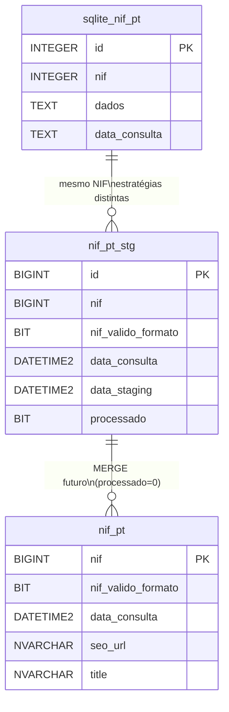

# Esquemas de Base de Dados — nif-pt

> Fonte única: `sql/01_criar_tabelas.sql` (157L) + `importar_nif_sqlite.py:27` DDL inline + `importar_nif.py:132` `colunas_tabela()`.

## 1. Visão Geral



| BD | Tabela | Colunas | PK | Histórico | Estratégia |
|----|--------|---------|----|-----------|------------|
| SQLite | `nif_pt` | 4 | `id AUTOINCREMENT` | Sim (sem unicidade `nif`) | JSON bruto schemaless |
| Azure SQL | `nif_pt` | 37 | `nif` | Não (só último) | 36 cols normalizadas |
| Azure SQL | `nif_pt_stg` | 40 | `id IDENTITY` | Sim (`processado`) | Staging + merge |

## 2. SQLite — `data/nif_pt.db` / `nif_pt`

### 2.1 DDL (`importar_nif_sqlite.py:27`)

```sql
CREATE TABLE IF NOT EXISTS nif_pt (
    id              INTEGER PRIMARY KEY AUTOINCREMENT,
    nif             INTEGER NOT NULL,
    dados           TEXT NOT NULL,
    data_consulta   TEXT NOT NULL DEFAULT (datetime('now'))
);
```

### 2.2 Catálogo

| # | Coluna | Tipo | Nulo | Default | Descrição |
|---|--------|------|------|---------|-----------|
| 1 | `id` | `INTEGER` | `NOT NULL` | `AUTOINCREMENT` | PK surrogate WAL |
| 2 | `nif` | `INTEGER` | `NOT NULL` | — | NIF consultado (9 dígitos) |
| 3 | `dados` | `TEXT` | `NOT NULL` | — | `json.dumps(resultado, ensure_ascii=False)` completo |
| 4 | `data_consulta` | `TEXT` | `NOT NULL` | `datetime('now')` | `YYYY-MM-DD HH:MM:SS` (`datetime.now()` em `importar_nif_sqlite.py:74`) |

### 2.3 Propriedades

* `PRAGMA journal_mode=WAL` (`importar_nif_sqlite.py:40`) — mitiga `database is locked`.
* `DB_PATH = Path(__file__).parent / cfg.get("db_path", "data/nif_pt.db")` (`importar_nif_sqlite.py:24`).
* Sem `UNIQUE(nif)` — permite histórico; consultar último com `ORDER BY data_consulta DESC LIMIT 1`.
* Exemplo: `1 registo` (2026-09-10, NIF `509442013`, `12288 bytes`).

### 2.4 Consultas úteis

```sql
-- Histórico completo
SELECT id, nif, data_consulta FROM nif_pt ORDER BY data_consulta DESC;

-- Último registo por NIF
SELECT nif, dados FROM nif_pt WHERE nif = 509442013 ORDER BY data_consulta DESC LIMIT 1;

-- Extrair campo do JSON (json_extract, SQLite 3.38+)
SELECT json_extract(dados, '$.dados.title') AS title FROM nif_pt;

-- Schema
SELECT sql FROM sqlite_master WHERE type='table' AND name='nif_pt';
PRAGMA table_info(nif_pt);
```

## 3. Azure SQL — `stg_nunotome.nif_pt` (37 cols, PK `nif`)

### 3.1 DDL (`sql/01_criar_tabelas.sql:21`)

```sql
CREATE TABLE stg_nunotome.nif_pt (
    nif                     BIGINT          NOT NULL,
    nif_valido_formato      BIT             NULL,
    data_consulta           DATETIME2       NOT NULL DEFAULT GETDATE(),
    consulta_origem         NVARCHAR(50)    NULL DEFAULT 'nif.pt',
    seo_url                 NVARCHAR(255)   NULL,
    title                   NVARCHAR(500)   NULL,
    alias                   NVARCHAR(500)   NULL,
    status                  NVARCHAR(50)    NULL,
    start_date              DATE            NULL,
    activity                NVARCHAR(MAX)   NULL,
    place_address           NVARCHAR(500)   NULL,
    place_pc4               NVARCHAR(10)    NULL,
    place_pc3               NVARCHAR(10)    NULL,
    place_city              NVARCHAR(100)   NULL,
    address                 NVARCHAR(500)   NULL,
    pc4                     NVARCHAR(10)    NULL,
    pc3                     NVARCHAR(10)    NULL,
    city                    NVARCHAR(100)   NULL,
    geo_region              NVARCHAR(100)   NULL,
    geo_county              NVARCHAR(100)   NULL,
    geo_parish              NVARCHAR(100)   NULL,
    contacts_email          NVARCHAR(255)   NULL,
    contacts_phone          NVARCHAR(50)    NULL,
    contacts_website        NVARCHAR(255)   NULL,
    contacts_fax            NVARCHAR(50)    NULL,
    structure_nature        NVARCHAR(50)    NULL,
    structure_capital       DECIMAL(18,2)   NULL,
    structure_capital_currency NVARCHAR(10) NULL,
    cae                     NVARCHAR(500)   NULL,
    racius                  NVARCHAR(500)   NULL,
    portugalio              NVARCHAR(500)   NULL,
    creditos_used           NVARCHAR(50)    NULL,
    creditos_left_month     INT             NULL,
    creditos_left_day       INT             NULL,
    creditos_left_hour      INT             NULL,
    creditos_left_minute    INT             NULL,
    creditos_left_paid      INT             NULL,
    CONSTRAINT pk_nif_pt PRIMARY KEY CLUSTERED (nif)
);
```

### 3.2 Catálogo por grupo

| Grupo | Colunas | Tipos | Fonte API |
|-------|---------|-------|-----------|
| **Chave e controlo** | `nif`, `nif_valido_formato`, `data_consulta`, `consulta_origem` | `BIGINT`, `BIT`, `DATETIME2`, `NVARCHAR(50)` | `resultado.nif`, `resultado.nif_valido_formato`, `GETDATE()`, `resultado.fonte` |
| **Identificação** | `seo_url`, `title`, `alias`, `status`, `start_date`, `activity` | `NVARCHAR(255/500/MAX)`, `DATE` | `dados.seo_url`, `dados.title`, `dados.alias`, `dados.status`, `dados.start_date` (`parse_date`), `dados.activity` (HTML) |
| **Morada place** | `place_address`, `place_pc4`, `place_pc3`, `place_city` | `NVARCHAR(500/10/100)` | `dados.place.*` |
| **Morada address** | `address`, `pc4`, `pc3`, `city` | idem | `dados.address`, `dados.pc4`... (campo adicional da API) |
| **Geo** | `geo_region`, `geo_county`, `geo_parish` | `NVARCHAR(100)` | `dados.geo.*` |
| **Contactos** | `contacts_email`, `contacts_phone`, `contacts_website`, `contacts_fax` | `NVARCHAR(255/50)` | `dados.contacts.*` |
| **Estrutura** | `structure_nature`, `structure_capital`, `structure_capital_currency` | `NVARCHAR(50)`, `DECIMAL(18,2)`, `NVARCHAR(10)` | `dados.structure.*` (`parse_capital` `","→"."`) |
| **CAE** | `cae` | `NVARCHAR(500)` | `dados.cae` (`extrair_cae` `",".join`) |
| **Links** | `racius`, `portugalio` | `NVARCHAR(500)` | `dados.racius`, `dados.portugalio` |
| **Créditos** | `creditos_used`, `creditos_left_*` (5) | `NVARCHAR(50)`, `INT` | `creditos.used`, `creditos.left.*` (`parse_int`) |

*PK `nif` único → só “ouro” (último registo). `DROP TABLE IF EXISTS` no DDL é destrutivo.*

## 4. Azure SQL — `stg_nunotome.nif_pt_stg` (40 cols, PK `id`)

### 4.1 DDL (`sql/01_criar_tabelas.sql:93`)

```sql
CREATE TABLE stg_nunotome.nif_pt_stg (
    id                      BIGINT          IDENTITY(1,1) NOT NULL,
    nif                     BIGINT          NOT NULL,
    nif_valido_formato      BIT             NULL,
    data_consulta           DATETIME2       NOT NULL DEFAULT GETDATE(),
    consulta_origem         NVARCHAR(50)    NULL DEFAULT 'nif.pt',
    data_staging            DATETIME2       NOT NULL DEFAULT GETDATE(),
    processado              BIT             NOT NULL DEFAULT 0,
    -- ... mesmos 30 cols de negócio + 6 creditos do nif_pt ...
    CONSTRAINT pk_nif_pt_stg PRIMARY KEY CLUSTERED (id)
);
```

### 4.2 Diferença `nif_pt` vs `nif_pt_stg`

| Coluna | `nif_pt` | `nif_pt_stg` | Notas |
|--------|----------|--------------|-------|
| `id` | ❌ | ✅ `IDENTITY(1,1)` | PK histórico |
| `data_staging` | ❌ | ✅ `DEFAULT GETDATE()` | Timestamp staging |
| `processado` | ❌ | ✅ `DEFAULT 0` | Flag merge |
| `data_consulta` | ✅ `GETDATE()` | ✅ `GETDATE()` | Em ambos |
| Restantes 36 | ✅ | ✅ | Idênticas |

### 4.3 Coerência Python ↔ SQL

`importar_nif.py:132` `colunas_tabela()` retorna **36** nomes:

```python
["nif", "nif_valido_formato", "consulta_origem",
 "seo_url", "title", "alias", "status", "start_date", "activity",
 "place_address", "place_pc4", "place_pc3", "place_city",
 "address", "pc4", "pc3", "city",
 "geo_region", "geo_county", "geo_parish",
 "contacts_email", "contacts_phone", "contacts_website", "contacts_fax",
 "structure_nature", "structure_capital", "structure_capital_currency",
 "cae", "racius", "portugalio",
 "creditos_used", "creditos_left_month", "creditos_left_day",
 "creditos_left_hour", "creditos_left_minute", "creditos_left_paid"]
```

*36 = 37 (`nif_pt`) -1 (`data_consulta` DEFAULT) = 40 (`nif_pt_stg`) -4 (`id`+`data_consulta`+`data_staging`+`processado`). **Match 100%** — `INSERT` omite intencionalmente colunas com `DEFAULT`.*

## 5. Tipos e Tamanhos

| Tipo SQL | Uso | Exemplo |
|----------|-----|---------|
| `NVARCHAR(10/50/100/255/500/MAX)` | Texto | `title NVARCHAR(500)` |
| `DECIMAL(18,2)` | Capital | `structure_capital` |
| `BIT` | Boolean | `nif_valido_formato`, `processado` |
| `INT` | Créditos | `creditos_left_month` |
| `DATE` | Data | `start_date` (`2010-05-18`) |
| `DATETIME2` | Timestamp | `data_consulta`, `data_staging` |
| `BIGINT` | NIF/ID | `nif` (9 dígitos), `id IDENTITY` |

## 6. Estratégia Staging → Prod (futuro)

```sql
-- Índice recomendado (não no DDL atual):
CREATE INDEX ix_nif_pt_stg_nif_processado
ON stg_nunotome.nif_pt_stg (nif, processado)
WHERE processado = 0;

-- Procedure MERGE futura (esqueleto):
MERGE stg_nunotome.nif_pt AS target
USING (SELECT * FROM stg_nunotome.nif_pt_stg WHERE processado = 0) AS source
ON target.nif = source.nif
WHEN MATCHED THEN UPDATE SET
    title = source.title,
    data_consulta = GETDATE()
    -- ... 34 cols ...
WHEN NOT MATCHED THEN INSERT
    (nif, nif_valido_formato, consulta_origem, seo_url, title, ...)
VALUES
    (source.nif, source.nif_valido_formato, source.consulta_origem, source.seo_url, source.title, ...);

UPDATE stg_nunotome.nif_pt_stg SET processado = 1 WHERE processado = 0;
```

## 7. Histórico DDL

Ver [ddl-history.md](ddl-history.md).

* `v0.1.0-alpha`: `nif_pt` + `nif_pt_stg` com `PRIMARY KEY (nif, data_staging)`.
* `v0.2.0-beta` (`b085cf2`): `id BIGINT IDENTITY` em `nif_pt_stg`, `CREATE SCHEMA IF NOT EXISTS`.
* `Unreleased`: sem alterações DDL.

## 8. Referências

* `sql/01_criar_tabelas.sql:8` `IF NOT EXISTS (SELECT 1 FROM sys.schemas WHERE name = 'stg_nunotome') EXEC('CREATE SCHEMA stg_nunotome')`
* `importar_nif.py:83` `mapear_registo()` + `importar_nif_sqlite.py:27` DDL inline
