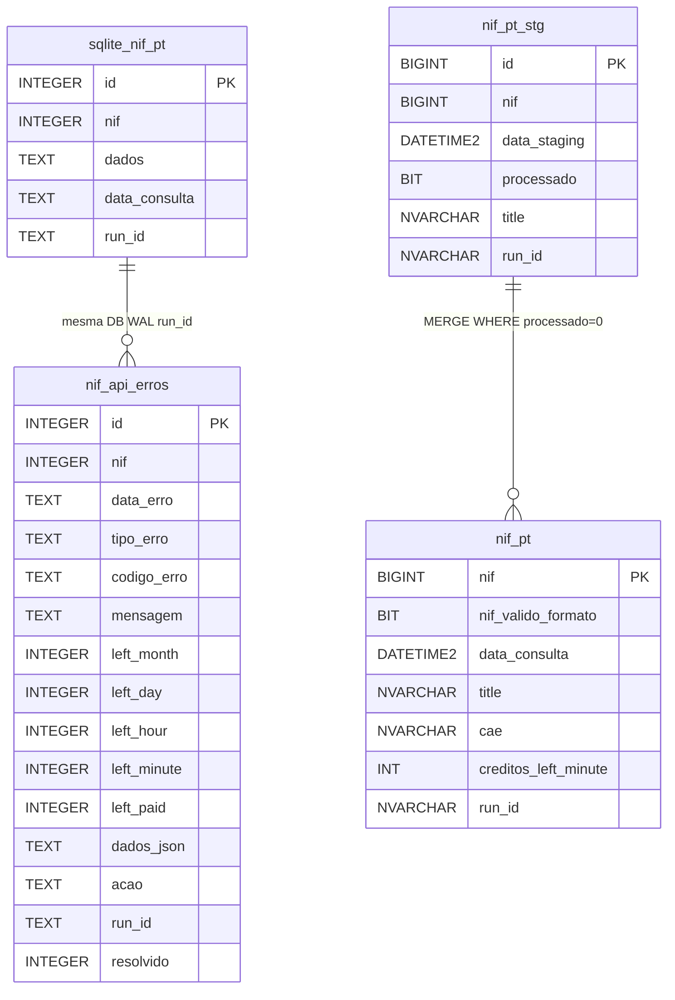

# Esquemas de Base de Dados — nif-pt v1.1.0 (run_id)

> Fonte: `sql/01_criar_tabelas.sql` (169L) + `sql/02_criar_tabela_erros.sql` (47L) + `sql/03_migracao_run_id.sql` (39L) + `importar_nif_sqlite.py:55` + `utils/error_handler.py:46` + `importar_nif.py:334` `colunas_tabela()` + `utils/run_id.py`.

## 1. Visão Geral v1.1.0



| BD | Tabela | Cols | PK | Histórico | Estratégia | DDL |
|----|--------|------|----|-----------|------------|-----|
| SQLite | `nif_pt` | 5 (4+`run_id TEXT`) | `id AUTOINCREMENT` | Sim | JSON bruto + `run_id` | `importar_nif_sqlite.py:55` + `sql/03_migracao_run_id.sql` |
| SQLite | `nif_api_erros` | 15 (14+`run_id TEXT`) | `id AUTOINCREMENT` | Sim | Auditoria + `run_id` | `utils/error_handler.py:46` + `sql/03_migracao_run_id.sql` |
| Azure | `nif_pt` | 38 (37+`run_id NVARCHAR36`) | `nif` | Não (ouro) | 37c normalizadas + `run_id` | `sql/01_criar_tabelas.sql:21` + `sql/03_migracao_run_id.sql:15` |
| Azure | `nif_pt_stg` | 41 (40+`run_id NVARCHAR36`) | `id IDENTITY` | Sim (`processado`) | Staging + merge + `run_id` | `sql/01_criar_tabelas.sql:99` + `sql/03_migracao_run_id.sql:22` |
| Azure | `nif_api_erros` | 15 (14+`run_id NVARCHAR36`) | `id IDENTITY` | Sim (`resolvido`) | Auditoria + `run_id` | `sql/02_criar_tabela_erros.sql:20` + `sql/03_migracao_run_id.sql:30` |

## 2. SQLite — `nif_pt` (5c: 4+`run_id`)

### 2.1 DDL (`importar_nif_sqlite.py:55`)

```sql
CREATE TABLE IF NOT EXISTS nif_pt (
    id            INTEGER PRIMARY KEY AUTOINCREMENT,
    nif           INTEGER NOT NULL,
    dados         TEXT NOT NULL,          -- json.dumps(resultado, ensure_ascii=False)
    data_consulta TEXT NOT NULL DEFAULT (datetime('now')),
    run_id        TEXT                    -- UUID v4 da execução (utils/run_id.py:41)
);
CREATE INDEX IF NOT EXISTS idx_nif_pt_run_id ON nif_pt(run_id);
-- Migração idempotente para BDs antigas (importar_nif_sqlite.py:102):
-- PRAGMA table_info(nif_pt) -> IF "run_id" NOT IN cols THEN ALTER TABLE ADD COLUMN run_id TEXT;
```

| # | Coluna | Tipo | Nulo | Default | Descrição |
|---|--------|------|------|---------|-----------|
| 1 | `id` | `INTEGER` | `NOT NULL` | `AUTOINCREMENT` | PK WAL |
| 2 | `nif` | `INTEGER` | `NOT NULL` | — | NIF 9 dígitos |
| 3 | `dados` | `TEXT` | `NOT NULL` | — | JSON completo `resultado` (inclui `run_id`) |
| 4 | `data_consulta` | `TEXT` | `NOT NULL` | `datetime('now')` | `YYYY-MM-DD HH:MM:SS` (`datetime.now()` em `importar_nif_sqlite.py:223`) |
| 5 | `run_id` | `TEXT` | `NULL` | — | UUID v4 por execução (`utils/run_id.py:41` `generate_run_id()`); índice `idx_nif_pt_run_id` |

* `PRAGMA journal_mode=WAL` (`importar_nif_sqlite.py:95`) · `DB_PATH = Path(...) / cfg.get("db_path", "data/nif_pt.db")` (`:52`) · sem `UNIQUE(nif)` → histórico; último com `ORDER BY data_consulta DESC LIMIT 1` · `json_extract(dados, '$.dados.title')` (SQLite 3.38+) · `run_id` propagado via `ensure_run_id(CLI>payload>ctx>gen)` (`importar_nif_sqlite.py:185`) e `INSERT (...,run_id)` com fallback se coluna falta (`:221`).

## 3. SQLite/Azure — `nif_api_erros` (15c: 14+`run_id`)

### 3.1 DDL SQLite (`utils/error_handler.py:46`)

```sql
CREATE TABLE IF NOT EXISTS nif_api_erros (
    id            INTEGER PRIMARY KEY AUTOINCREMENT,
    nif           INTEGER,
    data_erro     TEXT NOT NULL DEFAULT (datetime('now')),
    tipo_erro     TEXT NOT NULL,      -- rate_limit_minute/hour/day/month/paid/unknown/generic_error
    codigo_erro   TEXT,               -- result da API
    mensagem      TEXT,               -- message da API
    left_month    INTEGER, left_day INTEGER, left_hour INTEGER,
    left_minute   INTEGER, left_paid INTEGER,
    dados_json    TEXT NOT NULL,      -- JSON completo
    acao          TEXT,               -- retry_60s / retry_3600s / abort_day / abort_month / none
    run_id        TEXT,               -- UUID v4 da execução (utils/run_id.py:41)
    resolvido     INTEGER NOT NULL DEFAULT 0
);
CREATE INDEX IF NOT EXISTS idx_nif_api_erros_nif ON nif_api_erros(nif);
CREATE INDEX IF NOT EXISTS idx_nif_api_erros_tipo ON nif_api_erros(tipo_erro);
CREATE INDEX IF NOT EXISTS idx_nif_api_erros_run_id ON nif_api_erros(run_id);
-- Migração idempotente (utils/error_handler.py:153): PRAGMA table_info -> ALTER TABLE ADD COLUMN run_id TEXT se falta
```

### 3.2 DDL Azure (`sql/02_criar_tabela_erros.sql:20`)

```sql
CREATE TABLE stg_nunotome.nif_api_erros (
    id            BIGINT IDENTITY(1,1) NOT NULL,
    nif           BIGINT NULL,
    data_erro     DATETIME2 NOT NULL DEFAULT GETDATE(),
    tipo_erro     NVARCHAR(50) NOT NULL,
    codigo_erro   NVARCHAR(50) NULL,
    mensagem      NVARCHAR(500) NULL,
    left_month    INT NULL, left_day INT NULL, left_hour INT NULL,
    left_minute   INT NULL, left_paid INT NULL,
    dados_json    NVARCHAR(MAX) NOT NULL,
    acao          NVARCHAR(50) NULL,
    run_id        NVARCHAR(36) NULL,       -- UUID v4 da execução
    resolvido     BIT NOT NULL DEFAULT 0,
    CONSTRAINT pk_nif_api_erros PRIMARY KEY CLUSTERED (id)
);
CREATE INDEX ix_nif_api_erros_nif ON stg_nunotome.nif_api_erros(nif);
CREATE INDEX ix_nif_api_erros_tipo ON stg_nunotome.nif_api_erros(tipo_erro);
CREATE INDEX ix_nif_api_erros_data ON stg_nunotome.nif_api_erros(data_erro);
CREATE INDEX ix_nif_api_erros_run_id ON stg_nunotome.nif_api_erros(run_id);
-- Migração idempotente para BDs existentes: sql/03_migracao_run_id.sql:30
```

### 3.3 Catálogo `nif_api_erros` (15c)

| Grupo | Colunas | Tipos | Fonte |
|-------|---------|-------|-------|
| Chave | `id`, `nif`, `data_erro`, `resolvido` | `BIGINT/INTEGER`, `DATETIME2/TEXT`, `BIT/INTEGER` | `nif`, `GETDATE()`/`datetime('now')`, `0` |
| Classificação | `tipo_erro`, `codigo_erro`, `mensagem`, `acao` | `NVARCHAR(50)/TEXT` | `classificar_erro()` + `tratar_erro()` |
| Quota | `left_month/day/hour/minute/paid` | `INT/INTEGER` | `data["credits"]["left"]` |
| Auditoria | `dados_json` | `NVARCHAR(MAX)/TEXT` | `json.dumps(data, ensure_ascii=False)` |
| Rastreabilidade | `run_id` | `NVARCHAR(36)/TEXT` | `utils/run_id.py:41` `generate_run_id()` + `ensure_run_id()` + `guardar_erro(...,run_id)` |

Consultas úteis:

```sql
-- Últimos erros por tipo
SELECT tipo_erro, COUNT(*) FROM nif_api_erros GROUP BY tipo_erro;
-- Rate-limit minuto com retry
SELECT nif, mensagem, left_minute, acao, data_erro, substr(run_id,1,8) FROM nif_api_erros WHERE tipo_erro='rate_limit_minute' ORDER BY data_erro DESC;
-- Por run_id (agrupa retries da mesma execução)
SELECT tipo_erro, acao, run_id, COUNT(*) FROM nif_api_erros GROUP BY run_id, tipo_erro ORDER BY data_erro DESC;
SELECT * FROM nif_api_erros WHERE run_id='550e8400-e29b-41d4-a716-446655440000';
-- Azure
SELECT * FROM stg_nunotome.nif_api_erros WHERE run_id='550e8400-...' ORDER BY data_erro DESC;
-- Por resolver
SELECT * FROM stg_nunotome.nif_api_erros WHERE resolvido=0;
UPDATE stg_nunotome.nif_api_erros SET resolvido=1 WHERE id=123;
```

## 4. Azure SQL — `nif_pt` (38c: 37+`run_id`, PK `nif`)

### 4.1 DDL (`sql/01_criar_tabelas.sql:21`)

```sql
CREATE TABLE stg_nunotome.nif_pt (
    nif                     BIGINT NOT NULL,
    nif_valido_formato      BIT NULL,
    data_consulta           DATETIME2 NOT NULL DEFAULT GETDATE(),
    consulta_origem         NVARCHAR(50) NULL DEFAULT 'nif.pt',
    seo_url                 NVARCHAR(255) NULL, title NVARCHAR(500) NULL,
    alias                   NVARCHAR(500) NULL, status NVARCHAR(50) NULL,
    start_date              DATE NULL, activity NVARCHAR(MAX) NULL,
    place_address           NVARCHAR(500) NULL, place_pc4 NVARCHAR(10) NULL,
    place_pc3               NVARCHAR(10) NULL, place_city NVARCHAR(100) NULL,
    address                 NVARCHAR(500) NULL, pc4 NVARCHAR(10) NULL,
    pc3                     NVARCHAR(10) NULL, city NVARCHAR(100) NULL,
    geo_region              NVARCHAR(100) NULL, geo_county NVARCHAR(100) NULL,
    geo_parish              NVARCHAR(100) NULL,
    contacts_email          NVARCHAR(255) NULL, contacts_phone NVARCHAR(50) NULL,
    contacts_website        NVARCHAR(255) NULL, contacts_fax NVARCHAR(50) NULL,
    structure_nature        NVARCHAR(50) NULL, structure_capital DECIMAL(18,2) NULL,
    structure_capital_currency NVARCHAR(10) NULL,
    cae                     NVARCHAR(500) NULL, racius NVARCHAR(500) NULL,
    portugalio              NVARCHAR(500) NULL,
    creditos_used           NVARCHAR(50)    NULL, creditos_left_month INT NULL,
    creditos_left_day       INT NULL, creditos_left_hour INT NULL,
    creditos_left_minute    INT NULL, creditos_left_paid INT NULL,
    run_id                  NVARCHAR(36)    NULL,       -- UUID v4 da execução
    CONSTRAINT pk_nif_pt PRIMARY KEY CLUSTERED (nif)
);
CREATE INDEX ix_nif_pt_run_id ON stg_nunotome.nif_pt(run_id);
```

### 4.2 Catálogo por grupo (ver `docs/technical.md` §6 para condensado)

| Grupo | Colunas | Fonte API |
|-------|---------|-----------|
| Chave/controlo | `nif`, `nif_valido_formato`, `data_consulta`, `consulta_origem`, `run_id` | `resultado.nif`, `nif_validation`, `GETDATE()`, `fonte`, `run_id` (`utils/run_id.py`) |
| Identificação | `seo_url`, `title`, `alias`, `status`, `start_date`, `activity` | `dados.*` + `parse_date` |
| Morada place/address | `place_address/pc4/pc3/city`, `address/pc4/pc3/city` | `dados.place.*`, `dados.address` |
| Geo | `geo_region/county/parish` | `dados.geo.*` |
| Contactos | `contacts_email/phone/website/fax` | `dados.contacts.*` |
| Estrutura | `structure_nature/capital/capital_currency` | `dados.structure.*` + `parse_capital` |
| CAE | `cae` | `dados.cae` → `extrair_cae` `",".join` |
| Links | `racius`, `portugalio` | `dados.racius/portugalio` |
| Créditos | `creditos_used`, `left_month/day/hour/minute/paid` | `creditos.*` + `parse_int` |
| Rastreabilidade | `run_id` | `resultado.run_id` / `ensure_run_id()` |

*PK `nif` único → só ouro. `DROP TABLE IF EXISTS` destrutivo — ver ddl-history. `run_id` indexado `ix_nif_pt_run_id`.*

*PK `nif` único → só ouro. `DROP TABLE IF EXISTS` destrutivo — ver ddl-history.*

## 5. Azure SQL — `nif_pt_stg` (41c: 40+`run_id`, PK `id`)

### 5.1 DDL (`sql/01_criar_tabelas.sql:93`)

```sql
CREATE TABLE stg_nunotome.nif_pt_stg (
    id            BIGINT IDENTITY(1,1) NOT NULL,
    -- ... mesmos 38c do nif_pt mas com data_staging + processado ...
    data_staging  DATETIME2 NOT NULL DEFAULT GETDATE(),
    processado    BIT NOT NULL DEFAULT 0,
    run_id        NVARCHAR(36) NULL,       -- UUID v4 da execução
    CONSTRAINT pk_nif_pt_stg PRIMARY KEY CLUSTERED (id)
);
CREATE INDEX ix_nif_pt_stg_run_id ON stg_nunotome.nif_pt_stg(run_id);
```

### 5.2 Diferença `nif_pt` vs `nif_pt_stg`

| Coluna | `nif_pt` (38c) | `nif_pt_stg` (41c) | Notas |
|--------|----------|--------------|-------|
| `id` | ❌ | ✅ `IDENTITY` | histórico |
| `data_staging` | ❌ | ✅ `GETDATE()` | timestamp staging |
| `processado` | ❌ | ✅ `DEFAULT 0` | flag merge |
| `run_id` | ✅ `NVARCHAR36` | ✅ `NVARCHAR36` | rastreabilidade `idx_run_id` |
| Restantes 37 | ✅ | ✅ | — |
| Restantes 37 (sem `data_consulta` mas com `run_id`) | — | — | `colunas_tabela()` 37 = 38-1 = 41-4 (inclui `run_id`) |

### 5.3 Coerência Python ↔ SQL

`importar_nif.py:334` `colunas_tabela()` → 37 (36+`run_id`):

```python
["nif", "nif_valido_formato", "consulta_origem",
 "seo_url", "title", "alias", "status", "start_date", "activity",
 "place_address", "place_pc4", "place_pc3", "place_city",
 "address", "pc4", "pc3", "city",
 "geo_region", "geo_county", "geo_parish",
 "contacts_email", "contacts_phone", "contacts_website", "contacts_fax",
 "structure_nature", "structure_capital", "structure_capital_currency",
 "cae", "racius", "portugalio",
 "creditos_used", "creditos_left_month", "creditos_left_day",
 "creditos_left_hour", "creditos_left_minute", "creditos_left_paid",
 "run_id"]
```

37 = 38 (`nif_pt`) -1 (`data_consulta` DEFAULT) = 41 (`nif_pt_stg`) -4 (`id`+`data_consulta`+`data_staging`+`processado`). **Match 100%** (inclui `run_id`; `importar_nif.py:223` `mapear_registo(...,run_id)` + `utils/run_id.py:87`). Fallback sem `run_id` se coluna falta (`importar_nif.py:529`).

## 6. Tipos e Tamanhos

| Tipo | Uso | Exemplo |
|------|-----|---------|
| `NVARCHAR(10/50/100/255/500/MAX)` | Texto | `title NVARCHAR(500)` |
| `DECIMAL(18,2)` | Capital | `structure_capital` |
| `BIT` | Boolean | `nif_valido_formato`, `resolvido` |
| `INT` | Créditos/left | `creditos_left_month` |
| `DATE` | Data | `start_date` `2010-05-18` |
| `DATETIME2` | Timestamp | `data_consulta`, `data_erro` |
| `BIGINT` | NIF/ID | `nif` 9 dígitos, `id IDENTITY` |
| `TEXT/INTEGER` | SQLite | `dados TEXT`, `resolvido INTEGER` |

## 7. Estratégia Staging → Prod (futuro)

```sql
CREATE INDEX ix_nif_pt_stg_nif_processado
ON stg_nunotome.nif_pt_stg (nif, processado) WHERE processado=0;

MERGE stg_nunotome.nif_pt AS target
USING (SELECT * FROM stg_nunotome.nif_pt_stg WHERE processado=0) AS source
ON target.nif = source.nif
WHEN MATCHED THEN UPDATE SET title=source.title, data_consulta=GETDATE(), ...
WHEN NOT MATCHED THEN INSERT (nif, ...) VALUES (source.nif, ...);
UPDATE stg_nunotome.nif_pt_stg SET processado=1 WHERE processado=0;
```

## 8. Migração `run_id` (`sql/03_migracao_run_id.sql` 39L)

Idempotente para BDs já criadas com `01`/`02` (não faz `DROP`, seguro em prod). Para novas BDs, `01`/`02` já incluem `run_id` — é NO-OP.

```sql
-- sql/03_migracao_run_id.sql:15
IF COL_LENGTH('stg_nunotome.nif_pt','run_id') IS NULL ALTER TABLE stg_nunotome.nif_pt ADD run_id NVARCHAR(36) NULL;
IF NOT EXISTS (SELECT 1 FROM sys.indexes WHERE name='ix_nif_pt_run_id' ...) CREATE INDEX ix_nif_pt_run_id ON ...;
-- repete para nif_pt_stg (:22) e nif_api_erros (:30)
-- Verificação: SELECT TABLE_NAME, COLUMN_NAME FROM INFORMATION_SCHEMA.COLUMNS WHERE COLUMN_NAME='run_id';
```

Execução:

```powershell
sqlcmd -S kiwa-pt-operations.database.windows.net -d kiwa-pt-operations -i sql/03_migracao_run_id.sql
# SQLite migra automaticamente: PRAGMA table_info + ALTER TABLE ADD COLUMN (importar_nif_sqlite.py:102 / utils/error_handler.py:153)
```

## 9. Histórico DDL

Ver [ddl-history.md](ddl-history.md). `v1.0.0` adiciona `nif_api_erros` 14c (`sql/02_criar_tabela_erros.sql`); `v1.1.0` adiciona `run_id` (38/41/15c) + `sql/03_migracao_run_id.sql`.

## 10. Referências

* `sql/01_criar_tabelas.sql:8` `CREATE SCHEMA stg_nunotome` + `:80` `run_id`
* `importar_nif.py:223` `mapear_registo(...,run_id)` 37c · `utils/error_handler.py:46` `DDL_ERROS` 15c run_id · `utils/run_id.py:41` `generate_run_id`
* `sql/03_migracao_run_id.sql` migração idempotente
* `docs/technical.md` §6 ER condensado + §10b run_id
