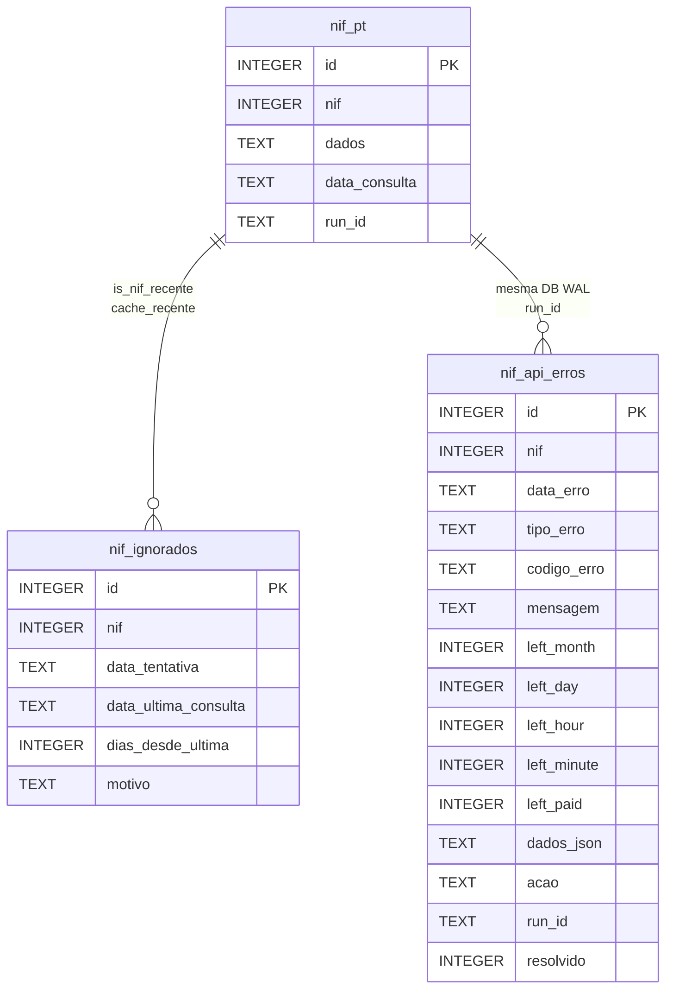

# Esquemas de Base de Dados — nif-pt v1.2.0 (cache + run_id)

> Fonte: `importar_nif_sqlite.py:55` (DDL `nif_pt` 5c) + `utils/error_handler.py:46` (DDL `nif_api_erros` 15c) + `utils/cache_validator.py:43` (DDL `nif_ignorados` 6c) + `config/config.yaml:15` (`cache_*`) + `utils/run_id.py`.

## 1. Visão Geral v1.2.0



| Tabela | Motor | Cols | PK | Histórico | Estratégia | DDL |
|--------|-------|------|----|-----------|------------|-----|
| `nif_pt` | `data/nif_pt.db` SQLite WAL | 5 (`id, nif, dados, data_consulta, run_id`) | `id AUTOINCREMENT` | Sim (sem `UNIQUE nif`) | JSON bruto + `run_id` | `importar_nif_sqlite.py:55` |
| `nif_api_erros` | `data/nif_pt.db` SQLite WAL | 15 (14 + `run_id`) | `id AUTOINCREMENT` | Sim | Auditoria `rate_limit_*` + `run_id` | `utils/error_handler.py:46` |
| `nif_ignorados` | `data/nif_pt.db` SQLite WAL | 6 (`id, nif, data_tentativa, data_ultima_consulta, dias_desde_ultima, motivo`) | `id AUTOINCREMENT` | Sim | Cache `is_nif_recente` + `registar_ignorado` | `utils/cache_validator.py:43` |

> v1.2.0 removeu Azure SQL (`sql/01_criar_tabelas.sql`, `sql/02_criar_tabela_erros.sql`, `sql/03_migracao_run_id.sql`, `pyodbc`, `kiwa-pt-operations/stg_nunotome`). Stack só SQLite WAL.

## 2. SQLite — `nif_pt` (5c: 4+`run_id`)

### 2.1 DDL (`importar_nif_sqlite.py:55`)

```sql
CREATE TABLE IF NOT EXISTS nif_pt (
    id            INTEGER PRIMARY KEY AUTOINCREMENT,
    nif           INTEGER NOT NULL,
    dados         TEXT NOT NULL,          -- json.dumps(resultado, ensure_ascii=False) inclui run_id
    data_consulta TEXT NOT NULL DEFAULT (datetime('now')),
    run_id        TEXT                    -- UUID v4 da execução (utils/run_id.py:41)
);
CREATE INDEX IF NOT EXISTS idx_nif_pt_run_id ON nif_pt(run_id);
-- Migração idempotente para BDs antigas (importar_nif_sqlite.py:102):
-- PRAGMA table_info(nif_pt) -> IF "run_id" NOT IN cols THEN ALTER TABLE ADD COLUMN run_id TEXT;
```

| # | Coluna | Tipo | Nulo | Default | Descrição |
|---|--------|------|------|---------|-----------|
| 1 | `id` | `INTEGER` | `NOT NULL` | `AUTOINCREMENT` | PK WAL |
| 2 | `nif` | `INTEGER` | `NOT NULL` | — | NIF 9 dígitos |
| 3 | `dados` | `TEXT` | `NOT NULL` | — | JSON completo `resultado` (inclui `run_id`) |
| 4 | `data_consulta` | `TEXT` | `NOT NULL` | `datetime('now')` | `YYYY-MM-DD HH:MM:SS` (`datetime.now()` em `importar_nif_sqlite.py:240`) |
| 5 | `run_id` | `TEXT` | `NULL` | — | UUID v4 por execução (`utils/run_id.py:41`); índice `idx_nif_pt_run_id` |

* `PRAGMA journal_mode=WAL` (`importar_nif_sqlite.py:95`) · `DB_PATH = Path(...) / cfg.get("db_path", "data/nif_pt.db")` (`:52`) · sem `UNIQUE(nif)` → histórico; `is_nif_recente()` (`utils/cache_validator.py:225`) lê `ORDER BY datetime(data_consulta) DESC LIMIT 1`; `json_extract(dados, '$.dados.title')` (SQLite 3.38+) · `run_id` propagado via `ensure_run_id(CLI>payload>ctx>gen)` (`importar_nif_sqlite.py:185`) e `INSERT (...,run_id)` com fallback se coluna falta (`:238`).

## 3. SQLite — `nif_api_erros` (15c: 14+`run_id`)

### 3.1 DDL (`utils/error_handler.py:46`)

```sql
CREATE TABLE IF NOT EXISTS nif_api_erros (
    id            INTEGER PRIMARY KEY AUTOINCREMENT,
    nif           INTEGER,
    data_erro     TEXT NOT NULL DEFAULT (datetime('now')),
    tipo_erro     TEXT NOT NULL,      -- rate_limit_minute/hour/day/month/paid/unknown/generic_error
    codigo_erro   TEXT,               -- result da API
    mensagem      TEXT,               -- message da API
    left_month    INTEGER, left_day INTEGER, left_hour INTEGER,
    left_minute   INTEGER, left_paid INTEGER,
    dados_json    TEXT NOT NULL,      -- JSON completo
    acao          TEXT,               -- retry_60s / retry_3600s / abort_day / abort_month / none
    run_id        TEXT,               -- UUID v4 da execução (utils/run_id.py:41)
    resolvido     INTEGER NOT NULL DEFAULT 0
);
CREATE INDEX IF NOT EXISTS idx_nif_api_erros_nif ON nif_api_erros(nif);
CREATE INDEX IF NOT EXISTS idx_nif_api_erros_tipo ON nif_api_erros(tipo_erro);
CREATE INDEX IF NOT EXISTS idx_nif_api_erros_run_id ON nif_api_erros(run_id);
-- Migração idempotente (utils/error_handler.py:153): PRAGMA table_info -> ALTER TABLE ADD COLUMN run_id TEXT se falta
```

### 3.2 Catálogo `nif_api_erros` (15c)

| Grupo | Colunas | Tipos | Fonte |
|-------|---------|-------|-------|
| Chave | `id`, `nif`, `data_erro`, `resolvido` | `INTEGER`, `TEXT`, `INTEGER` | `nif`, `datetime('now')`, `0` |
| Classificação | `tipo_erro`, `codigo_erro`, `mensagem`, `acao` | `TEXT` | `classificar_erro()` + `tratar_erro()` |
| Quota | `left_month/day/hour/minute/paid` | `INTEGER` | `data["credits"]["left"]` |
| Auditoria | `dados_json` | `TEXT` | `json.dumps(data, ensure_ascii=False)` |
| Rastreabilidade | `run_id` | `TEXT` | `utils/run_id.py:41` `generate_run_id()` + `ensure_run_id()` + `guardar_erro(...,run_id)` |

Consultas úteis:

```sql
-- Últimos erros por tipo
SELECT tipo_erro, COUNT(*) FROM nif_api_erros GROUP BY tipo_erro;
-- Rate-limit minuto com retry
SELECT nif, mensagem, left_minute, acao, data_erro, substr(run_id,1,8) FROM nif_api_erros WHERE tipo_erro='rate_limit_minute' ORDER BY data_erro DESC;
-- Por run_id (agrupa retries da mesma execução)
SELECT tipo_erro, acao, run_id, COUNT(*) FROM nif_api_erros GROUP BY run_id, tipo_erro ORDER BY data_erro DESC;
SELECT * FROM nif_api_erros WHERE run_id='550e8400-e29b-41d4-a716-446655440000';
-- Por resolver
SELECT * FROM nif_api_erros WHERE resolvido=0;
UPDATE nif_api_erros SET resolvido=1 WHERE id=123;
```

## 4. SQLite — `nif_ignorados` (6c) — novo v1.2.0

### 4.1 DDL (`utils/cache_validator.py:43`)

```sql
CREATE TABLE IF NOT EXISTS nif_ignorados (
    id                      INTEGER PRIMARY KEY AUTOINCREMENT,
    nif                     INTEGER NOT NULL,
    data_tentativa          TEXT NOT NULL DEFAULT (datetime('now')),
    data_ultima_consulta    TEXT,
    dias_desde_ultima       INTEGER,
    motivo                  TEXT NOT NULL DEFAULT 'cache_recente'
);
CREATE INDEX IF NOT EXISTS idx_nif_ignorados_nif ON nif_ignorados(nif);
CREATE INDEX IF NOT EXISTS idx_nif_ignorados_data ON nif_ignorados(data_tentativa);
-- DDL idempotente via _get_connection() (utils/cache_validator.py:126) + init_cache_tables() (consulta_nif.py:536)
-- Nome de tabela configurável via config/config.yaml:15 cache_tabela_ignorados (sanitizado alnum+_)
```

### 4.2 Catálogo `nif_ignorados` (6c)

| # | Coluna | Tipo | Nulo | Default | Descrição |
|---|--------|------|------|---------|-----------|
| 1 | `id` | `INTEGER` | `NOT NULL` | `AUTOINCREMENT` | PK WAL |
| 2 | `nif` | `INTEGER` | `NOT NULL` | — | NIF consultado (ignorado por cache) |
| 3 | `data_tentativa` | `TEXT` | `NOT NULL` | `datetime('now')` | Timestamp da tentativa ignorada (`YYYY-MM-DD HH:MM:SS`) |
| 4 | `data_ultima_consulta` | `TEXT` | `NULL` | — | `data_consulta` da linha mais recente em `nif_pt` (`is_nif_recente` `:314` `data_str`) |
| 5 | `dias_desde_ultima` | `INTEGER` | `NULL` | — | `diff.days` entre `now` e `data_ultima_consulta` (`registar_ignorado` `:362`); `0` se futuro |
| 6 | `motivo` | `TEXT` | `NOT NULL` | `'cache_recente'` | Motivo do ignorado (default único) |

* Criada por `utils/cache_validator.py:126` `_get_connection()` com `PRAGMA WAL` + `executescript(DDL_IGNORADOS)` + 2 índices `idx_nif_ignorados_*`; chamada idempotente em `consulta_nif.py:536` `init_cache_tables()` (fail-open) e em cada `is_nif_recente`/`registar_ignorado`.
* Relação: `nif_pt` (fonte) → `nif_ignorados` (tentativas ignoradas) via `is_nif_recente()` → `registar_ignorado()`; não há FK declarada (SQLite sem constraint), mas `nif` é chave lógica.
* Config: `config/config.yaml:15` `cache_tabela_ignorados: "nif_ignorados"` sanitizado `replace("_","").isalnum()` (`utils/cache_validator.py:121`).

### 4.3 Exemplos `nif_ignorados`

```sql
-- Últimas tentativas ignoradas
SELECT nif, data_ultima_consulta, dias_desde_ultima, motivo, data_tentativa
FROM nif_ignorados ORDER BY datetime(data_tentativa) DESC LIMIT 20;

-- Por NIF
SELECT nif, COUNT(*) AS tentativas_ignoradas, MAX(data_tentativa) AS ultima_tentativa
FROM nif_ignorados GROUP BY nif ORDER BY tentativas_ignoradas DESC;

-- Auditoria cache vs sucesso
SELECT 'nif_pt' AS tabela, COUNT(*) AS total FROM nif_pt
UNION ALL
SELECT 'nif_ignorados', COUNT(*) FROM nif_ignorados
UNION ALL
SELECT 'nif_api_erros', COUNT(*) FROM nif_api_erros;

-- Limpar cache para forçar refresh
DELETE FROM nif_ignorados WHERE nif=509442013;
DELETE FROM nif_ignorados WHERE date(data_tentativa) < date('now','-30 days');
```

### 4.4 Fluxo cache ↔ tabelas

```
consulta_nif.py:529 is_nif_recente(nif, dias=30)
  → SELECT data_consulta FROM nif_pt WHERE nif=? ORDER BY datetime(data_consulta) DESC LIMIT 1
  → parse _parse_data_consulta() (YYYY-MM-DD HH:MM:SS / ISO / Z)
  → total_seconds/86400 < 30 ? recente=True : False
  → se True: registar_ignorado(nif, data_ultima, "cache_recente")
           → INSERT INTO nif_ignorados (nif, data_ultima_consulta, dias_desde_ultima, motivo)
           → stdout JSON {ignorado:true, motivo:"cache_recente", data_ultima_consulta, cache_antiguidade_dias, run_id}
           → importar_nif_sqlite.py:194 if ignorado -> skip INSERT nif_pt
```

## 5. Tipos e Tamanhos

| Tipo | Uso | Exemplo |
|------|-----|---------|
| `INTEGER` | PK, NIF, left, dias | `nif` 9 dígitos, `left_minute`, `dias_desde_ultima` |
| `TEXT` | JSON, datas, motivo, run_id | `dados TEXT`, `data_consulta TEXT`, `motivo TEXT`, `run_id TEXT` |
| `DATETIME` | ISO `YYYY-MM-DD HH:MM:SS` | `data_consulta`, `data_tentativa`, `data_ultima_consulta` |

> SQLite WAL 3 tabelas — sem `NVARCHAR`, `DECIMAL`, `BIT`, `DATETIME2`, `BIGINT IDENTITY` (esses eram Azure, removido v1.2.0).

## 6. Coerência Python ↔ SQL

| Python | SQL | Notas |
|--------|-----|-------|
| `importar_nif_sqlite.py:55` `SQL_DDL` | `nif_pt` 5c | `INSERT (nif,dados,data_consulta,run_id)` (`:238`) + fallback sem `run_id` (`:242`) |
| `utils/error_handler.py:46` `DDL_ERROS` | `nif_api_erros` 15c | `INSERT (...,run_id)` + fallback (`:436`) |
| `utils/cache_validator.py:43` `DDL_IGNORADOS` | `nif_ignorados` 6c | `INSERT (nif, data_ultima_consulta, dias_desde_ultima, motivo)` (`:379`) + 2 índices |

Todas com `PRAGMA journal_mode=WAL` + `CREATE INDEX IF NOT EXISTS`.

## 7. Histórico DDL

Ver [ddl-history.md](ddl-history.md). `v1.0.0` adiciona `nif_api_erros` 15c; `v1.1.0` adiciona `run_id` (5/15c); `v1.2.0` adiciona `nif_ignorados` 6c + remove Azure (`sql/0*` + `pyodbc`).

## 8. Referências

* `importar_nif_sqlite.py:55` `SQL_DDL` + `:95` `WAL` + `:102` migração `run_id`
* `utils/cache_validator.py:43` `DDL_IGNORADOS` + `:55` `idx_nif` + `:126` `_get_connection()` + `:225` `is_nif_recente()` + `:329` `registar_ignorado()`
* `utils/error_handler.py:46` `DDL_ERROS` 15c + `:153` migração `run_id`
* `utils/run_id.py:41` `generate_run_id` · `config/config.yaml:15` `cache_*`
* `docs/technical.md` §6 ER condensado + §10c cache
