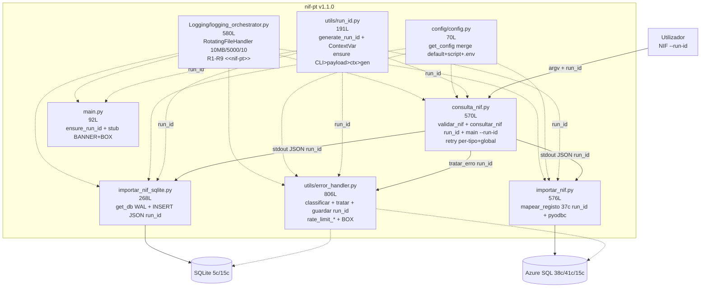
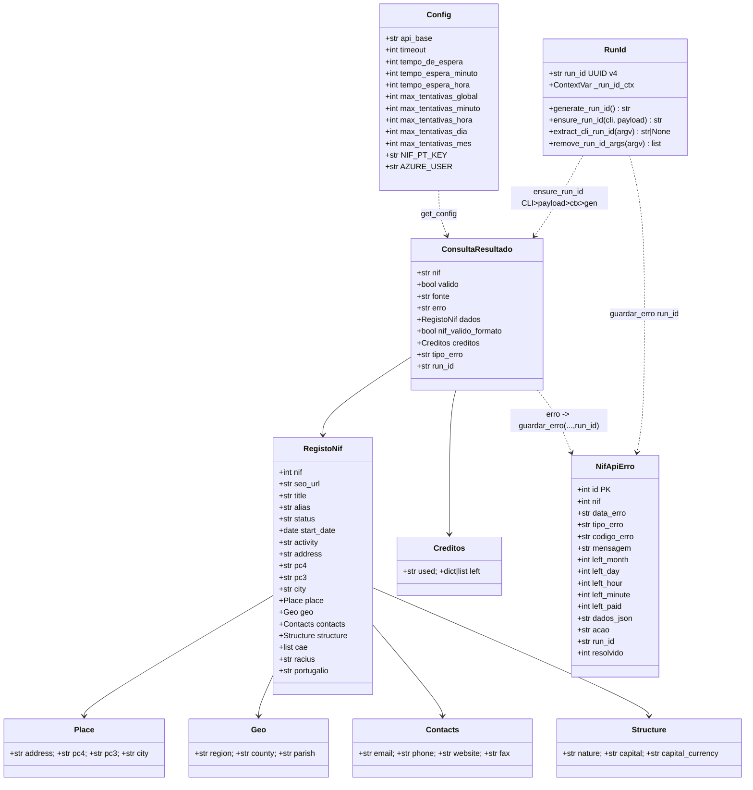
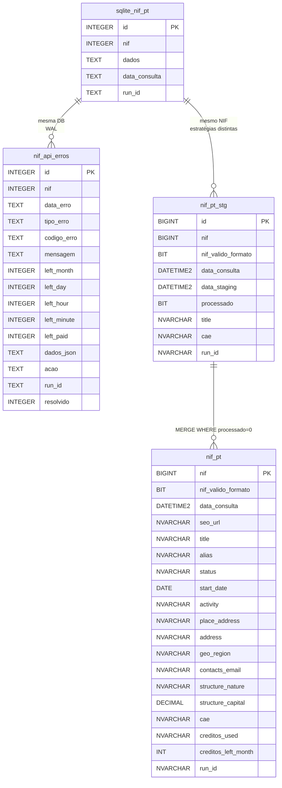
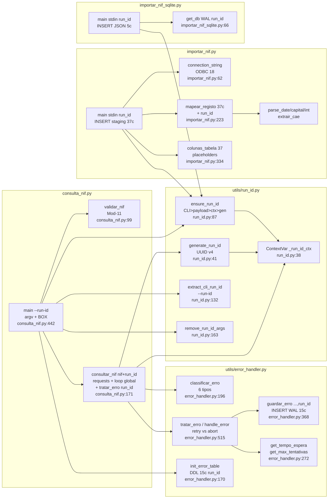

# Documentação Técnica — nif-pt v1.1.0 (run_id)

> **Stack:** Python 3.11+ · `requests>=2.31.0` · `pyyaml>=6.0.1` · `python-dotenv>=1.0.0` · `pyodbc>=5.0.0` (ODBC Driver 18) · SQLite WAL `data/nif_pt.db` · Azure SQL `kiwa-pt-operations/stg_nunotome` (38c `nif_pt` + 41c `nif_pt_stg` + 15c `nif_api_erros` com `run_id`)
> **HEAD:** `run_id` · **Tag:** `v1.1.0-unreleased` · **Data:** 2026-09-10 (base `v1.0.0` `cd83aa8`)
> **Scripts:** `consulta_nif.py:570L` · `importar_nif_sqlite.py:268L` · `importar_nif.py:576L` · `utils/run_id.py:191L` · `utils/error_handler.py:806L` · `main.py:92L` · `Logging/logging_orchestrator.py` · `config/config.py` + `config.yaml` · `sql/03_migracao_run_id.sql`

Índice: [1. Visão](#1-visão) · [2. Arquitetura C4](#2-arquitetura-c4) · [3. Sequência](#3-diagrama-de-sequência) · [4. Atividades](#4-diagrama-de-atividades) · [5. Classes](#5-diagrama-de-classes) · [6. ER](#6-esquema-er) · [7. Componentes](#7-diagrama-de-componentes) · [8. Catálogo de funções](#8-catálogo-de-funções-fileline) · [9. Config](#9-configuração) · [10. Camada de erros](#10-camada-de-erros) · [10b. Rastreabilidade run_id](#10b-rastreabilidade-run_id) · [11. Logging R1-R9](#11-logging-r1r9) · [12. ADRs](#12-adrs) · [13. Pipeline](#13-pipeline-stdinstdout) · [14. Help Python](#14-help-python)

---

## 1. Visão

`nif-pt` consulta a API pública `http://www.nif.pt/?json=1&q=<NIF>&key=<KEY>` com validação Mod-11 local, devolve JSON normalizado em `stdout` (com `run_id`) e persiste via pipe em SQLite (JSON bruto) e/ou Azure SQL (37 cols normalizadas + `run_id`). A camada `utils/error_handler` classifica erros de quota (`rate_limit_*`), persiste em `nif_api_erros` (dual SQLite/Azure, 15c com `run_id`) e decide `retry 60s/3600s` vs `abort`. O módulo `utils/run_id.py` garante `run_id` UUID v4 por execução com propagação `CLI > payload > contexto > geração`.

**Requisitos funcionais (9):** RF-01 Mod-11 · RF-02 `GET ?json=1` · RF-03 JSON normalizado + `run_id` · RF-04 erros rede/JSON/result · RF-05 SQLite WAL (5c) · RF-06 37c Azure + `run_id` · RF-07 pipeline `stdin/stdout` com `run_id` · RF-08 `get_config()` centralizado · RF-09 rastreabilidade `run_id` (`generate_run_id`, `ensure_run_id`, `--run-id`, migração).
**Requisitos não-funcionais (6):** RNF-01 `timeout 10s` + `sleep` batch · RNF-02 `exit 0/1` + `commit/rollback` + WAL · RNF-03 `.env` ignorado + `***` no log · RNF-04 `pathlib` + ODBC 18 + PS/Bash · RNF-05 `MANUAL.md` + `docs/` · RNF-06 `RotatingFileHandler` 10 MB/5000/10 + TAG `[run]`.

---

## 2. Arquitetura C4

### 2.1 Contexto (C4 Nível 1)

```mermaid
graph TB
    U[Utilizador<br/>CLI NIF 9 dígitos] --> SYS[nif-pt v1.1.0<br/>Python 3.11 CLI<br/>run_id UUID v4]
    SYS --> API[(nif.pt<br/>API externa<br/>GET ?json=1&q=&key=)]
    SYS --> DB1[(SQLite<br/>data/nif_pt.db<br/>nif_pt 5c + nif_api_erros 15c<br/>WAL + run_id idx)]
    SYS --> DB2[(Azure SQL<br/>kiwa-pt-operations<br/>stg_nunotome.nif_pt 38c + stg 41c + nif_api_erros 15c<br/>run_id NVARCHAR36 idx)]
    CFG[config.yaml + .env<br/>get_config()] -. configuração .-> SYS
    LOG[log_files/nif_pt.log<br/>RotatingFileHandler<br/>&lt;&lt;nif-pt&gt;&gt;] -. logs .-> SYS
    RID[utils/run_id.py<br/>generate_run_id + ContextVar<br/>--run-id > payload > ctx > uuid] -. run_id .-> SYS
```

| Ator / Sistema | Descrição | Ficheiro |
|---|---|---|
| Utilizador | Executa `python consulta_nif.py <NIF> [--run-id UUID]` + pipe | `consulta_nif.py:442` `main()` + `utils/run_id.py:132` `extract_cli_run_id()` |
| nif-pt | Valida Mod-11, consulta, classifica erro, persiste com `run_id` | `consulta_nif.py` + `utils/run_id.py` + `utils/error_handler.py` |
| nif.pt | `GET http://www.nif.pt/?json=1&q=&key=` | `consulta_nif.py:272` `requests.get` (`TIMEOUT 10`) |
| SQLite | `nif_pt` (5c: 4+`run_id TEXT`) + `nif_api_erros` (15c: 14+`run_id TEXT`) WAL + `idx_run_id` | `importar_nif_sqlite.py:55` + `utils/error_handler.py:46` + `sql/03_migracao_run_id.sql` |
| Azure SQL | `nif_pt` 38c (37+`run_id`) · `nif_pt_stg` 41c (40+`run_id`) · `nif_api_erros` 15c (14+`run_id`) + `ix_*_run_id` | `sql/01_criar_tabelas.sql:80` + `sql/02_criar_tabela_erros.sql:34` + `sql/03_migracao_run_id.sql` |

### 2.2 Contentores (C4 Nível 2)



| Contentor | Linhas | Responsabilidade | Estado v1.0.0 |
|---|---|---|---|
| `consulta_nif.py` | 570 | Mod-11 + `requests.get ?json=1` + loop `max_global+1` + `tratar_erro` + `consultar_nif(nif, run_id)` + `--run-id` + `run_id` em todos os JSON | ✅ |
| `utils/run_id.py` | 191 | `generate_run_id()` UUID v4 + `ContextVar` + `ensure_run_id(CLI>payload>ctx>gen)` + `extract_cli_run_id`/`remove_run_id_args` | ✅ novo `v1.1.0` |
| `utils/error_handler.py` | 806 | `classificar_erro` 6 tipos + `tratar_erro(...,run_id)` retry/abort + `guardar_erro(...,run_id)` 15c + `init_error_table` migração `run_id` | ✅ |
| `importar_nif_sqlite.py` | 268 | `PRAGMA WAL` + `INSERT (nif,dados,data_consulta,run_id)` + `ensure_run_id(CLI>payload>gen)` + `CREATE INDEX idx_run_id` + fallback | ✅ |
| `importar_nif.py` | 576 | `mapear_registo(resultado, run_id)` 37c (36+`run_id`) + `connection_string` ODBC 18 + `INSERT` staging 37 `?` + `--run-id` | ✅ |
| `config/config.py` | 70 | `get_config()` merge `default< script <.env` + `***` | ✅ |
| `Logging/logging_orchestrator.py` | 580 | `RotatingFileHandler` + 9 estilos R1-R9, `<<nif-pt>>`, `nif_pt.log`, TAG `[run]` | ✅ |
| `main.py` | 92 | `ensure_run_id(cli_value)` por execução + Stub `BANNER_APP` + `BOX` | ✅ |
| `sql/03_migracao_run_id.sql` | 39 | Migração idempotente `run_id NVARCHAR(36)` + `ix_*_run_id` para `nif_pt`/`nif_pt_stg`/`nif_api_erros` | ✅ |
| `api/ models/ scrapers/` | 0 | Reservados FastAPI/Pydantic/HTML | 🚧 v0.4 |

---

## 3. Diagrama de Sequência — Consulta com retry, run_id e persistência de erro

```mermaid
sequenceDiagram
    participant U as Utilizador<br/>CLI
    participant CLI as consulta_nif.py:main<br/>setup_logging + init_error_table<br/>ensure_run_id
    participant RID as utils/run_id<br/>generate_run_id + ContextVar<br/>ensure_run_id
    participant V as validar_nif<br/>Mod-11
    participant CFG as get_config<br/>config.yaml+.env
    participant API as nif.pt<br/>GET ?json=1&q=&key=<br/>timeout 10s
    participant EH as utils/error_handler<br/>classificar_erro + tratar_erro<br/>guardar_erro(...,run_id) -> nif_api_erros
    participant OUT as stdout<br/>JSON run_id
    participant IMP as importar_*.py<br/>stdin JSON run_id -> INSERT
    participant DB as SQLite / Azure SQL<br/>nif_pt + nif_api_erros run_id

    U->>CLI: python consulta_nif.py 509442013 [--run-id UUID]
    CLI->>RID: extract_cli_run_id() + ensure_run_id(cli_value)
    RID-->>CLI: run_id UUID v4 (550e8400-...)
    CLI->>CLI: len(argv_clean) <2 ? exit 1 (remove_run_id_args)
    CLI->>CLI: nif.isdigit? --não--> {"erro":"NIF deve conter apenas dígitos","run_id":...} exit 1
    CLI->>CFG: get_config("consulta_nif")
    CFG-->>CLI: api_base, timeout 10, NIF-PT-KEY ***XXXX, max_* 5/3/2/0/0, espera 60/3600
    CLI->>EH: init_error_table() idempotente (DDL 15c run_id + idx)
    EH-->>CLI: DDL nif_api_erros garantido (WAL)
    CLI->>V: validar_nif("509442013")
    V-->>CLI: true (Mod-11 total%11) — só loga, não bloqueia
    loop tentativa_global 0..max_global (5)
        CLI->>API: GET /?json=1&q=509442013&key=*** timeout 10s
        alt Timeout / RequestException
            API-->>CLI: requests.Timeout
            CLI->>CLI: last_error={"erro":"Timeout...","run_id":...}; sleep 60s; continue se <max_global
        else JSONDecodeError
            API-->>CLI: body não JSON
            CLI-->>U: {"erro":"Resposta inválida (não JSON)","run_id":...} exit 1
        else 200 JSON
            API-->>CLI: {"result":"success"|"error", "message","records","credits"}
            alt result != "success"
                CLI->>EH: tratar_erro(nif, data, tentativa_global, tentativas_por_tipo, run_id)
                EH->>EH: classificar_erro -> rate_limit_minute/hour/day/month/paid/generic/unknown
                EH->>DB: guardar_erro(nif, tipo, codigo, mensagem, left, dados_json, acao, run_id) WAL
                EH-->>CLI: {tipo, acao: retry|abort|none, espera 60|3600|0, deve_retry, max_tipo, max_global}
                alt acao == "retry" && deve_retry && tentativa_global < max_global
                    CLI->>CLI: sleep(espera) 60s minuto / 3600s hora; tentativas_por_tipo[tipo]++
                else acao == "abort" || !deve_retry
                    CLI-->>OUT: {"nif":..., "erro": message, "tipo_erro": tipo, "dados": data, "run_id":...} exit 1
                end
            else result == "success"
                CLI->>CLI: records.get(nif) fallback first_key; creditos
                CLI-->>OUT: {"nif":"509442013","valido":true,"erro":null,"dados":{...},"creditos":{...},"run_id":"550e8400-..."}
                OUT->>IMP: stdin JSON run_id
                IMP->>RID: ensure_run_id(cli_value, payload_value=run_id) CLI>payload>ctx>gen
                RID-->>IMP: run_id herdado (mesmo UUID)
                IMP->>IMP: json.loads; if erro -> exit 1
                IMP->>DB: INSERT nif_pt (SQLite JSON 5c) / nif_pt_stg (37c) + run_id commit + idx
                IMP-->>U: stderr BOX "Guardado em SQLite run_id=550e8400... / Inserido em Azure SQL run_id=..." exit 0
            end
        end
    end
```

**Pontos chave:** `run_id` gerado em `consulta_nif.py:481` `ensure_run_id(cli_value)` e propagado via `stdout` JSON → `stdin` importadores (`importar_nif.py:455` / `importar_nif_sqlite.py:185` `ensure_run_id(cli_value,payload_value)`); precedência `CLI --run-id` > `payload run_id` > `ContextVar` > `uuid4`; `NIF-PT-KEY` mascarada; `records` fallback; `credits.left` pode ser `[]`; `init_error_table` antes de qualquer request; contadores `tentativas_por_tipo` + `tentativa_global` com limite conjunto `&&`; persistência **sempre** (`guardar_erro(...,run_id)`) antes de decidir; `BOX` inclui `run_id` truncado.

---

## 4. Diagrama de Atividades — Validação, run_id e request com camada de erro

```mermaid
graph TD
    A[argv NIF --run-id] --> R0[ensure_run_id cli_value<br/>extract_cli_run_id + remove_run_id_args<br/>utils/run_id.py:132]
    R0 --> B{nif.isdigit?}
    B -- não --> E1[print erro + run_id + exit 1<br/>stderr]
    B -- sim --> C[get_config consulta_nif<br/>api_base, timeout 10, NIF-PT-KEY, max_*]
    C --> D{API_KEY existe?}
    D -- não --> E2[return erro NIF-PT-KEY + run_id<br/>exit 1]
    D -- sim --> F[init_error_table<br/>DDL nif_api_erros WAL 15c run_id]
    F --> G[validar_nif Mod-11<br/>Σ d*(9-i)%11 -> digito<br/>log WARN se FAIL<br/>não bloqueia]
    G --> H[Loop tentativa_global 0..max_global 5<br/>tentativas_por_tipo dict + run_id]
    H --> I[requests.get<br/>?json=1&q=&key= timeout 10s]
    I --> J{Exceção?}
    J -- Timeout --> K1[last_error Timeout + run_id<br/>sleep 60s se <max_global<br/>retry global]
    J -- RequestException --> K2[last_error rede + run_id<br/>sleep 60s retry]
    J -- JSONDecodeError --> E4[return não JSON + run_id<br/>exit 1]
    J -- ok 200 --> L{result == success?}
    L -- não --> M[tratar_erro nif+data+run_id<br/>classificar_erro<br/>guardar_erro WAL run_id]
    M --> N{tipo + acao?}
    N -- rate_limit_minute<br/>tenta<3 && global<5 --> O1[sleep 60s<br/>retry]
    N -- rate_limit_hour<br/>tenta<2 && global<5 --> O2[sleep 3600s<br/>retry]
    N -- rate_limit_day/month/paid<br/>ou esgotou --> E5[return abort + run_id<br/>tipo_erro + exit 1]
    N -- generic/unknown --> E6[return none + run_id<br/>exit 1]
    O1 --> H
    O2 --> H
    L -- sim --> P[records.get nif fallback<br/>first_key]
    P --> Q[return dict valido true<br/>dados+creditos+run_id+BOX<br/>stdout JSON run_id]
    K1 --> H
    K2 --> H
    E1 --> Z[*]
    E2 --> Z
    E4 --> Z
    E5 --> Z
    E6 --> Z
    Q --> R[Pipe JSON run_id -> importar_*.py<br/>ensure_run_id CLI>payload>ctx>gen<br/>INSERT WAL/Azure run_id<br/>BOX run_id + TIMING]
    R --> Z
```

---

## 5. Diagrama de Classes — Domínio (sem ORM, dicts normalizados)



*`mapear_registo(resultado, run_id)` (`importar_nif.py:223`) achata `RegistoNif` → 37 colunas (36+`run_id`); `NifApiErro` (15c) persiste via `guardar_erro(...,run_id)` (`utils/error_handler.py:368`); `RunId` (`utils/run_id.py:38` `ContextVar`) garante propagação `CLI --run-id` > `payload run_id` > `ctx` > `uuid4`.*

---

## 6. Esquema ER



**Catálogo resumido (detalhe em `docs/database/schema.md`):**

| Tabela | Motor | Cols | PK | Histórico | DDL |
|---|---|---|---|---|---|
| `nif_pt` (SQLite) | `data/nif_pt.db` | 5 (4+`run_id`) | `id AUTOINCREMENT` | Sim (sem `UNIQUE nif`) | `importar_nif_sqlite.py:55` + `sql/03_migracao_run_id.sql` |
| `nif_api_erros` (SQLite) | `data/nif_pt.db` | 15 (14+`run_id`) | `id AUTOINCREMENT` | Sim | `utils/error_handler.py:46` `DDL_ERROS` + `idx_run_id` |
| `stg_nunotome.nif_pt` | Azure SQL | 38 (37+`run_id`) | `nif` | Não (ouro) | `sql/01_criar_tabelas.sql:21` + `sql/03_migracao_run_id.sql:15` |
| `stg_nunotome.nif_pt_stg` | Azure SQL | 41 (40+`run_id`) | `id IDENTITY` | Sim (`processado`) | `sql/01_criar_tabelas.sql:99` + `sql/03_migracao_run_id.sql:22` |
| `stg_nunotome.nif_api_erros` | Azure SQL | 15 (14+`run_id`) | `id IDENTITY` | Sim | `sql/02_criar_tabela_erros.sql:20` + `sql/03_migracao_run_id.sql:30` |

37 cols `importar_nif.py:334` `colunas_tabela()` (36+`run_id`) excluem `id/data_consulta/data_staging/processado` (DEFAULT). Ver §10b run_id.

---

## 7. Diagrama de Componentes



---

## 8. Catálogo de funções (file:line)

| Módulo | Função / Classe | Linha | Assinatura | Descrição |
|---|---|---|---|---|
| `consulta_nif` | `validar_nif` | `99` | `(nif: str) -> bool` | Mod-11 AT `Σ d*(9-i)%11` |
| `consulta_nif` | `consultar_nif` | `171` | `(nif: str, run_id: str|None) -> dict` | `GET ?json=1&q=&key=` + loop `max_global+1` + `tratar_erro(...,run_id)` + `run_id` em retorno |
| `consulta_nif` | `main` | `442` | `() -> None` | CLI `argv` + `--run-id` (`extract_cli_run_id`/`remove_run_id_args`) + `ensure_run_id()` + `init_error_table` + `print(json)` + BOX `run_id` |
| `utils/run_id` | `generate_run_id` | `41` | `() -> str` | UUID v4 `xxxxxxxx-xxxx-4xxx-xxxx-...` (36c) |
| `utils/run_id` | `set_run_id` | `59` | `(run_id: str|None) -> str|None` | `ContextVar.set` |
| `utils/run_id` | `get_run_id` | `78` | `() -> str|None` | `ContextVar.get` |
| `utils/run_id` | `ensure_run_id` | `87` | `(cli_value, payload_value) -> str` | Precedência `CLI > payload > ctx > uuid4` + `set_run_id` |
| `utils/run_id` | `extract_cli_run_id` | `132` | `(argv) -> str|None` | Parse `--run-id UUID` / `--run-id=UUID` sem argparse |
| `utils/run_id` | `remove_run_id_args` | `163` | `(argv) -> list[str]` | Cópia `argv` sem `--run-id` |
| `importar_nif_sqlite` | `get_db` | `66` | `() -> sqlite3.Connection` | `mkdir` + `WAL` + `DDL nif_pt` 5c + migração `run_id` + `idx_run_id` |
| `importar_nif_sqlite` | `main` | `123` | `() -> None` | `stdin` JSON `run_id` → `ensure_run_id(CLI>payload>gen)` → `INSERT (nif,dados,data_consulta,run_id)` + fallback |
| `importar_nif` | `connection_string` | `62` | `() -> str` | `DRIVER={ODBC 18};SERVER=...;Encrypt=yes` |
| `importar_nif` | `extrair_cae` | `96` | `(registo: dict) -> str|None` | `list → ",".join` |
| `importar_nif` | `parse_date` | `128` | `(val) -> date|None` | `fromisoformat` + `Z` |
| `importar_nif` | `parse_capital` | `163` | `(val) -> float|None` | `","→"."` |
| `importar_nif` | `parse_int` | `194` | `(val) -> int|None` | `int()` seguro |
| `importar_nif` | `mapear_registo` | `223` | `(resultado: dict, run_id: str|None) -> dict` | 37c (36+`run_id`) `place/geo/contacts/structure/creditos` + `run_id` |
| `importar_nif` | `colunas_tabela` | `334` | `() -> list[str]` | 37 nomes (inclui `run_id`) |
| `importar_nif` | `placeholders` | `365` | `() -> str` | 37 `?` |
| `importar_nif` | `valores_para_insert` | `378` | `(reg: dict) -> list` | ordem `colunas_tabela` |
| `importar_nif` | `main` | `397` | `() -> None` | `stdin` JSON `run_id` → `ensure_run_id` → `mapear` → `INSERT staging` 37c + fallback |
| `utils/error_handler` | `classificar_erro` | `196` | `(data: dict) -> str` | 6 tipos `rate_limit_*` + `generic/unknown` |
| `utils/error_handler` | `get_tempo_espera` | `272` | `(tipo_erro: str) -> int` | `60`/`3600`/`0` do `config.yaml` |
| `utils/error_handler` | `get_max_tentativas` | `296` | `(tipo_erro: str) -> int` | `3/2/0/0` do `config.yaml` |
| `utils/error_handler` | `get_max_tentativas_global` | `329` | `() -> int` | `5` do `config.yaml` |
| `utils/error_handler` | `guardar_erro` | `368` | `(nif, tipo_erro, codigo_erro, mensagem, left, dados_completos, acao, run_id) -> int|None` | `INSERT nif_api_erros` 15c WAL `run_id` |
| `utils/error_handler` | `tratar_erro` | `515` | `(nif, data, attempt, retry_count, tentativas_por_tipo, tentativa_global, run_id) -> dict` | `retry/abort/none` + `espera` + `deve_retry` + `run_id` |
| `utils/error_handler` | `handle_error` | `787` | `alias tratar_erro` | compat enunciado + `run_id` |
| `utils/error_handler` | `init_error_table` | `170` | `() -> None` | DDL 15c idempotente WAL + migração `run_id` |
| `config/config` | `get_config` | `30` | `(script_name: str) -> dict` | merge `default< script <.env` + `***` |
| `Logging/logging_orchestrator` | `RotatingFileHandler` | `74` | `class Handler` | rotação `max_bytes/max_records/max_backup` |
| `Logging/logging_orchestrator` | `setup_logging` | `226` | `() -> Logger` | wrapper `ini_logging` idempotente |
| `main` | `main` | `35` | `() -> None` | `ensure_run_id(cli_value)` por execução + `BANNER_APP` + `BOX` ajuda |

---

## 9. Configuração

### 9.1 `config/config.yaml` (37L)

```yaml
default:
  retry_count: 1              # legado, fallback se max_* não existir
  timeout: 10                 # s para requests.get (10s, não 1000)
  tempo_de_espera: 60         # s — rede/Timeout genérico
  tempo_espera_minuto: 60     # s — rate_limit_minute
  tempo_espera_hora: 3600     # s — rate_limit_hour
  max_tentativas_global: 5
  max_tentativas_minuto: 3
  max_tentativas_hora: 2
  max_tentativas_dia: 0       # 0 = abort sem retry
  max_tentativas_mes: 0
  max_tentativas_paid: 0
consulta_nif:
  api_base: "http://www.nif.pt"
importar_nif_sqlite:
  db_path: "data/nif_pt.db"
  tabela: "nif_pt"
importar_nif:
  sql_server: "kiwa-pt-operations.database.windows.net"
  sql_database: "kiwa-pt-operations"
  sql_schema: "stg_nunotome"
  sql_driver: "ODBC Driver 18 for SQL Server"
  tabela_staging: "nif_pt_stg"
```

### 9.2 `config/config.py:get_config()` (70L)

`CONFIG_YAML = yaml.safe_load(open(..., encoding="utf-8"))` → `config = default.copy(); config.update(script_config)` (shallow) → `config["NIF_PT_KEY"]=os.getenv("NIF-PT-KEY")` (hífen!) + `AZURE_USER/PALAVRA_CHAVE/API_TOKEN` → log `AZURE_USER=OK/MISSING NIF-PT-KEY=***XXXX` + WARN se falta.

### 9.3 `config/.env` (não versionado)

```env
NIF-PT-KEY=xxxxx          # com hífen — obter em http://www.nif.pt/contactos/api/
AZURE_USER=seu_user
AZURE_PALAVRA_CHAVE=sua_password
# API_TOKEN=opcional
```

---

## 10. Camada de erros

| Tipo (`classificar_erro`) | Mensagem API | `left` | Ação `tratar_erro` | Espera | `max_*` | Persistência |
|---|---|---|---|---|---|---|
| `rate_limit_minute` | `Limit per minute` | `minute==0` | `retry` se `tenta<3 && global<5` senão `abort` | 60s | 3 | `guardar_erro(...,run_id, acao=retry_60s)` |
| `rate_limit_hour` | `Limit per hour` | `hour==0` | `retry` se `tenta<2 && global<5` | 3600s | 2 | `retry_3600s` |
| `rate_limit_day` | `Limit per day` | `day==0` | `abort` fatal + BOX | 0 | 0 | `abort_day` |
| `rate_limit_month` | `Limit per month` | `month==0` | `abort` fatal + BOX | 0 | 0 | `abort_month` |
| `rate_limit_paid` | `Limit per ... paid` | `paid==0` | `abort` | 0 | 0 | `abort_paid` |
| `generic_error` | `result != success` sem `limit` | — | `none` (auditoria) | 0 | 0 | `none` |
| `unknown` | `result==success` ou não-dict | — | `none` | 0 | 0 | `none` |

**Lógica conjunta:** `deve_retry = (tenta_tipo < max_tipo) && (tenta_global < max_global)` — só retry se ambos permitirem; motivo `max_tipo` vs `max_global` logado `[rate-limit]`. Fallback legado `attempt < retry_count` se `tentativas_por_tipo is None`.

**DDL `nif_api_erros` (15c: 14+`run_id`):** `id PK`, `nif`, `data_erro`, `tipo_erro`, `codigo_erro`, `mensagem`, `left_month/day/hour/minute/paid`, `dados_json`, `acao`, `run_id TEXT/NVARCHAR(36)`, `resolvido` + índices `nif`, `tipo_erro`, `data_erro`, `run_id` (`idx_nif_api_erros_run_id` / `ix_nif_api_erros_run_id`). SQLite em `utils/error_handler.py:46` (`WAL` + migração `ALTER TABLE ADD COLUMN run_id TEXT` + `CREATE INDEX IF NOT EXISTS idx_*_run_id`), Azure em `sql/02_criar_tabela_erros.sql:34` + `sql/03_migracao_run_id.sql:30`. Todos os `tratar_erro(...,run_id)` / `guardar_erro(...,run_id)` propagam o mesmo `run_id` da execução.

---

## 10b. Rastreabilidade run_id (`utils/run_id.py` 191L)

### Conceito

`run_id` é um **UUID v4** (`xxxxxxxx-xxxx-4xxx-xxxx-xxxxxxxxxxxx`, 36 chars com hífens) que identifica **uma execução** do programa — todos os `INSERT` na mesma invocação partilham o mesmo `run_id`. Permite agrupar por execução (`SELECT * FROM nif_pt WHERE run_id=?`), replay determinístico e auditoria ponta-a-ponta (`consulta_nif` → `importar_*` → `nif_api_erros`).

### Geração (`utils/run_id.py:41`)

```python
# utils/run_id.py:41
def generate_run_id() -> str: return str(uuid.uuid4())  # 36 chars, 4 hífens
```

- `utils/run_id.py:38` `_run_id_ctx: ContextVar[str|None]` — thread-safe e async-safe, evita global mutável.
- `utils/run_id.py:59` `set_run_id(run_id)` / `utils/run_id.py:78` `get_run_id()` — acesso ao contexto.
- Cada `main()` gera `run_id` único se não fornecido: `consulta_nif.py:481` `ensure_run_id(cli_value=extract_cli_run_id())` · `importar_nif.py:429` · `importar_nif_sqlite.py:158` · `main.py:60`.

### CLI `--run-id` (`utils/run_id.py:132`)

```powershell
python consulta_nif.py 509442013 --run-id 550e8400-e29b-41d4-a716-446655440000
python consulta_nif.py 509442013 --run-id=550e8400-e29b-41d4-a716-446655440000 | python importar_nif_sqlite.py --run-id 550e8400-e29b-41d4-a716-446655440000
```

- `utils/run_id.py:132` `extract_cli_run_id(argv)` — parse manual sem `argparse` (suporta `--run-id UUID` e `--run-id=UUID`), para não quebrar `sys.argv[1]` posicional (NIF).
- `utils/run_id.py:163` `remove_run_id_args(argv)` — devolve cópia sem `--run-id` para validação `isdigit` posicional (`consulta_nif.py:495` `argv_clean`).

### Propagação (`utils/run_id.py:87`)

**Precedência** `ensure_run_id(cli_value, payload_value)`:

1. `cli_value` (`--run-id`) se não-vazio
2. `payload_value` (`resultado["run_id"]` do JSON stdin) se não-vazio
3. `ContextVar` actual se já definido
4. Gera novo `uuid4`

O `run_id` resolvido é sempre guardado no contexto via `set_run_id`.

```
consulta_nif.py main()  --ensure_run_id(cli)-->  consultar_nif(nif, run_id)  --inclui run_id no dict-->  stdout JSON {nif,valido,dados,run_id,tipo_erro}
       | run_id UUID                                                                                         | run_id herdado
       v                                                                                                      v
importar_nif*.py main()  --extract_cli_run_id + ensure_run_id(cli,payload=JSON.run_id)-->  INSERT (run_id)  +  guardar_erro(...,run_id)
```

- `consulta_nif.py:171` `consultar_nif(nif, run_id=None)` — resolve `run_id or get_run_id() or generate_run_id()` e inclui `run_id` em **todos** os returns (sucesso, erro rede/timeout, JSON inválido, `result != success`, `NIF-PT-KEY` falta) (`consulta_nif.py:237`, `256`, `287`, `309`, `352`, `431`).
- `importar_nif_sqlite.py:185` `ensure_run_id(cli_value, payload_value=resultado.get("run_id"))` + fallback `warning [run] run_id ausente — gerado novo` + `resultado["run_id"]=run_id` para compat retro; `importar_nif.py:455` idem + `mapear_registo(resultado, run_id=_run_id)` (`importar_nif.py:279`).
- `utils/error_handler.py:368` `guardar_erro(...,run_id)` + `utils/error_handler.py:515` `tratar_erro(...,run_id)` — se `run_id is None` tenta `get_run_id()`.

### Persistência

| Tabela | DDL com `run_id` | Índice `run_id` | Inserção |
|--------|------------------|-----------------|----------|
| SQLite `nif_pt` | `importar_nif_sqlite.py:55` `run_id TEXT` + `ALTER TABLE ADD COLUMN run_id TEXT` idempotente (`:102`) | `idx_nif_pt_run_id` (`:112`) | `INSERT (nif,dados,data_consulta,run_id)` + fallback sem `run_id` se coluna falta (`:221`) |
| SQLite `nif_api_erros` | `utils/error_handler.py:46` `run_id TEXT` + migração `ALTER TABLE ADD COLUMN` (`:153`) | `idx_nif_api_erros_run_id` (`:68`) | `INSERT (...,run_id)` + fallback (`:436`) |
| Azure `nif_pt` / `nif_pt_stg` | `sql/01_criar_tabelas.sql:80` / `:160` `run_id NVARCHAR(36) NULL` | `ix_nif_pt_run_id` / `ix_nif_pt_stg_run_id` (`:87` / `:168`) | `importar_nif.py:518` `INSERT (37 cols incl. run_id)` + fallback 36c |
| Azure `nif_api_erros` | `sql/02_criar_tabela_erros.sql:34` `run_id NVARCHAR(36)` | `ix_nif_api_erros_run_id` (`:46`) | `guardar_erro(...,run_id)` 15c |

Consultas úteis:

```sql
-- Todas as linhas de uma execução
SELECT nif, title, data_consulta FROM stg_nunotome.nif_pt_stg WHERE run_id='550e8400-e29b-41d4-a716-446655440000';
SELECT nif, tipo_erro, acao FROM stg_nunotome.nif_api_erros WHERE run_id='550e8400-e29b-41d4-a716-446655440000';
-- SQLite
SELECT nif, substr(run_id,1,8), data_consulta FROM nif_pt WHERE run_id='550e8400-...' ORDER BY data_consulta DESC;
SELECT tipo_erro, COUNT(*) FROM nif_api_erros GROUP BY run_id, tipo_erro;
```

### Migração SQL (`sql/03_migracao_run_id.sql` 39L)

Idempotente, seguro em prod (não faz `DROP`):

```sql
-- sql/03_migracao_run_id.sql:15
IF COL_LENGTH('stg_nunotome.nif_pt','run_id') IS NULL ALTER TABLE ... ADD run_id NVARCHAR(36) NULL;
IF NOT EXISTS (SELECT 1 FROM sys.indexes WHERE name='ix_nif_pt_run_id' ...) CREATE INDEX ...
-- repete para nif_pt_stg (:22) e nif_api_erros (:30)
```

Para novas BDs, `01_criar_tabelas.sql` e `02_criar_tabela_erros.sql` já incluem a coluna — este script é NO-OP. Para BDs existentes, executar:

```powershell
sqlcmd -S kiwa-pt-operations.database.windows.net -d kiwa-pt-operations -i sql/03_migracao_run_id.sql
# Verificação:
# SELECT TABLE_NAME, COLUMN_NAME FROM INFORMATION_SCHEMA.COLUMNS WHERE COLUMN_NAME='run_id';
```

SQLite migra automaticamente no arranque (`PRAGMA table_info` + `ALTER TABLE ADD COLUMN` idempotente) — não é preciso script manual.

### Exemplos ponta-a-ponta

```powershell
# 1. Execução normal — run_id gerado e propagado
python consulta_nif.py 509442013 | python importar_nif_sqlite.py
# log: [run] run_id=550e8400-e29b-41d4-a716-446655440000  BOX | run_id : 550e8400-... |

# 2. Replay determinístico — mesmo run_id nas 3 tabelas
$rid = "550e8400-e29b-41d4-a716-446655440000"
python consulta_nif.py 509442013 --run-id $rid | Tee-Object -FilePath tmp.json | python importar_nif.py
python importar_nif_sqlite.py --run-id $rid < tmp.json
# SELECT * FROM nif_api_erros WHERE run_id='550e8400-...'; -- agrupa retries da mesma execução

# 3. Herança via JSON sem --run-id nos importadores (recomendado pipe)
python consulta_nif.py 509442013 --run-id $rid | python importar_nif_sqlite.py
# importador lê run_id do JSON (payload_value) — precedência CLI > payload
```

Ver `MANUAL.md` §2.4 + §6 + §7.5, `docs/database/schema.md` §3-5 e `utils/run_id.py:1` docstring.

---

## 11. Logging R1–R9 (`Logging/logging_orchestrator.py` 580L)

* **Prefixo:** `<<nif-pt>>` · **Ficheiro:** `log_files/nif_pt.log` · **Handler:** `RotatingFileHandler` 10 MB / 5000 recs / 10 backups (`LOG_MAX_BYTES/RECORDS/BACKUP`).
* **Níveis:** `LOG_LEVEL_GLOBAL/FILE/CONSOLE = INFO` · **Ultra-debug:** `FILE_ULTRA_DEBUG/CONSOLE_ULTRA_DEBUG = True` → `%(filename)s - %(funcName)s - %(lineno)d` em `DEBUG`.
* **Estilos:** R1 `WIDTH 49 ≤79` · R2 `= app, - secção, ~ função` · R3 BANNER 3 linhas `f"{' title ':=^49}"` · R4 TAG `[api][valid][cfg][db][sqlite][io][map][erro][rate-limit][cli][run]` · R6 `f-string alignment` · R7 `INFO` banners · R9 TIMING `time.perf_counter() %.2fs` (APP/SECTION/FUNCTION).
* **`stderr` não quebra pipe:** `StreamHandler(sys.stderr)` + `stdout` só JSON (com `run_id`).
* **`run_id` no log:** `[run] run_id=550e8400-...` no arranque de todos os `main()` + BOX `| run_id : ... |` em erros/sucessos (`consulta_nif.py:539` / `importar_nif.py:548` / `importar_nif_sqlite.py:243`), truncado `run_id[:8]` em `DEBUG`.

---

## 12. ADRs

| ADR | Decisão | Consequência | Alternativa |
|---|---|---|---|
| ADR-001 | SQLite JSON bruto vs Azure 37c (36+`run_id`) | SQLite schemaless resiste a mudanças; Azure analítico (37c) | Normalizar ambos (quebra com novos campos) |
| ADR-002 | `PRAGMA WAL` | Mitiga `database is locked`, leitura concorrente | `DELETE` mode (bloqueia) |
| ADR-003 | `ODBC 18` + `Encrypt=yes` | Compatível Azure atual, exige instalação | Driver 17 + `TrustServerCertificate=yes` |
| ADR-004 | Pipeline `stdin/stdout` vs `main.py` orquestrador | Composição Unix `tee`, testável; `tee >( )` não PS | Orquestrador único (perde pipe) |
| ADR-005 | `get_config()` merge `default< script <.env` | `.env` só segredos, YAML versionado; `shallow merge` | 1 ficheiro (mistura segredos) |
| ADR-006 | `logging_orchestrator` integrado (era template) | `<<nif-pt>>`, `nif_pt.log`, R1-R9 em todos os scripts | `print` stderr (sem rotação) |
| ADR-007 | Camada `error_handler` com `nif_api_erros` 15c run_id | Auditoria + retry `60s/3600s` vs abort + limites per-tipo+global + `run_id` | Retry cego `retry_count` único |
| ADR-008 | `NIF-PT-KEY` com hífen | Fidelidade ao portal; frágil em Docker | `NIF_PT_KEY` (normalizado v2) |
| ADR-009 | `run_id` UUID v4 + `ContextVar` + `ensure_run_id` | Rastreabilidade por execução sem quebrar pipe; replay com `--run-id`; índices `run_id` | Sem `run_id` (sem agrupamento) / global mutável (não-thread-safe) |

---

## 13. Pipeline `stdin`/`stdout`

```
[CLI NIF --run-id] --argv--> validar_nif() --get_config--> ensure_run_id(cli) --> requests.get(?json=1&q=&key=, timeout 10)
                --records[nif]+run_id--> stdout JSON {nif,valido,dados,creditos,run_id,tipo_erro} (ensure_ascii=False)
                --pipe run_id--> stdin --json.loads + ensure_run_id(CLI>payload>ctx>gen)--> INSERT
                    SQLite: (nif, dados=JSON, data_consulta, run_id) WAL 5c
                    Azure: 37c via mapear_registo(resultado, run_id) -> pyodbc INSERT staging
                    nif_api_erros: 15c guardar_erro(...,run_id)
                --BOX run_id/TAG [run]/TIMING--> log_files/nif_pt.log (stderr)
```

* `stdout` só JSON com `run_id` → `| python importar_*.py` · `stderr` humano + BOX `| NIF : ... |` + `| run_id : ... |` · `exit 0` ok / `1` erro · precedência `CLI --run-id` > `payload run_id` > `ctx` > `uuid4`.

---

## 14. Help Python

Todos os módulos/funções têm docstrings PEP 257 com `Args / Returns / Raises / Examples / See Also` para `help(xxx)`:

```python
help(consulta_nif.validar_nif)
help(consulta_nif.consultar_nif)          # consultar_nif(nif, run_id)
help(utils.run_id.generate_run_id)
help(utils.run_id.ensure_run_id)           # CLI > payload > ctx > gen
help(utils.run_id.extract_cli_run_id)
help(utils.error_handler.tratar_erro)      # tratar_erro(...,run_id)
help(utils.error_handler.classificar_erro)
help(utils.error_handler.guardar_erro)     # guardar_erro(...,run_id)
help(config.config.get_config)
help(importar_nif.mapear_registo)          # mapear_registo(resultado, run_id) 37c
```

Ver `docs/api/help.md` para transcrição verificada `python -m pydoc` / `help()`.

---

## 15. Referências

* `consulta_nif.py:99` `validar_nif` · `consulta_nif.py:171` `consultar_nif(nif, run_id)` · `utils/run_id.py:41` `generate_run_id` / `utils/run_id.py:87` `ensure_run_id` · `utils/error_handler.py:196` `classificar_erro` / `utils/error_handler.py:368` `guardar_erro(...,run_id)`
* `sql/01_criar_tabelas.sql:21` `nif_pt` 38c (37+`run_id`) · `sql/01_criar_tabelas.sql:99` `nif_pt_stg` 41c (40+`run_id`) · `sql/02_criar_tabela_erros.sql:20` `nif_api_erros` 15c + `sql/03_migracao_run_id.sql` migração idempotente
* `config/config.yaml:1` default 11 chaves · `Logging/logging_orchestrator.py:226` `setup_logging` + TAG `[run]`
* `MANUAL.md` v1.1.0 · `CHANGELOG.md` v1.1.0 · `docs/api/nif-pt-api.md` · `docs/database/schema.md` (run_id) · `importar_nif.py:223` `mapear_registo` 37c
