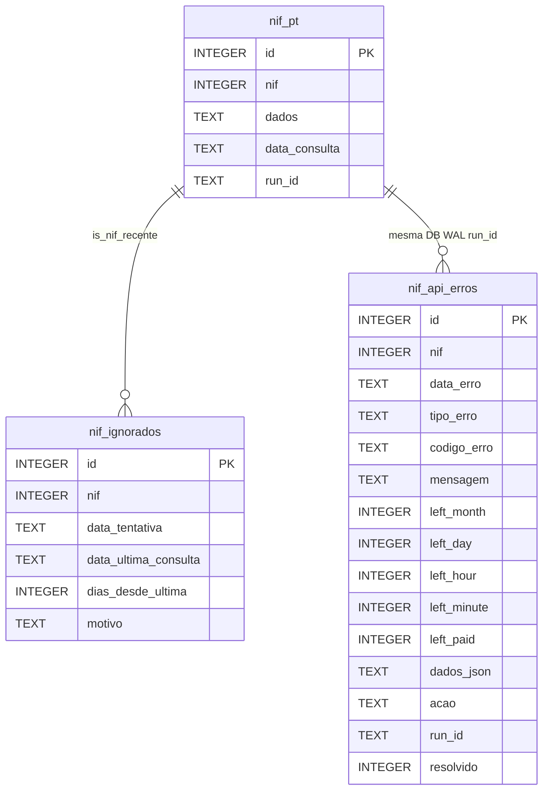
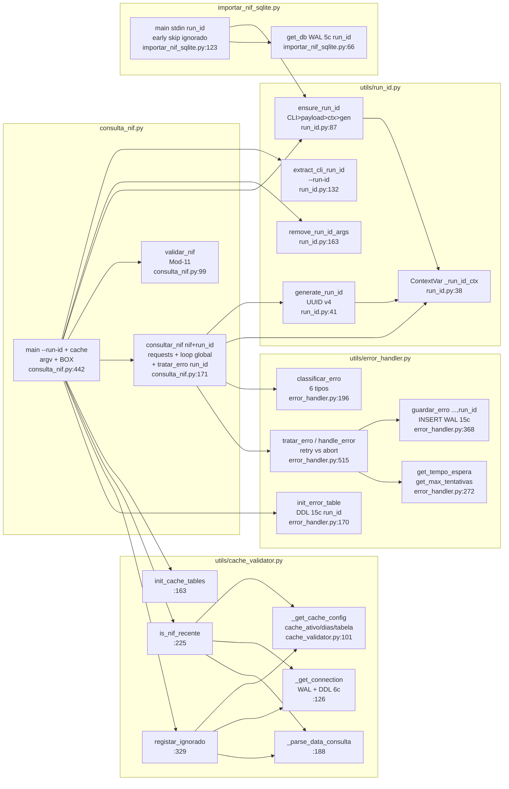

# Documentação Técnica — nif-pt v1.2.0 (cache + run_id)

> **Stack:** Python 3.11+ · `requests>=2.31.0` · `pyyaml>=6.0.1` · `python-dotenv>=1.0.0` · SQLite WAL `data/nif_pt.db` (3 tabelas: `nif_pt` 5c + `nif_api_erros` 15c + `nif_ignorados` 6c com `run_id` + `cache`)
> **HEAD:** `cache` + `run_id` · **Tag:** `v1.2.0-unreleased` · **Data:** 2026-09-10 (base `v1.1.0`)
> **Scripts:** `consulta_nif.py:626L` · `importar_nif_sqlite.py:285L` · `utils/cache_validator.py:407L` · `utils/run_id.py:191L` · `utils/error_handler.py:806L` · `main.py:92L` · `Logging/logging_orchestrator.py` · `config/config.py:134` + `config.yaml:31`

Índice: [1. Visão](#1-visão) · [2. Arquitetura C4](#2-arquitetura-c4) · [3. Sequência](#3-diagrama-de-sequência) · [4. Atividades](#4-diagrama-de-atividades) · [5. Classes](#5-diagrama-de-classes) · [6. ER](#6-esquema-er) · [7. Componentes](#7-diagrama-de-componentes) · [8. Catálogo de funções](#8-catálogo-de-funções-fileline) · [9. Config](#9-configuração) · [10. Camada de erros](#10-camada-de-erros) · [10b. Rastreabilidade run_id](#10b-rastreabilidade-run_id) · [10c. Validação cache](#10c-validação-cache) · [11. Logging R1-R9](#11-logging-r1r9) · [12. ADRs](#12-adrs) · [13. Pipeline](#13-pipeline-stdinstdout) · [14. Help Python](#14-help-python)

---

## 1. Visão

`nif-pt` consulta a API pública `http://www.nif.pt/?json=1&q=<NIF>&key=<KEY>` com validação Mod-11 local, **validação cache SQLite** (`nif_ignorados` 6c) antes de consumir créditos, devolve JSON normalizado em `stdout` (com `run_id` e opcional `ignorado`) e persiste via pipe em SQLite (JSON bruto). A camada `utils/error_handler` classifica erros de quota (`rate_limit_*`), persiste em `nif_api_erros` (SQLite WAL, 15c com `run_id`) e decide `retry 60s/3600s` vs `abort`. O módulo `utils/cache_validator` garante `is_nif_recente` + `registar_ignorado` com janela `cache_antiguidade_dias`. O módulo `utils/run_id.py` garante `run_id` UUID v4 por execução com propagação `CLI > payload > contexto > geração`.

**Requisitos funcionais (10):** RF-01 Mod-11 · RF-02 `GET ?json=1` · RF-03 JSON normalizado + `run_id`/`ignorado` · RF-04 erros rede/JSON/result · RF-05 SQLite WAL `nif_pt` 5c · RF-06 pipeline `stdin/stdout` com `run_id`/`ignorado` · RF-07 `get_config()` centralizado com `cache_*` · RF-08 rastreabilidade `run_id` · RF-09 cache `is_nif_recente` + `nif_ignorados` 6c · RF-10 `nif_api_erros` 15c.
**Requisitos não-funcionais (6):** RNF-01 `timeout 10s` + `sleep` batch + cache evita créditos · RNF-02 `exit 0/1` + `commit/rollback` + WAL + fail-open cache · RNF-03 `.env` ignorado + `***` no log · RNF-04 `pathlib` + PS/Bash + só `sqlite3` · RNF-05 `MANUAL.md` + `docs/` · RNF-06 `RotatingFileHandler` 10 MB/5000/10 + TAG `[cache][run]`.

---

## 2. Arquitetura C4

### 2.1 Contexto (C4 Nível 1)

```mermaid
graph TB
    U[Utilizador<br/>CLI NIF 9 dígitos] --> SYS[nif-pt v1.2.0<br/>Python 3.11 CLI<br/>cache + run_id]
    SYS --> API[(nif.pt<br/>API externa<br/>GET ?json=1&q=&key=<br/>se cache miss)]
    SYS --> DB[(SQLite<br/>data/nif_pt.db<br/>nif_pt 5c + nif_api_erros 15c<br/>+ nif_ignorados 6c WAL)]
    CFG[config.yaml 31L + .env<br/>get_config() cache_*] -. configuração .-> SYS
    LOG[log_files/nif_pt.log<br/>RotatingFileHandler<br/>&lt;&lt;nif-pt&gt;&gt; [cache][run]] -. logs .-> SYS
    CV[utils/cache_validator<br/>is_nif_recente + registar_ignorado<br/>DDL 6c] -. cache .-> SYS
    RID[utils/run_id.py<br/>generate_run_id + ContextVar<br/>--run-id > payload > ctx > uuid] -. run_id .-> SYS
```

| Ator / Sistema | Descrição | Ficheiro |
|---|---|---|
| Utilizador | Executa `python consulta_nif.py <NIF> [--run-id UUID]` + pipe | `consulta_nif.py:442` `main()` + `utils/run_id.py:132` |
| nif-pt | Valida Mod-11, verifica cache, consulta, classifica erro, persiste com `run_id` | `consulta_nif.py` + `utils/cache_validator.py` + `utils/run_id.py` + `utils/error_handler.py` |
| nif.pt | `GET http://www.nif.pt/?json=1&q=&key=` (só se `is_nif_recente==False`) | `consulta_nif.py:272` `requests.get` (`TIMEOUT 10`) |
| SQLite | `nif_pt` 5c + `nif_api_erros` 15c + `nif_ignorados` 6c WAL + índices `run_id`/`nif_ignorados_*` | `importar_nif_sqlite.py:55` + `utils/error_handler.py:46` + `utils/cache_validator.py:43` |
| cache_validator | `nif_ignorados` 6c + `is_nif_recente` + `registar_ignorado` + `init_cache_tables` | `utils/cache_validator.py:43` |

### 2.2 Contentores (C4 Nível 2)

```mermaid
graph TB
    subgraph nif-pt v1.2.0
        C[consulta_nif.py<br/>626L<br/>validar_nif + cache + consultar_nif run_id<br/>retry per-tipo+global]
        CV[utils/cache_validator.py<br/>407L<br/>is_nif_recente + registar_ignorado<br/>DDL nif_ignorados 6c WAL + init]
        S[importar_nif_sqlite.py<br/>285L<br/>get_db WAL + INSERT JSON 5c<br/>early skip ignorado + run_id]
        R[utils/run_id.py<br/>191L<br/>generate_run_id + ContextVar<br/>ensure CLI>payload>ctx>gen]
        E[utils/error_handler.py<br/>806L<br/>classificar + tratar + guardar run_id<br/>rate_limit_* + BOX]
        CFG[config/config.py<br/>134L<br/>get_config merge default+script+.env<br/>cache_*]
        LOG[Logging/logging_orchestrator.py<br/>580L<br/>RotatingFileHandler 10MB/5000/10<br/>R1-R9 &lt;&lt;nif-pt&gt;&gt; [cache][run]]
        MAIN[main.py<br/>92L<br/>ensure_run_id + stub BANNER+BOX]
    end
    U[Utilizador<br/>NIF --run-id] -->|argv + run_id| C
    C -->|is_nif_recente? recente?| CV
    CV -.->|cache hit -> nif_ignorados| DB
    C -->|stdout JSON run_id + ignorado| S
    C -->|tratar_erro run_id| E
    R -. run_id .-> C & S & E & CV & MAIN
    E -.-> DB
    CV -.-> DB
    CFG -.-> C & S & E & CV
    LOG -.-> C & S & E & CV & MAIN
    S --> DB[(SQLite 5c/15c/6c WAL)]
```

| Contentor | Linhas | Responsabilidade | Estado v1.2.0 |
|---|---|---|---|
| `consulta_nif.py` | 626 | Mod-11 + `is_nif_recente` cache + `requests.get ?json=1` + loop `max_global+1` + `tratar_erro` + `consultar_nif(nif, run_id)` + `--run-id` + `run_id`/`ignorado` em JSON | ✅ |
| `utils/cache_validator.py` | 407 | `is_nif_recente(nif,dias)->(bool,str)` + `registar_ignorado(nif, data_ultima)` + `init_cache_tables()` + DDL `nif_ignorados` 6c + 2 índices + WAL + `_parse_data_consulta` | ✅ novo `v1.2.0` |
| `utils/run_id.py` | 191 | `generate_run_id()` UUID v4 + `ContextVar` + `ensure_run_id(CLI>payload>ctx>gen)` + `extract_cli_run_id`/`remove_run_id_args` | ✅ |
| `utils/error_handler.py` | 806 | `classificar_erro` 6 tipos + `tratar_erro(...,run_id)` retry/abort + `guardar_erro(...,run_id)` 15c + `init_error_table` | ✅ |
| `importar_nif_sqlite.py` | 285 | `PRAGMA WAL` + `INSERT (nif,dados,data_consulta,run_id)` + early skip `ignorado` + `ensure_run_id(CLI>payload>gen)` + fallback | ✅ |
| `config/config.py` | 134 | `get_config()` merge `default< script <.env` + `***` + documenta `cache_*` | ✅ |
| `Logging/logging_orchestrator.py` | 580 | `RotatingFileHandler` + 9 estilos R1-R9, `<<nif-pt>>`, `nif_pt.log`, TAG `[cache][run]` | ✅ |
| `main.py` | 92 | `ensure_run_id(cli_value)` por execução + Stub `BANNER_APP` + `BOX` ajuda | ✅ |
| `api/ models/ scrapers/` | 0 | Reservados FastAPI/Pydantic/HTML | 🚧 v1.3 |

---

## 3. Diagrama de Sequência — Consulta com cache, retry, run_id e persistência

```mermaid
sequenceDiagram
    participant U as Utilizador<br/>CLI
    participant CLI as consulta_nif.py:main<br/>setup_logging + init_error_table<br/>+ init_cache_tables<br/>ensure_run_id
    participant CV as utils/cache_validator<br/>is_nif_recente + registar_ignorado<br/>nif_ignorados 6c WAL
    participant V as validar_nif<br/>Mod-11
    participant CFG as get_config<br/>config.yaml+.env<br/>cache_ativo/dias
    participant API as nif.pt<br/>GET ?json=1&q=&key=<br/>timeout 10s
    participant EH as utils/error_handler<br/>classificar_erro + tratar_erro<br/>guardar_erro(...,run_id)
    participant OUT as stdout<br/>JSON run_id + ignorado
    participant IMP as importar_nif_sqlite.py<br/>stdin JSON -> INSERT/skip
    participant DB as SQLite WAL<br/>nif_pt 5c + nif_ignorados 6c<br/>+ nif_api_erros 15c

    U->>CLI: python consulta_nif.py 509442013 [--run-id UUID]
    CLI->>CFG: get_config("consulta_nif")
    CFG-->>CLI: api_base, timeout 10, NIF-PT-KEY ***XXXX, max_* 5/3/2/0/0, cache_ativo true dias 30
    CLI->>EH: init_error_table() DDL 15c run_id WAL
    EH-->>CLI: nif_api_erros garantido
    CLI->>CV: init_cache_tables() DDL nif_ignorados 6c WAL
    CV-->>CLI: nif_ignorados garantido
    CLI->>V: validar_nif("509442013")
    V-->>CLI: true (Mod-11) — só loga, não bloqueia
    CLI->>CV: is_nif_recente(nif, dias=30) SELECT data_consulta FROM nif_pt WHERE nif=? ORDER BY datetime DESC LIMIT 1
    CV-->>CLI: (recente:bool, data_ultima:str|None) + [cache] recente=True/False (0.02s)
    alt recente == True
        CLI->>CV: registar_ignorado(nif, data_ultima, "cache_recente") INSERT nif_ignorados
        CV->>DB: INSERT nif_ignorados (nif, data_ultima_consulta, dias_desde_ultima, motivo) + data_tentativa DEFAULT
        CV-->>CLI: id ignorado
        CLI-->>OUT: {"nif":..., "ignorado":true, "motivo":"cache_recente", "data_ultima_consulta":..., "cache_antiguidade_dias":30, "run_id":...} exit 0 sem API
        OUT->>IMP: stdin JSON ignorado:true
        IMP->>IMP: if ignorado -> INFO [cache] skip INSERT + BOX skip + exit 0
    else recente == False
        loop tentativa_global 0..max_global (5)
            CLI->>API: GET /?json=1&q=509442013&key=*** timeout 10s
            alt Timeout / RequestException
                API-->>CLI: requests.Timeout
                CLI->>CLI: last_error={"erro":"Timeout...","run_id":...}; sleep 60s; continue se <max_global
            else JSONDecodeError
                API-->>CLI: body não JSON
                CLI-->>U: {"erro":"Resposta inválida (não JSON)","run_id":...} exit 1
            else 200 JSON
                API-->>CLI: {"result":"success"|"error", "message","records","credits"}
                alt result != "success"
                    CLI->>EH: tratar_erro(nif, data, tentativa_global, tentativas_por_tipo, run_id)
                    EH->>EH: classificar_erro -> rate_limit_minute/hour/day/month/paid/generic/unknown
                    EH->>DB: guardar_erro(nif, tipo, codigo, mensagem, left, dados_json, acao, run_id) WAL 15c
                    EH-->>CLI: {tipo, acao: retry|abort|none, espera 60|3600|0, deve_retry, max_tipo, max_global}
                    alt acao == "retry" && deve_retry && tentativa_global < max_global
                        CLI->>CLI: sleep(espera) 60s minuto / 3600s hora; tentativas_por_tipo[tipo]++
                    else acao == "abort" || !deve_retry
                        CLI-->>OUT: {"nif":..., "erro": message, "tipo_erro": tipo, "dados": data, "run_id":...} exit 1
                    end
                else result == "success"
                    CLI->>CLI: records.get(nif) fallback first_key; creditos
                    CLI-->>OUT: {"nif":"509442013","valido":true,"erro":null,"dados":{...},"creditos":{...},"run_id":"550e8400-..."}
                    OUT->>IMP: stdin JSON run_id
                    IMP->>DB: INSERT nif_pt (nif,dados,data_consulta,run_id) WAL 5c commit + idx
                    IMP-->>U: stderr BOX "Guardado em SQLite run_id=550e8400..." exit 0
                end
            end
        end
    end
```

**Pontos chave:** `run_id` gerado em `consulta_nif.py:481` + cache check `consulta_nif.py:529` `is_nif_recente` **antes** de `requests.get`; se `recente==True` → `registar_ignorado` + JSON `ignorado:true` + `sys.exit(0)` sem API; `importar_nif_sqlite.py:194` faz `if ignorado: skip`; precedência `CLI --run-id` > `payload run_id` > `ContextVar` > `uuid4`; `NIF-PT-KEY` mascarada; `init_cache_tables` + `init_error_table` antes de qualquer query; contadores `tentativas_por_tipo` + `tentativa_global` com limite conjunto `&&`; persistência **sempre** (`guardar_erro`) antes de decidir; `BOX` inclui `run_id` + `BOX NIF ignorado`.

---

## 4. Diagrama de Atividades — Validação, cache, run_id e request

```mermaid
graph TD
    A[argv NIF --run-id] --> R0[ensure_run_id cli_value<br/>extract_cli_run_id + remove_run_id_args<br/>utils/run_id.py:132]
    R0 --> B{nif.isdigit?}
    B -- não --> E1[print erro + run_id + exit 1]
    B -- sim --> C[get_config consulta_nif<br/>api_base, timeout 10, cache_ativo/dias, NIF-PT-KEY, max_*]
    C --> D{API_KEY existe?}
    D -- não --> E2[return erro NIF-PT-KEY + run_id<br/>exit 1]
    D -- sim --> F[init_error_table WAL 15c<br/>+ init_cache_tables WAL 6c<br/>fail-open]
    F --> G[validar_nif Mod-11<br/>Σ d*(9-i)%11 -> digito<br/>log WARN se FAIL<br/>não bloqueia]
    G --> CC{cache_ativo?}
    CC -- não --> H[Loop tentativa_global 0..max_global 5<br/>tentativas_por_tipo dict + run_id]
    CC -- sim --> CH[is_nif_recente nif dias<br/>SELECT data_consulta FROM nif_pt<br/>WHERE nif=? ORDER BY datetime DESC LIMIT 1<br/>_parse_data_consulta YYYY-MM-DD HH:MMSS/ISO]
    CH --> CR{recente?}
    CR -- sim recente=True --> CI[registar_ignorado<br/>INSERT nif_ignorados<br/>dias_desde_ultima + motivo cache_recente<br/>+ data_tentativa DEFAULT]
    CI --> CO[stdout JSON ignorado:true<br/>motivo cache_recente<br/>data_ultima_consulta + cache_antiguidade_dias<br/>+ run_id + BOX cache + exit 0<br/>sem API]
    CR -- não recente=False --> H
    CH -- erro BD fail-open<br/>return False --> H
    H --> I[requests.get<br/>?json=1&q=&key= timeout 10s]
    I --> J{Exceção?}
    J -- Timeout --> K1[last_error Timeout + run_id<br/>sleep 60s se <max_global<br/>retry global]
    J -- RequestException --> K2[last_error rede + run_id<br/>sleep 60s retry]
    J -- JSONDecodeError --> E4[return não JSON + run_id<br/>exit 1]
    J -- ok 200 --> L{result == success?}
    L -- não --> M[tratar_erro nif+data+run_id<br/>classificar_erro<br/>guardar_erro WAL 15c run_id]
    M --> N{tipo + acao?}
    N -- rate_limit_minute<br/>tenta<3 && global<5 --> O1[sleep 60s<br/>retry]
    N -- rate_limit_hour<br/>tenta<2 && global<5 --> O2[sleep 3600s<br/>retry]
    N -- rate_limit_day/month/paid<br/>ou esgotou --> E5[return abort + run_id<br/>tipo_erro + exit 1]
    N -- generic/unknown --> E6[return none + run_id<br/>exit 1]
    O1 --> H
    O2 --> H
    L -- sim --> P[records.get nif fallback<br/>first_key]
    P --> Q[return dict valido true<br/>dados+creditos+run_id+BOX<br/>stdout JSON run_id]
    K1 --> H
    K2 --> H
    E1 --> Z[*]
    E2 --> Z
    E4 --> Z
    E5 --> Z
    E6 --> Z
    Q --> R[Pipe JSON run_id -> importar_nif_sqlite.py<br/>ensure_run_id CLI>payload>ctx>gen<br/>if ignorado: skip INSERT [cache]<br/>else INSERT WAL 5c run_id<br/>BOX run_id + TIMING]
    CO --> R2[Pipe JSON ignorado -> importar_nif_sqlite.py<br/>INFO [cache] skip + BOX skip<br/>exit 0]
    R --> Z
    R2 --> Z
```

---

## 5. Diagrama de Classes — Domínio (sem ORM, dicts normalizados)

```mermaid
classDiagram
    class ConsultaResultado {
        +str nif
        +bool valido
        +str fonte
        +str erro
        +RegistoNif dados
        +bool nif_valido_formato
        +Creditos creditos
        +str tipo_erro
        +str run_id
        +bool ignorado
        +str motivo
        +str data_ultima_consulta
        +int cache_antiguidade_dias
    }
    class RegistoNif {
        +int nif
        +str seo_url
        +str title
        +str alias
        +str status
        +date start_date
        +str activity
        +str address
        +str pc4
        +str pc3
        +str city
        +Place place
        +Geo geo
        +Contacts contacts
        +Structure structure
        +list cae
        +str racius
        +str portugalio
    }
    class Place { +str address; +str pc4; +str pc3; +str city }
    class Geo { +str region; +str county; +str parish }
    class Contacts { +str email; +str phone; +str website; +str fax }
    class Structure { +str nature; +str capital; +str capital_currency }
    class Creditos { +str used; +dict|list left }
    class NifApiErro {
        +int id PK
        +int nif
        +str data_erro
        +str tipo_erro
        +str codigo_erro
        +str mensagem
        +int left_month
        +int left_day
        +int left_hour
        +int left_minute
        +int left_paid
        +str dados_json
        +str acao
        +str run_id
        +int resolvido
    }
    class NifIgnorado {
        +int id PK
        +int nif
        +str data_tentativa
        +str data_ultima_consulta
        +int dias_desde_ultima
        +str motivo
    }
    class RunId {
        +str run_id UUID v4
        +generate_run_id() str
        +ensure_run_id(cli, payload) str
        +extract_cli_run_id(argv) str|None
        +remove_run_id_args(argv) list
        +ContextVar _run_id_ctx
    }
    class CacheValidator {
        +is_nif_recente(nif, dias) (bool, str)
        +registar_ignorado(nif, data_ultima, motivo) int
        +init_cache_tables() None
        +_parse_data_consulta(val) datetime
        +_get_cache_config() (bool,int,str)
        +_get_connection() Connection
    }
    class Config {
        +str api_base
        +int timeout
        +int tempo_de_espera
        +int tempo_espera_minuto
        +int tempo_espera_hora
        +int max_tentativas_global
        +bool cache_ativo
        +int cache_antiguidade_dias
        +str cache_tabela_ignorados
        +str NIF_PT_KEY
    }
    ConsultaResultado --> RegistoNif
    RegistoNif --> Place
    RegistoNif --> Geo
    RegistoNif --> Contacts
    RegistoNif --> Structure
    ConsultaResultado --> Creditos
    ConsultaResultado ..> NifApiErro : erro -> guardar_erro(...,run_id)
    ConsultaResultado ..> NifIgnorado : cache hit -> registar_ignorado
    CacheValidator ..> NifIgnorado : DDL 6c + is_nif_recente
    CacheValidator ..> ConsultaResultado : is_nif_recente -> ignorado:true
    Config ..> ConsultaResultado : get_config + cache_*
    Config ..> CacheValidator : _get_cache_config
    RunId ..> ConsultaResultado : ensure_run_id CLI>payload>ctx>gen
    RunId ..> NifApiErro : guardar_erro run_id
    RunId ..> NifIgnorado : registar_ignorado (via run_id log)
```

---

## 6. Esquema ER



**Catálogo resumido (detalhe em `docs/database/schema.md`):**

| Tabela | Motor | Cols | PK | Histórico | DDL |
|---|---|---|---|---|---|
| `nif_pt` | `data/nif_pt.db` SQLite WAL | 5 (`id, nif, dados, data_consulta, run_id`) | `id AUTOINCREMENT` | Sim (sem `UNIQUE nif`) | `importar_nif_sqlite.py:55` |
| `nif_api_erros` | `data/nif_pt.db` SQLite WAL | 15 (14 + `run_id`) | `id AUTOINCREMENT` | Sim | `utils/error_handler.py:46` `DDL_ERROS` + `idx_run_id` |
| `nif_ignorados` | `data/nif_pt.db` SQLite WAL | 6 (`id, nif, data_tentativa, data_ultima_consulta, dias_desde_ultima, motivo`) | `id AUTOINCREMENT` | Sim | `utils/cache_validator.py:43` `DDL_IGNORADOS` + 2 índices |

Sem Azure desde v1.2.0 — sem `stg_nunotome`, `pyodbc`, `ODBC Driver 18`, `sql/0*`.

---

## 7. Diagrama de Componentes



---

## 8. Catálogo de funções (file:line)

| Módulo | Função / Classe | Linha | Assinatura | Descrição |
|---|---|---|---|---|
| `consulta_nif` | `validar_nif` | `99` | `(nif: str) -> bool` | Mod-11 AT `Σ d*(9-i)%11` |
| `consulta_nif` | `consultar_nif` | `171` | `(nif: str, run_id: str\|None) -> dict` | `GET ?json=1&q=&key=` + loop `max_global+1` + `tratar_erro(...,run_id)` + `run_id` em retorno |
| `consulta_nif` | `main` | `442` | `() -> None` | CLI `argv` + `--run-id` + `init_error_table` + `init_cache_tables` + `is_nif_recente` → `ignorado:true` + `print(json)` + BOX `run_id`/`cache` |
| `utils/run_id` | `generate_run_id` | `41` | `() -> str` | UUID v4 `xxxxxxxx-xxxx-4xxx-xxxx-...` (36c) |
| `utils/run_id` | `set_run_id` / `get_run_id` | `59` / `78` | `(run_id) -> str\|None` | `ContextVar.set/get` |
| `utils/run_id` | `ensure_run_id` | `87` | `(cli_value, payload_value) -> str` | Precedência `CLI > payload > ctx > uuid4` + `set_run_id` |
| `utils/run_id` | `extract_cli_run_id` | `132` | `(argv) -> str\|None` | Parse `--run-id UUID` / `--run-id=UUID` |
| `utils/run_id` | `remove_run_id_args` | `163` | `(argv) -> list[str]` | Cópia `argv` sem `--run-id` |
| `utils/cache_validator` | `_get_cache_config` | `101` | `() -> (bool,int,str)` | Lê `cache_ativo`, `cache_antiguidade_dias`, `cache_tabela_ignorados` (sanitizado) |
| `utils/cache_validator` | `_get_connection` | `126` | `() -> sqlite3.Connection` | `WAL` + `DDL nif_ignorados` 6c + 2 índices `idx_nif_ignorados_*` |
| `utils/cache_validator` | `init_cache_tables` | `163` | `() -> None` | DDL 6c idempotente WAL (fail-open) |
| `utils/cache_validator` | `_parse_data_consulta` | `188` | `(val: str\|None) -> datetime\|None` | Parse `YYYY-MM-DD HH:MM:SS` / `ISO` / `Z` |
| `utils/cache_validator` | `is_nif_recente` | `225` | `(nif: str\|int, dias: int\|None) -> (bool, str\|None)` | `SELECT data_consulta FROM nif_pt WHERE nif=? ORDER BY datetime DESC LIMIT 1` + `total_seconds/86400 < dias` + `INFO [cache]` |
| `utils/cache_validator` | `registar_ignorado` | `329` | `(nif, data_ultima_consulta, motivo) -> int\|None` | `INSERT nif_ignorados (nif, data_ultima_consulta, dias_desde_ultima, motivo)` |
| `importar_nif_sqlite` | `get_db` | `66` | `() -> sqlite3.Connection` | `mkdir` + `WAL` + `DDL nif_pt` 5c + migração `run_id` + `idx_run_id` |
| `importar_nif_sqlite` | `main` | `123` | `() -> None` | `stdin` JSON `run_id`/`ignorado` → `ensure_run_id` → `if ignorado: skip` → `INSERT (nif,dados,data_consulta,run_id)` + fallback |
| `utils/error_handler` | `classificar_erro` | `196` | `(data: dict) -> str` | 6 tipos `rate_limit_*` + `generic/unknown` |
| `utils/error_handler` | `get_tempo_espera` | `272` | `(tipo_erro: str) -> int` | `60`/`3600`/`0` do `config.yaml` |
| `utils/error_handler` | `get_max_tentativas` | `296` | `(tipo_erro: str) -> int` | `3/2/0/0` do `config.yaml` |
| `utils/error_handler` | `guardar_erro` | `368` | `(nif, tipo_erro, ..., run_id) -> int\|None` | `INSERT nif_api_erros` 15c WAL `run_id` |
| `utils/error_handler` | `tratar_erro` | `515` | `(nif, data, ..., run_id) -> dict` | `retry/abort/none` + `espera` + `deve_retry` + `run_id` |
| `config/config` | `get_config` | `53` | `(script_name: str) -> dict` | merge `default< script <.env` + `***` + `cache_*` |
| `Logging/logging_orchestrator` | `setup_logging` | `226` | `() -> Logger` | wrapper `ini_logging` idempotente + TAG `[cache][run]` |
| `main` | `main` | `35` | `() -> None` | `ensure_run_id(cli_value)` por execução + `BANNER_APP` + `BOX` |

---

## 9. Configuração

### 9.1 `config/config.yaml` (31L)

```yaml
default:
  retry_count: 1              # legado, fallback se max_* não existir
  timeout: 10                 # s para requests.get (10s, não 1000)
  tempo_de_espera: 60         # s — rede/Timeout genérico
  tempo_espera_minuto: 60     # s — rate_limit_minute
  tempo_espera_hora: 3600     # s — rate_limit_hour
  max_tentativas_global: 5
  max_tentativas_minuto: 3
  max_tentativas_hora: 2
  max_tentativas_dia: 0       # 0 = abort sem retry
  max_tentativas_mes: 0
  max_tentativas_paid: 0
  cache_ativo: true           # liga validação cache antes de API
  cache_antiguidade_dias: 30  # janela recenticidade (dias)
  cache_tabela_ignorados: "nif_ignorados"
consulta_nif:
  api_base: "http://www.nif.pt"
importar_nif_sqlite:
  db_path: "data/nif_pt.db"
  tabela: "nif_pt"
```

> Removido v1.2.0: bloco `importar_nif` (`sql_server`, `sql_database`, `sql_schema`, `sql_driver`, `tabela_staging`), `pyodbc`, `AZURE_*`.

### 9.2 `config/config.py:get_config()` (134L)

`CONFIG_YAML = yaml.safe_load(open(..., encoding="utf-8"))` → `config = default.copy(); config.update(script_config)` (shallow) → `config["NIF_PT_KEY"]=os.getenv("NIF-PT-KEY")` (hífen!) + `API_TOKEN` → log `NIF-PT-KEY=***XXXX` + WARN se falta. Documenta `cache_*` (`cache_ativo`, `cache_antiguidade_dias`, `cache_tabela_ignorados`) via `_get_cache_config()`.

### 9.3 `config/.env` (não versionado)

```env
NIF-PT-KEY=xxxxx          # com hífen — obter em http://www.nif.pt/contactos/api/
# API_TOKEN=opcional
```

---

## 10. Camada de erros

| Tipo (`classificar_erro`) | Mensagem API | `left` | Ação `tratar_erro` | Espera | `max_*` | Persistência |
|---|---|---|---|---|---|---|
| `rate_limit_minute` | `Limit per minute` | `minute==0` | `retry` se `tenta<3 && global<5` senão `abort` | 60s | 3 | `guardar_erro(...,run_id, acao=retry_60s)` |
| `rate_limit_hour` | `Limit per hour` | `hour==0` | `retry` se `tenta<2 && global<5` | 3600s | 2 | `retry_3600s` |
| `rate_limit_day` | `Limit per day` | `day==0` | `abort` fatal + BOX | 0 | 0 | `abort_day` |
| `rate_limit_month` | `Limit per month` | `month==0` | `abort` fatal + BOX | 0 | 0 | `abort_month` |
| `rate_limit_paid` | `Limit per ... paid` | `paid==0` | `abort` | 0 | 0 | `abort_paid` |
| `generic_error` | `result != success` sem `limit` | — | `none` (auditoria) | 0 | 0 | `none` |
| `unknown` | `result==success` ou não-dict | — | `none` | 0 | 0 | `none` |

**Lógica conjunta:** `deve_retry = (tenta_tipo < max_tipo) && (tenta_global < max_global)` — só retry se ambos permitirem; motivo `max_tipo` vs `max_global` logado `[rate-limit]`. Fallback legado `attempt < retry_count` se `tentativas_por_tipo is None`.

**DDL `nif_api_erros` (15c: 14+`run_id`):** `id PK`, `nif`, `data_erro`, `tipo_erro`, `codigo_erro`, `mensagem`, `left_month/day/hour/minute/paid`, `dados_json`, `acao`, `run_id TEXT`, `resolvido` + índices `nif`, `tipo_erro`, `data_erro`, `run_id` (`idx_nif_api_erros_run_id`). SQLite em `utils/error_handler.py:46` (`WAL` + migração `ALTER TABLE ADD COLUMN run_id TEXT` + `CREATE INDEX IF NOT EXISTS idx_*_run_id`). Todos os `tratar_erro(...,run_id)` / `guardar_erro(...,run_id)` propagam o mesmo `run_id` da execução.

---

## 10b. Rastreabilidade run_id (`utils/run_id.py` 191L)

### Conceito

`run_id` é um **UUID v4** (`xxxxxxxx-xxxx-4xxx-xxxx-xxxxxxxxxxxx`, 36 chars com hífens) que identifica **uma execução** do programa — todos os `INSERT` na mesma invocação partilham o mesmo `run_id`. Permite agrupar por execução (`SELECT * FROM nif_pt WHERE run_id=?`), replay determinístico e auditoria ponta-a-ponta (`consulta_nif` → `importar_nif_sqlite` → `nif_api_erros`).

### Geração (`utils/run_id.py:41`)

```python
def generate_run_id() -> str: return str(uuid.uuid4())  # 36 chars, 4 hífens
```

- `utils/run_id.py:38` `_run_id_ctx: ContextVar[str|None]` — thread-safe e async-safe.
- `utils/run_id.py:59` `set_run_id(run_id)` / `utils/run_id.py:78` `get_run_id()` — acesso ao contexto.

### CLI `--run-id` (`utils/run_id.py:132`)

```powershell
python consulta_nif.py 509442013 --run-id 550e8400-e29b-41d4-a716-446655440000
python consulta_nif.py 509442013 --run-id=550e8400-e29b-41d4-a716-446655440000 | python importar_nif_sqlite.py --run-id 550e8400-e29b-41d4-a716-446655440000
```

- `utils/run_id.py:132` `extract_cli_run_id(argv)` — parse manual sem `argparse` (suporta `--run-id UUID` e `--run-id=UUID`).
- `utils/run_id.py:163` `remove_run_id_args(argv)` — devolve cópia sem `--run-id` para validação `isdigit` posicional (`consulta_nif.py:495` `argv_clean`).

### Propagação (`utils/run_id.py:87`)

**Precedência** `ensure_run_id(cli_value, payload_value)`:

1. `cli_value` (`--run-id`) se não-vazio
2. `payload_value` (`resultado["run_id"]` do JSON stdin) se não-vazio
3. `ContextVar` actual se já definido
4. Gera novo `uuid4`

### Persistência

| Tabela | DDL com `run_id` | Índice `run_id` | Inserção |
|--------|------------------|-----------------|----------|
| SQLite `nif_pt` | `importar_nif_sqlite.py:55` `run_id TEXT` + migração `ALTER TABLE ADD COLUMN run_id TEXT` (`:102`) | `idx_nif_pt_run_id` (`:112`) | `INSERT (nif,dados,data_consulta,run_id)` + fallback (`:238`) |
| SQLite `nif_api_erros` | `utils/error_handler.py:46` `run_id TEXT` + migração (`:153`) | `idx_nif_api_erros_run_id` (`:68`) | `INSERT (...,run_id)` + fallback (`:436`) |

```sql
-- Por execução
SELECT nif, substr(run_id,1,8), data_consulta FROM nif_pt WHERE run_id='550e8400-...' ORDER BY data_consulta DESC;
SELECT tipo_erro, COUNT(*) FROM nif_api_erros GROUP BY run_id, tipo_erro;
```

---

## 10c. Validação cache (`utils/cache_validator.py` 407L) — novo v1.2.0

### Conceito

Cache evita gasto de créditos repetindo pedidos para NIFs já consultados dentro da janela `cache_antiguidade_dias` (default 30d). Em `consulta_nif.py:529` **antes** de `requests.get`, `is_nif_recente(nif, dias)` pesquisa `nif_pt` SQLite; se `recente==True` → `registar_ignorado()` em `nif_ignorados` 6c + JSON `{ignorado:true, motivo:cache_recente, data_ultima_consulta, cache_antiguidade_dias}` + `sys.exit(0)` sem API; `importar_nif_sqlite.py:194` faz early skip.

### Configuração (`config/config.yaml:15`)

```yaml
default:
  cache_ativo: true                 # bool — liga/desliga cache
  cache_antiguidade_dias: 30        # int — janela dias (0 desliga recenticidade)
  cache_tabela_ignorados: "nif_ignorados"  # str — nome tabela (sanitizado alnum+_)
```

- `utils/cache_validator.py:101` `_get_cache_config() -> (bool,int,str)` — lê e sanitiza (`replace("_","").isalnum()` → fallback `"nif_ignorados"`); aceita `bool/int/str` para `dias`.
- `utils/cache_validator.py:82` `_get_db_path() -> Path` — resolve `data/nif_pt.db` relativo à raiz via `cfg.get("db_path")`.
- `consulta_nif.py:532` `_get_cache_config()` + `consulta_nif.py:536` `init_cache_tables()` (fail-open).

### DDL `nif_ignorados` 6c (`utils/cache_validator.py:43`)

```sql
CREATE TABLE IF NOT EXISTS nif_ignorados (
    id                      INTEGER PRIMARY KEY AUTOINCREMENT,
    nif                     INTEGER NOT NULL,
    data_tentativa          TEXT NOT NULL DEFAULT (datetime('now')),
    data_ultima_consulta    TEXT,
    dias_desde_ultima       INTEGER,
    motivo                  TEXT NOT NULL DEFAULT 'cache_recente'
);
CREATE INDEX IF NOT EXISTS idx_nif_ignorados_nif ON nif_ignorados(nif);
CREATE INDEX IF NOT EXISTS idx_nif_ignorados_data ON nif_ignorados(data_tentativa);
```

- `utils/cache_validator.py:126` `_get_connection() -> sqlite3.Connection` — `mkdir(parents)` + `connect` + `PRAGMA journal_mode=WAL` + `executescript(DDL_IGNORADOS)` + 2 índices + `commit`; usa nome de tabela sanitizado (`replace("nif_ignorados", tabela)` se diferente).
- `utils/cache_validator.py:163` `init_cache_tables() -> None` — abre e fecha ligação (garante DDL), chamada em `consulta_nif.py:536` (fail-open `try: init_cache_tables() except:`).
- Índices `idx_nif_ignorados_nif` (lookup por NIF) + `idx_nif_ignorados_data` (auditoria temporal).

### Funções públicas

**`is_nif_recente(nif, dias) -> (bool, str|None)` (`utils/cache_validator.py:225`):**

```python
# SELECT data_consulta FROM nif_pt WHERE nif=? ORDER BY datetime(data_consulta) DESC LIMIT 1
# _parse_data_consulta() para YYYY-MM-DD HH:MM:SS / ISO / Z
# total_dias = (now - dt_ultima).total_seconds() / 86400
# recente = 0 <= total_dias < dias  (futuro -> True por segurança)
# dias <=0 -> (False, None) sempre
# tabela nif_pt inexistente -> (False, None)
# falha BD -> (False, None) fail-open
# log INFO [cache] NIF ... ultima=... dias_desde=... antiguidade=... recente=... (%.2fs)
```

- `utils/cache_validator.py:188` `_parse_data_consulta(val) -> datetime|None` — tenta `"%Y-%m-%d %H:%M:%S"`, `"%Y-%m-%d %H:%M:%S.%f"`, `"%Y-%m-%dT%H:%M:%S"`, `"%Y-%m-%dT%H:%M:%S.%f"`, fallback `fromisoformat(replace("Z",""))`.
- Fail-open: qualquer `sqlite3.Error` → `return False, None` (nunca quebra fluxo para API).

**`registar_ignorado(nif, data_ultima_consulta, motivo="cache_recente") -> int|None` (`utils/cache_validator.py:329`):**

```python
# dias_desde = (now - _parse_data_consulta(data_ultima)).days if >=0 else 0
# INSERT INTO {tabela} (nif, data_ultima_consulta, dias_desde_ultima, motivo) VALUES (?,?,?,?)
# log INFO [cache] Ignorado registado id=... nif=... ultima=... dias_desde=... (%.2fs)
# falha -> rollback + ERROR [cache] Falha ao registar + return None
```

### Integração `consulta_nif.py:529` (main)

```python
# consulta_nif.py:529 (antes de consultar_nif)
cache_ativo, cache_dias, _ = _get_cache_config()
if cache_ativo:
    try: init_cache_tables()
    except: warning
    recente, data_ultima = is_nif_recente(nif, dias=cache_dias)
    if recente:
        try: registar_ignorado(nif, data_ultima)
        except: warning
        logger.info("[cache] NIF %s ignorado - ultima consulta %s dentro de %d dias", nif, data_ultima, cache_dias)
        ignorado_payload = {
            "nif": nif, "valido": validar_nif(nif), "fonte": None, "erro": None,
            "dados": None, "nif_valido_formato": None, "creditos": None,
            "run_id": _run_id, "ignorado": True, "motivo": "cache_recente",
            "data_ultima_consulta": data_ultima, "cache_antiguidade_dias": cache_dias,
        }
        print(json.dumps(ignorado_payload, indent=2, ensure_ascii=False))
        # BOX NIF ignorado - cache recente + run_id + TIMING + sys.exit(0) sem API
else:
    debug("[cache] cache_ativo=false -> validação ignorada")
# except fail-open: warning + prossegue para API
```

- `importar_nif_sqlite.py:194` early skip:

```python
if resultado.get("ignorado"):
    logger.info("[cache] NIF %s ignorado (cache_recente) ultima=%s run_id=%s - skip INSERT", ...)
    # BOX NIF ignorado - skip SQLite + sys.exit(0)
```

### Exemplos ponta-a-ponta

```powershell
# 1. Cache miss — vai à API + persiste
python consulta_nif.py 509442013 | python importar_nif_sqlite.py
# log: [cache] NIF 509442013 ultima=None ... recente=False -> GET -> INSERT

# 2. Cache hit — sem API + audita nif_ignorados + skip INSERT
python consulta_nif.py 509442013
# stdout: {"nif":"509442013","ignorado":true,"motivo":"cache_recente","data_ultima_consulta":"2026-09-10 12:00:00","cache_antiguidade_dias":30,"run_id":"..."}
# stderr: [cache] NIF 509442013 ignorado - ultima consulta 2026-09-10 12:00:00 dentro de 30 dias
# BOX | NIF ignorado - cache recente |
python consulta_nif.py 509442013 | python importar_nif_sqlite.py
# stderr: [cache] NIF 509442013 ignorado (cache_recente) ultima=... - skip INSERT

# 3. Forçar refresh
# config.yaml -> cache_ativo: false  ou  cache_antiguidade_dias: 0
# ou DELETE FROM nif_ignorados WHERE nif=509442013; DELETE FROM nif_pt WHERE nif=509442013;

# 4. Auditoria
# sqlite3 data/nif_pt.db "SELECT nif, data_ultima_consulta, dias_desde_ultima, motivo FROM nif_ignorados ORDER BY data_tentativa DESC LIMIT 5;"
# sqlite3 data/nif_pt.db "SELECT COUNT(*) FROM nif_pt; SELECT COUNT(*) FROM nif_ignorados; SELECT COUNT(*) FROM nif_api_erros;"
```

### Consultas úteis

```sql
-- Todas as tentativas ignoradas por NIF
SELECT nif, data_tentativa, data_ultima_consulta, dias_desde_ultima, motivo FROM nif_ignorados WHERE nif=509442013 ORDER BY datetime(data_tentativa) DESC;

-- Taxa de cache hit
SELECT COUNT(*) AS ignorados FROM nif_ignorados;
SELECT COUNT(*) AS sucessos FROM nif_pt;

-- Últimas consultas vs ignorados
SELECT nif, data_consulta, substr(run_id,1,8) FROM nif_pt ORDER BY datetime(data_consulta) DESC LIMIT 5;
SELECT nif, data_tentativa, substr(data_ultima_consulta,1,16) FROM nif_ignorados ORDER BY datetime(data_tentativa) DESC LIMIT 5;
```

Ver `MANUAL.md` §2.4c + §6 + `docs/database/schema.md` §4 e `utils/cache_validator.py:1` docstring.

---

## 11. Logging R1–R9 (`Logging/logging_orchestrator.py` 580L)

* **Prefixo:** `<<nif-pt>>` · **Ficheiro:** `log_files/nif_pt.log` · **Handler:** `RotatingFileHandler` 10 MB / 5000 recs / 10 backups (`LOG_MAX_BYTES/RECORDS/BACKUP`).
* **Níveis:** `LOG_LEVEL_GLOBAL/FILE/CONSOLE = INFO` · **Ultra-debug:** `FILE_ULTRA_DEBUG/CONSOLE_ULTRA_DEBUG = True` → `%(filename)s - %(funcName)s - %(lineno)d` em `DEBUG`.
* **Estilos:** R1 `WIDTH 49 ≤79` · R2 `= app, - secção, ~ função` · R3 BANNER 3 linhas `f"{' title ':=^49}"` · R4 TAG `[api][valid][cfg][db][sqlite][io][map][erro][rate-limit][cache][cli][run]` · R6 `f-string alignment` · R7 `INFO` banners · R9 TIMING `time.perf_counter() %.2fs` (APP/SECTION/FUNCTION).
* **`stderr` não quebra pipe:** `StreamHandler(sys.stderr)` + `stdout` só JSON (com `run_id` + `ignorado` opcional).
* **`run_id` no log:** `[run] run_id=550e8400-...` no arranque de todos os `main()` + BOX `| run_id : ... |` + truncado `run_id[:8]` em `DEBUG`.
* **`[cache]` no log:** `INFO [cache] NIF ... recente=True/False (%.2fs)` (`cache_validator.py:304`), `INFO [cache] Ignorado registado id=...` (`:384`), `INFO [cache] NIF ... ignorado - ultima consulta ... dentro de 30 dias` (`consulta_nif.py:546`), `INFO [cache] NIF ... ignorado (cache_recente) ... - skip INSERT` (`importar_nif_sqlite.py:195`).

---

## 12. ADRs

| ADR | Decisão | Consequência | Alternativa |
|---|---|---|---|
| ADR-001 | SQLite JSON bruto único (sem Azure 37c) — removido v1.2.0 | Simplificação: só `sqlite3` stdlib, 3 deps, `WAL` 3 tabelas; JSON schemaless resiste a mudanças | Normalizar ambos (quebra) / Azure 37c (removido) |
| ADR-002 | `PRAGMA WAL` em `nif_pt` + `nif_api_erros` + `nif_ignorados` | Mitiga `database is locked`, leitura concorrente | `DELETE` mode (bloqueia) |
| ADR-003 | Remoção `ODBC 18` + `Encrypt=yes` (v1.2.0) | Instalação sem drivers; só `pip install -r requirements.txt` | `ODBC 18` (removido) |
| ADR-004 | Pipeline `stdin/stdout` com early skip `ignorado` | Composição Unix `tee`, testável; `ignorado` não insere mas audita `nif_ignorados` | Orquestrador único (perde pipe) |
| ADR-005 | `get_config()` merge `default< script <.env` + `cache_*` | `.env` só segredos, YAML versionado; `shallow merge` + `cache_*` configurável | 1 ficheiro (mistura segredos) |
| ADR-006 | `logging_orchestrator` integrado (era template) | `<<nif-pt>>`, `nif_pt.log`, R1-R9 + TAG `[cache][run]` | `print` stderr (sem rotação) |
| ADR-007 | Camada `error_handler` com `nif_api_erros` 15c `run_id` | Auditoria + retry `60s/3600s` vs abort + limites per-tipo+global + `run_id` | Retry cego `retry_count` único |
| ADR-008 | `NIF-PT-KEY` com hífen | Fidelidade ao portal; frágil em Docker | `NIF_PT_KEY` (normalizado v2) |
| ADR-009 | `run_id` UUID v4 + `ContextVar` + `ensure_run_id` | Rastreabilidade por execução sem quebrar pipe; replay com `--run-id`; índices `run_id` | Sem `run_id` (sem agrupamento) / global mutável |
| ADR-010 | Cache `nif_ignorados` 6c + `is_nif_recente` + `registar_ignorado` (v1.2.0) | Evita créditos para NIFs recentes (30d default); `nif_ignorados` audita com 2 índices; fail-open; `TAG [cache]` + `BOX` + `TIMING`; configurável `cache_ativo`/`dias`/`tabela` | Cache em memória (perde persistência) / sem cache (gasta créditos) |

---

## 13. Pipeline `stdin`/`stdout`

```
[CLI NIF --run-id] --argv--> validar_nif() --get_config(cache_*)--> ensure_run_id(cli) + init_error_table + init_cache_tables
                 --is_nif_recente(nif, dias)--> se recente: registar_ignorado() -> nif_ignorados 6c -> stdout JSON {ignorado:true, motivo:cache_recente, data_ultima_consulta, cache_antiguidade_dias, run_id} (sem API) -> stdin importar_nif_sqlite.py early skip [cache]
                 --se não recente: requests.get(?json=1&q=&key=, timeout 10) -> tratar_erro() [retry 60s/3600s | abort] -> guardar_erro(...,run_id) WAL
                 --records[nif]+run_id--> stdout JSON {nif,valido,dados,creditos,run_id,tipo_erro} (ensure_ascii=False) -> stdin importar_nif_sqlite.py
                 --pipe run_id--> stdin --json.loads + ensure_run_id(CLI>payload>ctx>gen) + if ignorado: skip else INSERT nif_pt WAL 5c
                 --BOX run_id/cache/TAG [cache][run]/TIMING--> log_files/nif_pt.log (stderr)
```

* `stdout` só JSON (com `run_id` + opcional `ignorado/motivo/data_ultima_consulta/cache_antiguidade_dias`) → `| python importar_nif_sqlite.py` · `stderr` humano + BOX `| NIF : ... |` + `| Ultima : ... |` + `| run_id : ... |` · `exit 0` ok / `1` erro / `0` ignorado (não erro) · precedência `CLI --run-id` > `payload run_id` > `ctx` > `uuid4`; cache `recente==True` evita `requests.get`.

---

## 14. Help Python

Todos os módulos/funções têm docstrings PEP 257 com `Args / Returns / Raises / Examples / See Also` para `help(xxx)`:

```python
help(consulta_nif.validar_nif)
help(consulta_nif.consultar_nif)          # consultar_nif(nif, run_id)
help(utils.run_id.generate_run_id)
help(utils.run_id.ensure_run_id)           # CLI > payload > ctx > gen
help(utils.run_id.extract_cli_run_id)
help(utils.cache_validator.is_nif_recente) # is_nif_recente(nif, dias) -> (bool, str)
help(utils.cache_validator.registar_ignorado)
help(utils.cache_validator.init_cache_tables)
help(utils.error_handler.tratar_erro)      # tratar_erro(...,run_id)
help(utils.error_handler.classificar_erro)
help(utils.error_handler.guardar_erro)     # guardar_erro(...,run_id)
help(config.config.get_config)             # get_config + cache_*
help(importar_nif_sqlite.get_db)
```

Ver `docs/api/help.md` para transcrição verificada `python -m pydoc` / `help()`.

---

## 15. Referências

* `consulta_nif.py:99` `validar_nif` · `consulta_nif.py:171` `consultar_nif(nif, run_id)` · `consulta_nif.py:529` cache `is_nif_recente` · `utils/cache_validator.py:43` `DDL_IGNORADOS` / `utils/cache_validator.py:225` `is_nif_recente` / `:329` `registar_ignorado` · `utils/run_id.py:41` `generate_run_id` / `utils/run_id.py:87` `ensure_run_id` · `utils/error_handler.py:196` `classificar_erro` / `utils/error_handler.py:368` `guardar_erro(...,run_id)`
* `importar_nif_sqlite.py:55` `nif_pt` 5c + `importar_nif_sqlite.py:194` early skip `ignorado` · `utils/cache_validator.py:43` `nif_ignorados` 6c
* `config/config.yaml:15` `cache_*` · `Logging/logging_orchestrator.py:226` `setup_logging` + TAG `[cache][run]`
* `MANUAL.md` v1.2.0 · `CHANGELOG.md` v1.2.0 · `docs/api/nif-pt-api.md` (cache) · `docs/database/schema.md` 5/15/6c
