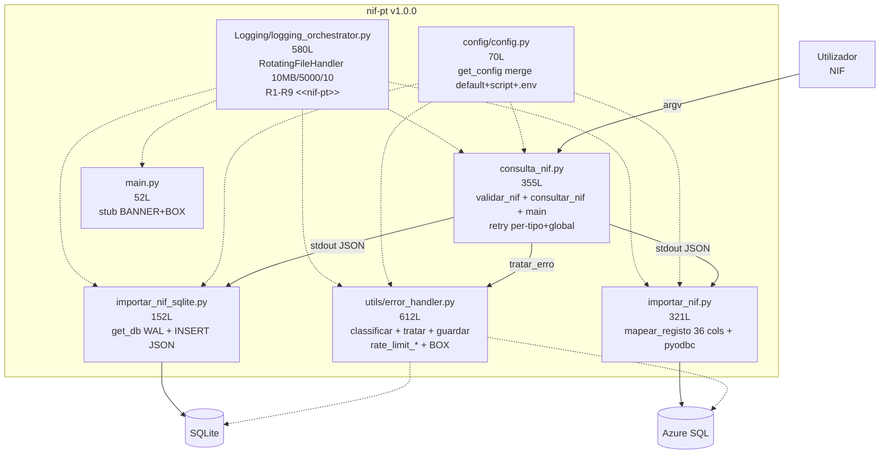
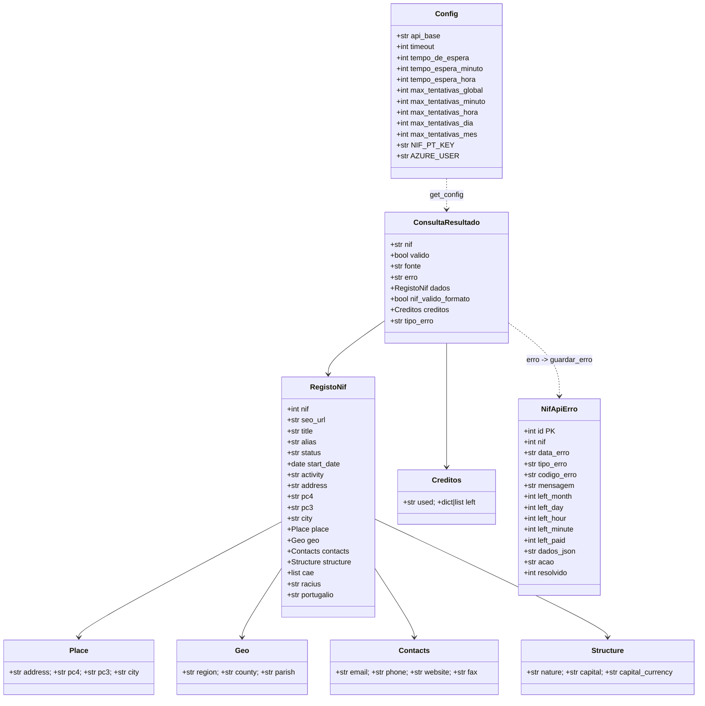
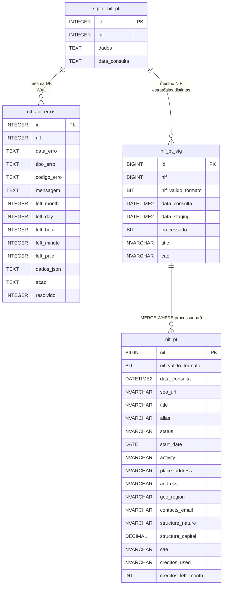
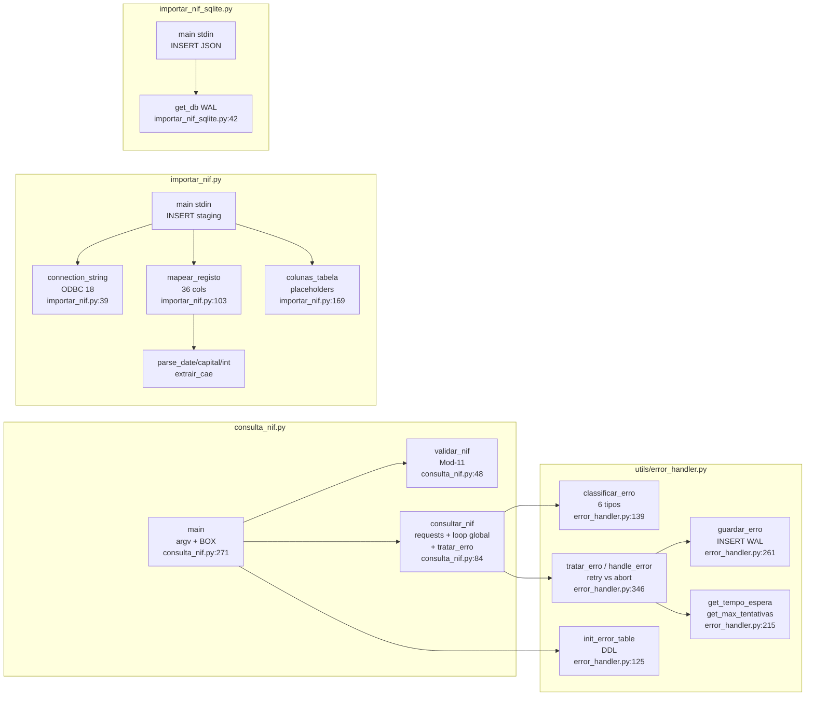

# Documentação Técnica — nif-pt v1.0.0

> **Stack:** Python 3.11+ · `requests>=2.31.0` · `pyyaml>=6.0.1` · `python-dotenv>=1.0.0` · `pyodbc>=5.0.0` (ODBC Driver 18) · SQLite WAL `data/nif_pt.db` · Azure SQL `kiwa-pt-operations/stg_nunotome` (37 cols `nif_pt` + 40 cols `nif_pt_stg` + 14 cols `nif_api_erros`)
> **HEAD:** `cd83aa8` · **Tag:** `v1.0.0` · **Data:** 2026-09-10
> **Scripts:** `consulta_nif.py` · `importar_nif_sqlite.py` · `importar_nif.py` · `main.py` (stub) · `utils/error_handler.py` (612L) · `Logging/logging_orchestrator.py` · `config/config.py` + `config.yaml`

Índice: [1. Visão](#1-visão) · [2. Arquitetura C4](#2-arquitetura-c4) · [3. Sequência](#3-diagrama-de-sequência) · [4. Atividades](#4-diagrama-de-atividades) · [5. Classes](#5-diagrama-de-classes) · [6. ER](#6-esquema-er) · [7. Componentes](#7-diagrama-de-componentes) · [8. Catálogo de funções](#8-catálogo-de-funções-fileline) · [9. Config](#9-configuração) · [10. Camada de erros](#10-camada-de-erros) · [11. Logging R1-R9](#11-logging-r1r9) · [12. ADRs](#12-adrs) · [13. Pipeline](#13-pipeline-stdinstdout) · [14. Help Python](#14-help-python)

---

## 1. Visão

`nif-pt` consulta a API pública `http://www.nif.pt/?json=1&q=<NIF>&key=<KEY>` com validação Mod-11 local, devolve JSON normalizado em `stdout` e persiste via pipe em SQLite (JSON bruto) e/ou Azure SQL (36 cols normalizadas). A camada `utils/error_handler` classifica erros de quota (`rate_limit_*`), persiste em `nif_api_erros` (dual SQLite/Azure) e decide `retry 60s/3600s` vs `abort`.

**Requisitos funcionais (8):** RF-01 Mod-11 · RF-02 `GET ?json=1` · RF-03 JSON normalizado · RF-04 erros rede/JSON/result · RF-05 SQLite WAL · RF-06 36 cols Azure · RF-07 pipeline `stdin/stdout` · RF-08 `get_config()` centralizado.
**Requisitos não-funcionais (6):** RNF-01 `timeout 10s` + `sleep` batch · RNF-02 `exit 0/1` + `commit/rollback` + WAL · RNF-03 `.env` ignorado + `***` no log · RNF-04 `pathlib` + ODBC 18 + PS/Bash · RNF-05 `MANUAL.md` + `docs/` · RNF-06 `RotatingFileHandler` 10 MB/5000/10.

---

## 2. Arquitetura C4

### 2.1 Contexto (C4 Nível 1)

```mermaid
graph TB
    U[Utilizador<br/>CLI NIF 9 dígitos] --> SYS[nif-pt<br/>Python 3.11 CLI<br/>v1.0.0]
    SYS --> API[(nif.pt<br/>API externa<br/>GET ?json=1&q=&key=)]
    SYS --> DB1[(SQLite<br/>data/nif_pt.db<br/>nif_pt + nif_api_erros<br/>WAL)]
    SYS --> DB2[(Azure SQL<br/>kiwa-pt-operations<br/>stg_nunotome.nif_pt* + nif_api_erros)]
    CFG[config.yaml + .env<br/>get_config()] -. configuração .-> SYS
    LOG[log_files/nif_pt.log<br/>RotatingFileHandler<br/>&lt;&lt;nif-pt&gt;&gt;] -. logs .-> SYS
```

| Ator / Sistema | Descrição | Ficheiro |
|---|---|---|
| Utilizador | Executa `python consulta_nif.py <NIF>` + pipe | `consulta_nif.py:271` `main()` |
| nif-pt | Valida Mod-11, consulta, classifica erro, persiste | `consulta_nif.py` + `utils/error_handler.py` |
| nif.pt | `GET http://www.nif.pt/?json=1&q=&key=` | `consulta_nif.py:113` `requests.get` |
| SQLite | `nif_pt` (4 cols) + `nif_api_erros` (14 cols) WAL | `importar_nif_sqlite.py:32` + `utils/error_handler.py:46` |
| Azure SQL | `nif_pt` 37 cols · `nif_pt_stg` 40 cols · `nif_api_erros` 14 cols | `sql/01_criar_tabelas.sql` + `sql/02_criar_tabela_erros.sql` |

### 2.2 Contentores (C4 Nível 2)



| Contentor | Linhas | Responsabilidade | Estado v1.0.0 |
|---|---|---|---|
| `consulta_nif.py` | 355 | Mod-11 + `requests.get ?json=1` + loop `max_global+1` + `tratar_erro` | ✅ |
| `utils/error_handler.py` | 612 | `classificar_erro` 6 tipos + `tratar_erro` retry/abort + `guardar_erro` + `init_error_table` | ✅ |
| `importar_nif_sqlite.py` | 152 | `PRAGMA WAL` + `INSERT (nif,dados,data_consulta)` | ✅ |
| `importar_nif.py` | 321 | `mapear_registo` 36 cols + `connection_string` ODBC 18 + `INSERT` staging | ✅ |
| `config/config.py` | 70 | `get_config()` merge `default< script <.env` + `***` | ✅ |
| `Logging/logging_orchestrator.py` | 580 | `RotatingFileHandler` + 9 estilos R1-R9, `<<nif-pt>>`, `nif_pt.log` | ✅ |
| `main.py` | 52 | Stub `BANNER_APP` + `BOX` ajuda | 🚧 futuro `cli.py --nif --to` |
| `api/ models/ scrapers/` | 0 | Reservados FastAPI/Pydantic/HTML | 🚧 v0.4 |

---

## 3. Diagrama de Sequência — Consulta com retry e persistência de erro

```mermaid
sequenceDiagram
    participant U as Utilizador<br/>CLI
    participant CLI as consulta_nif.py:main<br/>setup_logging + init_error_table
    participant V as validar_nif<br/>Mod-11
    participant CFG as get_config<br/>config.yaml+.env
    participant API as nif.pt<br/>GET ?json=1&q=&key=<br/>timeout 10s
    participant EH as utils/error_handler<br/>classificar_erro + tratar_erro<br/>guardar_erro -> nif_api_erros
    participant OUT as stdout<br/>JSON
    participant IMP as importar_*.py<br/>stdin -> INSERT
    participant DB as SQLite / Azure SQL

    U->>CLI: python consulta_nif.py 509442013
    CLI->>CLI: len(sys.argv) <2 ? exit 1
    CLI->>CLI: nif.isdigit? --não--> {"erro":"NIF deve conter apenas dígitos"} exit 1
    CLI->>CFG: get_config("consulta_nif")
    CFG-->>CLI: api_base, timeout 10, NIF-PT-KEY ***XXXX, max_* 5/3/2/0/0, espera 60/3600
    CLI->>EH: init_error_table() idempotente
    EH-->>CLI: DDL nif_api_erros garantido (WAL)
    CLI->>V: validar_nif("509442013")
    V-->>CLI: true (Mod-11 total%11) — só loga, não bloqueia
    loop tentativa_global 0..max_global (5)
        CLI->>API: GET /?json=1&q=509442013&key=*** timeout 10s
        alt Timeout / RequestException
            API-->>CLI: requests.Timeout
            CLI->>CLI: last_error={"erro":"Timeout..."}; sleep 60s; continue se <max_global
        else JSONDecodeError
            API-->>CLI: body não JSON
            CLI-->>U: {"erro":"Resposta inválida (não JSON)"} exit 1
        else 200 JSON
            API-->>CLI: {"result":"success"|"error", "message","records","credits"}
            alt result != "success"
                CLI->>EH: tratar_erro(nif, data, tentativa_global, tentativas_por_tipo)
                EH->>EH: classificar_erro -> rate_limit_minute/hour/day/month/paid/generic/unknown
                EH->>DB: guardar_erro(nif, tipo, codigo, mensagem, left, dados_json, acao) WAL
                EH-->>CLI: {tipo, acao: retry|abort|none, espera 60|3600|0, deve_retry, max_tipo, max_global}
                alt acao == "retry" && deve_retry && tentativa_global < max_global
                    CLI->>CLI: sleep(espera) 60s minuto / 3600s hora; tentativas_por_tipo[tipo]++
                else acao == "abort" || !deve_retry
                    CLI-->>OUT: {"nif":..., "erro": message, "tipo_erro": tipo, "dados": data} exit 1
                end
            else result == "success"
                CLI->>CLI: records.get(nif) fallback first_key; creditos
                CLI-->>OUT: {"nif":"509442013","valido":true,"erro":null,"dados":{...},"creditos":{...}}
                OUT->>IMP: stdin JSON
                IMP->>IMP: json.loads; if erro -> exit 1
                IMP->>DB: INSERT nif_pt (SQLite JSON) / nif_pt_stg (36 cols) commit
                IMP-->>U: stderr BOX "Guardado em SQLite / Inserido em Azure SQL" exit 0
            end
        end
    end
```

**Pontos chave:** `NIF-PT-KEY` mascarada; `records` fallback; `credits.left` pode ser `[]`; `init_error_table` antes de qualquer request; contadores `tentativas_por_tipo` + `tentativa_global` com limite conjunto `&&`; persistência **sempre** (`guardar_erro`) antes de decidir.

---

## 4. Diagrama de Atividades — Validação e request com camada de erro

```mermaid
graph TD
    A[argv NIF] --> B{nif.isdigit?}
    B -- não --> E1[print erro + exit 1<br/>stderr]
    B -- sim --> C[get_config consulta_nif<br/>api_base, timeout 10, NIF-PT-KEY, max_*]
    C --> D{API_KEY existe?}
    D -- não --> E2[return erro NIF-PT-KEY<br/>exit 1]
    D -- sim --> F[init_error_table<br/>DDL nif_api_erros WAL]
    F --> G[validar_nif Mod-11<br/>Σ d*(9-i)%11 -> digito<br/>log WARN se FAIL<br/>não bloqueia]
    G --> H[Loop tentativa_global 0..max_global 5<br/>tentativas_por_tipo dict]
    H --> I[requests.get<br/>?json=1&q=&key= timeout 10s]
    I --> J{Exceção?}
    J -- Timeout --> K1[last_error Timeout<br/>sleep 60s se <max_global<br/>retry global]
    J -- RequestException --> K2[last_error rede<br/>sleep 60s retry]
    J -- JSONDecodeError --> E4[return não JSON<br/>exit 1]
    J -- ok 200 --> L{result == success?}
    L -- não --> M[tratar_erro nif+data<br/>classificar_erro<br/>guardar_erro WAL]
    M --> N{tipo + acao?}
    N -- rate_limit_minute<br/>tenta<3 && global<5 --> O1[sleep 60s<br/>retry]
    N -- rate_limit_hour<br/>tenta<2 && global<5 --> O2[sleep 3600s<br/>retry]
    N -- rate_limit_day/month/paid<br/>ou esgotou --> E5[return abort<br/>tipo_erro + exit 1]
    N -- generic/unknown --> E6[return none<br/>exit 1]
    O1 --> H
    O2 --> H
    L -- sim --> P[records.get nif fallback<br/>first_key]
    P --> Q[return dict valido true<br/>dados+creditos+BOX<br/>stdout JSON]
    K1 --> H
    K2 --> H
    E1 --> Z[*]
    E2 --> Z
    E4 --> Z
    E5 --> Z
    E6 --> Z
    Q --> R[Pipe -> importar_*.py<br/>stdin INSERT WAL/Azure<br/>BOX + TIMING]
    R --> Z
```

---

## 5. Diagrama de Classes — Domínio (sem ORM, dicts normalizados)



*`mapear_registo()` (`importar_nif.py:83`) achata `RegistoNif` → 36 colunas; `NifApiErro` persiste via `guardar_erro()` (`utils/error_handler.py:261`).*

---

## 6. Esquema ER



**Catálogo resumido (detalhe em `docs/database/schema.md`):**

| Tabela | Motor | Cols | PK | Histórico | DDL |
|---|---|---|---|---|---|
| `nif_pt` (SQLite) | `data/nif_pt.db` | 4 | `id AUTOINCREMENT` | Sim (sem `UNIQUE nif`) | `importar_nif_sqlite.py:32` |
| `nif_api_erros` (SQLite) | `data/nif_pt.db` | 14 | `id AUTOINCREMENT` | Sim | `utils/error_handler.py:46` `DDL_ERROS` |
| `stg_nunotome.nif_pt` | Azure SQL | 37 | `nif` | Não (ouro) | `sql/01_criar_tabelas.sql:21` |
| `stg_nunotome.nif_pt_stg` | Azure SQL | 40 | `id IDENTITY` | Sim (`processado`) | `sql/01_criar_tabelas.sql:93` |
| `stg_nunotome.nif_api_erros` | Azure SQL | 14 | `id IDENTITY` | Sim | `sql/02_criar_tabela_erros.sql:20` |

36 cols `importar_nif.py:169` `colunas_tabela()` excluem `id/data_consulta/data_staging/processado` (DEFAULT).

---

## 7. Diagrama de Componentes



---

## 8. Catálogo de funções (file:line)

| Módulo | Função / Classe | Linha | Assinatura | Descrição |
|---|---|---|---|---|
| `consulta_nif` | `validar_nif` | `48` | `(nif: str) -> bool` | Mod-11 AT `Σ d*(9-i)%11` |
| `consulta_nif` | `consultar_nif` | `84` | `(nif: str) -> dict` | `GET ?json=1&q=&key=` + loop `max_global+1` + `tratar_erro` |
| `consulta_nif` | `main` | `271` | `() -> None` | CLI `argv` + `init_error_table` + `print(json)` + BOX |
| `importar_nif_sqlite` | `get_db` | `42` | `() -> sqlite3.Connection` | `mkdir` + `WAL` + `DDL nif_pt` |
| `importar_nif_sqlite` | `main` | `62` | `() -> None` | `stdin` → `INSERT (nif,dados,data_consulta)` |
| `importar_nif` | `connection_string` | `39` | `() -> str` | `DRIVER={ODBC 18};SERVER=...;Encrypt=yes` |
| `importar_nif` | `extrair_cae` | `54` | `(registo: dict) -> str|None` | `list → ",".join` |
| `importar_nif` | `parse_date` | `66` | `(val) -> date|None` | `fromisoformat` + `Z` |
| `importar_nif` | `parse_capital` | `80` | `(val) -> float|None` | `","→"."` |
| `importar_nif` | `parse_int` | `92` | `(val) -> int|None` | `int()` seguro |
| `importar_nif` | `mapear_registo` | `103` | `(resultado: dict) -> dict` | 36 cols `place/geo/contacts/structure/creditos` |
| `importar_nif` | `colunas_tabela` | `169` | `() -> list[str]` | 36 nomes |
| `importar_nif` | `placeholders` | `183` | `() -> str` | 36 `?` |
| `importar_nif` | `valores_para_insert` | `188` | `(reg: dict) -> list` | ordem `colunas_tabela` |
| `importar_nif` | `main` | `193` | `() -> None` | `stdin` → `mapear` → `INSERT staging` |
| `utils/error_handler` | `classificar_erro` | `139` | `(data: dict) -> str` | 6 tipos `rate_limit_*` + `generic/unknown` |
| `utils/error_handler` | `get_tempo_espera` | `215` | `(tipo_erro: str) -> int` | `60`/`3600`/`0` do `config.yaml` |
| `utils/error_handler` | `get_max_tentativas` | `226` | `(tipo_erro: str) -> int` | `3/2/0/0` do `config.yaml` |
| `utils/error_handler` | `get_max_tentativas_global` | `244` | `() -> int` | `5` do `config.yaml` |
| `utils/error_handler` | `guardar_erro` | `261` | `(nif, tipo_erro, codigo_erro, mensagem, left, dados_completos, acao) -> int|None` | `INSERT nif_api_erros` WAL |
| `utils/error_handler` | `tratar_erro` | `346` | `(nif, data, attempt, retry_count, tentativas_por_tipo, tentativa_global) -> dict` | `retry/abort/none` + `espera` + `deve_retry` |
| `utils/error_handler` | `handle_error` | `609` | `alias tratar_erro` | compat enunciado |
| `utils/error_handler` | `init_error_table` | `125` | `() -> None` | DDL idempotente WAL |
| `config/config` | `get_config` | `30` | `(script_name: str) -> dict` | merge `default< script <.env` + `***` |
| `Logging/logging_orchestrator` | `RotatingFileHandler` | `74` | `class Handler` | rotação `max_bytes/max_records/max_backup` |
| `Logging/logging_orchestrator` | `setup_logging` | `226` | `() -> Logger` | wrapper `ini_logging` idempotente |
| `main` | `main` | `18` | `() -> None` | stub `BANNER_APP` + `BOX` ajuda |

---

## 9. Configuração

### 9.1 `config/config.yaml` (37L)

```yaml
default:
  retry_count: 1              # legado, fallback se max_* não existir
  timeout: 10                 # s para requests.get (10s, não 1000)
  tempo_de_espera: 60         # s — rede/Timeout genérico
  tempo_espera_minuto: 60     # s — rate_limit_minute
  tempo_espera_hora: 3600     # s — rate_limit_hour
  max_tentativas_global: 5
  max_tentativas_minuto: 3
  max_tentativas_hora: 2
  max_tentativas_dia: 0       # 0 = abort sem retry
  max_tentativas_mes: 0
  max_tentativas_paid: 0
consulta_nif:
  api_base: "http://www.nif.pt"
importar_nif_sqlite:
  db_path: "data/nif_pt.db"
  tabela: "nif_pt"
importar_nif:
  sql_server: "kiwa-pt-operations.database.windows.net"
  sql_database: "kiwa-pt-operations"
  sql_schema: "stg_nunotome"
  sql_driver: "ODBC Driver 18 for SQL Server"
  tabela_staging: "nif_pt_stg"
```

### 9.2 `config/config.py:get_config()` (70L)

`CONFIG_YAML = yaml.safe_load(open(..., encoding="utf-8"))` → `config = default.copy(); config.update(script_config)` (shallow) → `config["NIF_PT_KEY"]=os.getenv("NIF-PT-KEY")` (hífen!) + `AZURE_USER/PALAVRA_CHAVE/API_TOKEN` → log `AZURE_USER=OK/MISSING NIF-PT-KEY=***XXXX` + WARN se falta.

### 9.3 `config/.env` (não versionado)

```env
NIF-PT-KEY=xxxxx          # com hífen — obter em http://www.nif.pt/contactos/api/
AZURE_USER=seu_user
AZURE_PALAVRA_CHAVE=sua_password
# API_TOKEN=opcional
```

---

## 10. Camada de erros

| Tipo (`classificar_erro`) | Mensagem API | `left` | Ação `tratar_erro` | Espera | `max_*` | Persistência |
|---|---|---|---|---|---|---|
| `rate_limit_minute` | `Limit per minute` | `minute==0` | `retry` se `tenta<3 && global<5` senão `abort` | 60s | 3 | `guardar_erro(... acao=retry_60s)` |
| `rate_limit_hour` | `Limit per hour` | `hour==0` | `retry` se `tenta<2 && global<5` | 3600s | 2 | `retry_3600s` |
| `rate_limit_day` | `Limit per day` | `day==0` | `abort` fatal + BOX | 0 | 0 | `abort_day` |
| `rate_limit_month` | `Limit per month` | `month==0` | `abort` fatal + BOX | 0 | 0 | `abort_month` |
| `rate_limit_paid` | `Limit per ... paid` | `paid==0` | `abort` | 0 | 0 | `abort_paid` |
| `generic_error` | `result != success` sem `limit` | — | `none` (auditoria) | 0 | 0 | `none` |
| `unknown` | `result==success` ou não-dict | — | `none` | 0 | 0 | `none` |

**Lógica conjunta:** `deve_retry = (tenta_tipo < max_tipo) && (tenta_global < max_global)` — só retry se ambos permitirem; motivo `max_tipo` vs `max_global` logado `[rate-limit]`. Fallback legado `attempt < retry_count` se `tentativas_por_tipo is None`.

**DDL `nif_api_erros` (14 cols):** `id PK`, `nif`, `data_erro`, `tipo_erro`, `codigo_erro`, `mensagem`, `left_month/day/hour/minute/paid`, `dados_json`, `acao`, `resolvido` + índices `nif`, `tipo_erro`, `data_erro`. SQLite em `utils/error_handler.py:46` (`WAL`), Azure em `sql/02_criar_tabela_erros.sql`.

---

## 11. Logging R1–R9 (`Logging/logging_orchestrator.py` 580L)

* **Prefixo:** `<<nif-pt>>` · **Ficheiro:** `log_files/nif_pt.log` · **Handler:** `RotatingFileHandler` 10 MB / 5000 recs / 10 backups (`LOG_MAX_BYTES/RECORDS/BACKUP`).
* **Níveis:** `LOG_LEVEL_GLOBAL/FILE/CONSOLE = INFO` · **Ultra-debug:** `FILE_ULTRA_DEBUG/CONSOLE_ULTRA_DEBUG = True` → `%(filename)s - %(funcName)s - %(lineno)d` em `DEBUG`.
* **Estilos:** R1 `WIDTH 49 ≤79` · R2 `= app, - secção, ~ função` · R3 BANNER 3 linhas `f"{' title ':=^49}"` · R4 TAG `[api][valid][cfg][db][sqlite][io][map][erro][rate-limit][cli]` · R6 `f-string alignment` · R7 `INFO` banners · R9 TIMING `time.perf_counter() %.2fs` (APP/SECTION/FUNCTION).
* **`stderr` não quebra pipe:** `StreamHandler(sys.stderr)` + `stdout` só JSON.

---

## 12. ADRs

| ADR | Decisão | Consequência | Alternativa |
|---|---|---|---|
| ADR-001 | SQLite JSON bruto vs Azure 36 cols | SQLite schemaless resiste a mudanças; Azure analítico | Normalizar ambos (quebra com novos campos) |
| ADR-002 | `PRAGMA WAL` | Mitiga `database is locked`, leitura concorrente | `DELETE` mode (bloqueia) |
| ADR-003 | `ODBC 18` + `Encrypt=yes` | Compatível Azure atual, exige instalação | Driver 17 + `TrustServerCertificate=yes` |
| ADR-004 | Pipeline `stdin/stdout` vs `main.py` orquestrador | Composição Unix `tee`, testável; `tee >( )` não PS | Orquestrador único (perde pipe) |
| ADR-005 | `get_config()` merge `default< script <.env` | `.env` só segredos, YAML versionado; `shallow merge` | 1 ficheiro (mistura segredos) |
| ADR-006 | `logging_orchestrator` integrado (era template) | `<<nif-pt>>`, `nif_pt.log`, R1-R9 em todos os scripts | `print` stderr (sem rotação) |
| ADR-007 | Camada `error_handler` com `nif_api_erros` | Auditoria + retry `60s/3600s` vs abort + limites per-tipo+global | Retry cego `retry_count` único |
| ADR-008 | `NIF-PT-KEY` com hífen | Fidelidade ao portal; frágil em Docker | `NIF_PT_KEY` (normalizado v2) |

---

## 13. Pipeline `stdin`/`stdout`

```
[CLI NIF] --argv--> validar_nif() --get_config--> requests.get(?json=1&q=&key=, timeout 10)
                --records[nif]--> stdout JSON (ensure_ascii=False)
                --pipe--> stdin --json.loads--> INSERT
                    SQLite: (nif, dados=JSON, data_consulta) WAL
                    Azure: 36 cols via mapear_registo -> pyodbc INSERT staging
                --BOX/TAG/TIMING--> log_files/nif_pt.log (stderr)
```

* `stdout` só JSON → `| python importar_*.py` · `stderr` humano + BOX `| NIF : ... |` · `exit 0` ok / `1` erro.

---

## 14. Help Python

Todos os módulos/funções têm docstrings PEP 257 com `Args / Returns / Raises / Examples / See Also` para `help(xxx)`:

```python
help(consulta_nif.validar_nif)
help(consulta_nif.consultar_nif)
help(utils.error_handler.tratar_erro)
help(utils.error_handler.classificar_erro)
help(utils.error_handler.guardar_erro)
help(config.config.get_config)
help(importar_nif.mapear_registo)
```

Ver `docs/api/help.md` para transcrição verificada `python -m pydoc` / `help()`.

---

## 15. Referências

* `consulta_nif.py:48` `validar_nif` · `consulta_nif.py:84` `consultar_nif` · `utils/error_handler.py:139` `classificar_erro`
* `sql/01_criar_tabelas.sql:21` `nif_pt` 37 cols · `sql/01_criar_tabelas.sql:93` `nif_pt_stg` 40 cols · `sql/02_criar_tabela_erros.sql:20` `nif_api_erros`
* `config/config.yaml:1` default 11 chaves · `Logging/logging_orchestrator.py:226` `setup_logging`
* `MANUAL.md` v1.0.0 · `CHANGELOG.md` v1.0.0 · `docs/api/nif-pt-api.md` · `docs/database/schema.md`
